+++
title = "Django"
date = 2020-08-31

[taxonomies]
categories = ["安全"]
+++

Django基础

什么是框架？

框架是一组封装完好的程序包，软件开发者基于框架可以快速高效的开发出符合代码规格的产品
<!-- more -->

框架的本质就是将一堆可以复用的代码提取出来，减少重复造轮子，开发者只需要专注于核心业务逻辑和代码


常见的框架：

web前端框架：BootStrap  JQuery React

web后端框架：Django   Flask   Struts   Sprint   ThinkPHP

安全渗透：Metaspolit


Django介绍

Django是目前最流行最成熟的Python web框架之一

免费开源


特点：

1. 社区活跃，功能全面，文档完整，开发案例最多
2. 全面支持ORM数据库的操作，管理后台，表单处理，URL映射、HTML模板引擎等一系列的web解决方案
3. 基于MVC/MTV架构，使得各个模块之间相互独立又能有效组合，有非常好的拓展性。


MVC架构：

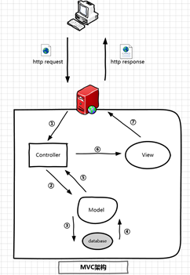

controller：控制器，作为model和view的桥梁，接收用户请求，获取和更新model中的数据，告知view该如何呈现

model：模型，负责与web业务相关的数据逻辑处理，包括数据库的增删查改等操作

view：视图，负责数据的显示和呈现，显示的内容基于model数据


MTV架构：

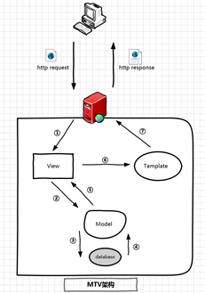

model：与MVC中的model功能一致

view：类似于MVC中的controller

template：类似于MVC中的view


数据逻辑（model）涉及到数据操作，例如MySQL

视图逻辑（template）涉及web前端页面的开发。HTML、CSS、JS

控制逻辑（view）涉及web后端开发技术。Python、PHP、Java


Django环境安装：pip3 install  -i https://pypi.tuna.tsinghua.edu.cn/simple django==2.2.7

查看安装：pip3(pip) list

升级pip：pip install --upgrade pip -i https://pypi.tuna.tsinghua.edu.cn/simple

安装数据库驱动：pip3 install mysql-connector-python -i https://pypi.tuna.tsinghua.edu.cn/simple

kali启动数据库：service mysql start

然后通过命令mysql -u root -p进行登录，默认密码为root

创建项目

Django-admin startproject mysite

创建成功之后，有mysite文件夹还有一个manage.py

 

urls.py 网址映射，将用户输入的url映射到后台逻辑视图

setting.py 全局系统参数设置

wsgi.py 定义WSGI接口，用来与web服务器联动

\__init__.py 让Python把该目录当做是一个开发包

manage.py Django的命令行管理工具，用于启动服务，数据库同步，创建管理员等操作

templates(目录) 放置静态web文件，比如html css js 图片

 

运行django

python manage.py runserver

 

创建项目app

python manage.py startapp jianyidjango

 

就会在djangocms目录下面出现一个新目录 jianyidjango

然后打开新目录，就可以看到各个py文件

整个项目文件就创建好了，接下来往里面填充内容


Django第一个项目

项目描述

DjangoCMS用户信息管理系统

 

\1.   当用户访问主页时，看到用户欢迎页

\2.   点击用户欢迎页里面的主页按钮，能够跳转到用户管理页

\3.   用户管理页需要具备信息的增删改功能，并且能够跳转到用户欢迎页和用户列表页

\4.   点击用户管理页的查询用户列表按钮，可以跳转到用户列表页

 

第一步：新建app 

python3 nanage.py startapp jianyidjango

 

第二步：欢迎页实现

views编写

```python
from django.http import HttpResponse
def welcome(request):
	return HttpResponse('欢迎您的访问！')
```

 

urls映射

```python
from jianyidjango.views import welcome
urlpatterns = [
	path('admin/', admin.site.urls),
	path('', welcome),
```

 

views进化

```python
def welcome(request):
	return HttpResponse('<h1>欢迎您的访问！</h1><p>点击以下的链接，可以进入jianyidjango主页！</p>') 
def welcome(request):
	content='<h1>欢迎您的访问！</h1><p>点击以下的链接，可以进入jianyidjango主页！</p>'
	return HttpResponse(content)
```

 

 

因为在vscode中，需要自己手工创建templates目录。所以就需要在settings.py中设置templates路径

 

templates创建的时候，要放在和jianyidjango同一级目录下

 

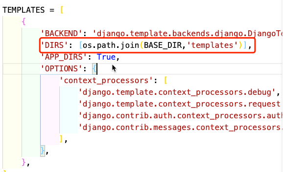

 

render和HTTPresponse的区别

 

首先在django中使用他们需要导入
from django.http import HttpResponse
from django.shortcuts import render, redirect

1、HttpResponse
作用：内部传入一个字符串参数，然后发送给浏览器

2、render
render可以接受三个参数：
一个是 request参数
一个是html模板文件
一个是保存具有数据的字典参数。 如：{key:value}形式
作用：将数据以字典形式填充到html模板文件中，最后将结果返回给浏览器

3、redirect
redirect 是重定向函数 调用函数后直接跳转到url地址
作用：接受一个url参数，表示让浏览器条专区制定的url
redirect 是 HttpResponsedirect 的缩写
例：return redirect(’/www.baidu.com/’) 里面的url是一个绝对地址
reverse是反向解析
return redirect(reverse(“week:index”))


index.html设置

```html
<!DOCTYPE html>
<html lang="en">
<head>
	<meta charset="UTF-8">
    <title>jianyidjango主页</title>
</head>
<body>
	<h1>jianyidjango主页</h1>
	<h3>填写你的个人信息到以下表单</h3>
	<form method="POST" action="#">
		<input type="text" placeholder="请输入姓名">
		<input type="password" placeholder="请输入密码">
        <input type="submit" value="提交">
	</form>
</body>
</html>
```

 

list.html

 

数据库设置

首先在settings.py中先注册app

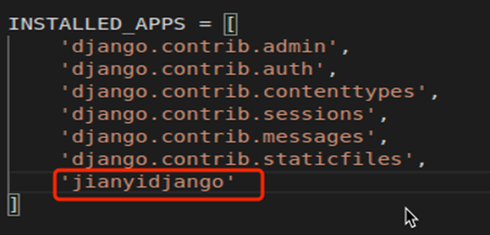

在mysql数据库中，通过命令 create database jianyidjango; 创建数据库

查看数据库的命令 show databases；

然后在settings.py设置数据库：

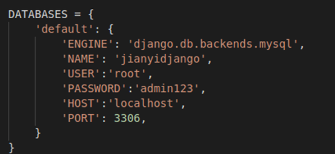

数据库迁移

Python3 manage.py makemigrations

Python3 manage.py migrate


model配置

model里面配置的类，在数据库中会显示成数据表，类里面的变量是数据表中表项。

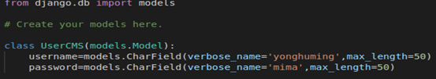

实现查询、增加功能

views配置

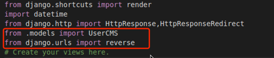


index.html设置

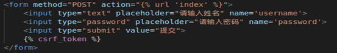

list.html设置

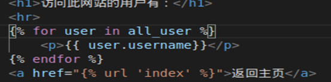

再次执行数据库迁移

Python3 manage.py makemigrations

Python3 manage.py migrate


然后在index页面添加用户，在list查看有没有效果


最后再设置一个删除页 delete.html

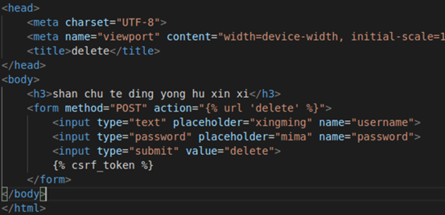

设置views.py

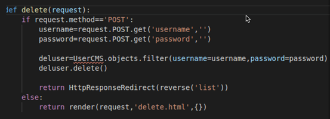

设置urls.py

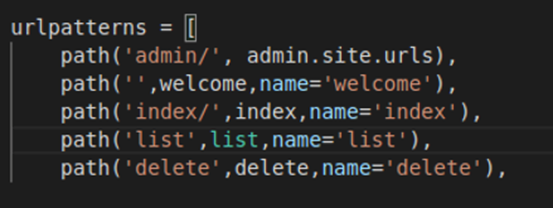

如果需要可以设置页面跳转效果


总结：

1. 所有的html文件都要放在templates目录下，默认是无法访问的
2. 新的页面要被访问，必须编写views的视图函数，然后在urls做映射
3. 页面之间的跳转，基于a链接来实现，href设置的时候通过模板变量
4. views中处理http请求的时候，可以通过HTTPResponse、render、HTTPResponseRedirct等方式来实现
5. 在form表单中，通过模板变量来保证安全性，生成随机数
6. 通过数据库可以实现动态网站，网站内容随着后台数据库的改变而改变


ORM概述

什么是ORM？

Python是开发语言，数据可以MySQL采用的数据库语言，这两种语言之间如何实现互操作？

ORM

object relational mapping 对象关系映射

用于实现数据库和编程语言之间的映射，ORM就是将SQL操作和编程语言操作做了一个翻译。

通过ORM技术来操作数据库，使得开发者无需接触SQL语句，而是直接操作对象的属性和方法，大大提高开发效果。

 

 

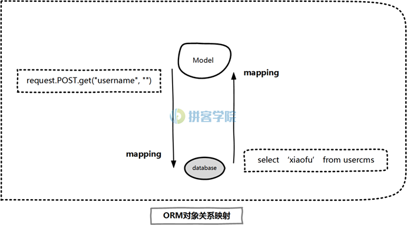

 

ORM功能

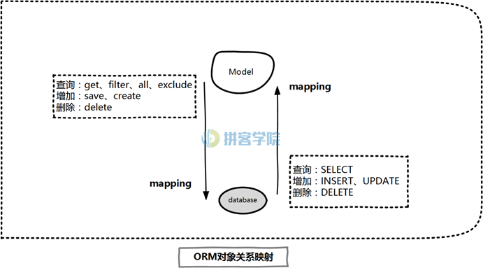

 

①  映射技术：每一张数据库表对应的是开发语言中的类，每一个数据字段，对应的是类中的属性

②  CRUD操作：即增删查改操作，在SQL语句中通过insert select update delete来实现，在djangoORM中通过get filter save delete方法（函数）来实现

③  缓存优化：从数据库查询到的数据以类形式保存在内存中，用于随时提取。

真正需要查询结果时才执行数据库的select操作，而不是在ORM查询命令执行时就查询数据库

 

有哪些ORM技术？

不同的后端语言都有自己的ORM，django的orm叫DjangoORM，通过创建model类和定义field字段来实现

 

model创建语法

 

先导入模块

from Django.db import models

class Modelname(models.Model): #创建类并继承models.Model

​    \#通过models.XXXField创建field字段

​    field1=models.XXXField(verbose_name=’xxx’,max_length=xxx)

​    \#定义子类，为父类添加说明

​    class Meta:

​       verbose_name=xxx

​       verbose_name_plural=xxx

 

属性及字段

Field类型

AutoField：一个自动递增的整型字段，添加记录时它会自动增长，通常用于数据表的主键

CharField：字符串字段，用于输入较短的字符

TextField：文本字段

EmailField：邮箱字段，用于输入带有email格式的字符

DateTimeField：日期字段，支持时间输入

ImageField：用于上传图片并验证图片的合法性，必须定义upload_to参数

IntergerField：整数字段

 

每个表都应该有一个主键，并且只能有一个。主键有两个作用，一是约束作用，用来规范一个存储主键和唯一性，同时也在此键上建立了一个主键索引；

主键的约束作用：

唯一标识数据库表中的每条记录

必须包含唯一值

主键列不能包含null值

 

Field属性：

primary_key：定义此字段是否为主键 True or False

default：设置默认值

null：是否容许数据库字段为Null，默认是False

blank：是否容许用户不输入，默认false

choices：设置该字段的可选值

max_length：一般在文本字段来设置

verbose_name：设置字段的别名，所有字段都可以设置

upload_to：设置上传路径，ImageField和FileField需要设置此参数

 

Meta类属性

verbose_name：设置对象名称，如果没有设置，则默认为该类名的小写分词形式

UserCMS 会被转换为 user cms

verbose_name_plural 设置对象名称的复数，一般设置成和verbose_name一样，否则会默认加s

 

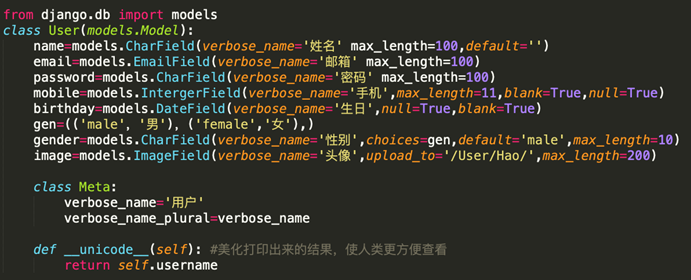

 

数据同步

全局同步

makemigrations 生成数据库表初始化文件initial.py

migrate 基于initial.py正式生成数据表

部分同步

makemigrations jianyidjango

 

Model操作

查询

ModelName.Objects.all() 查询类的所有数据

ModelName.Objects.filter() 返回符合筛选条件的数据集（一个或者多个对象）

ModelName.Objects.get() 返回符合筛选条件的数据（一个对象）

ModelName.Objects.exclude() 返回不符合筛选条件的数据

 

增加

ModelName.save()

ModelName.create()

 

删除

ModelName.Objects.all().delete() 查询所有对象并删除

ModelName.Objects.filter().delete()

ModelName.Objects.get().delete()

ModelName.Objects.exclude().delete()

 

排序

ModelName.Objects.all().order_by(‘xxx’) 查询类中的所有对象并根据关键词排序

 

切片

ModelName.Objects.all().order_by(‘xxx’)[a:b]

 

 

Admin（后台管理）

创建并注册模型管理类

进入admin.py文件，将models编写的类导入

继承admin.ModelAdmin,创建管理类

将类与管理类注册到admin

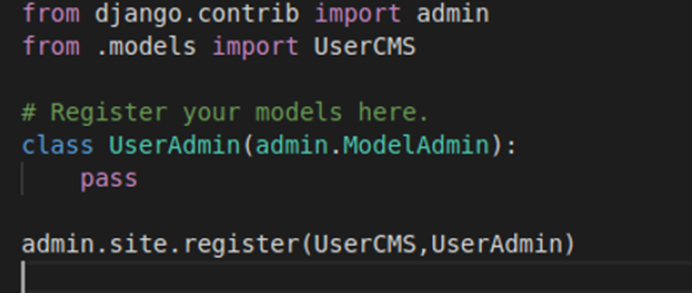

 

创建admin超级用户

 

python3 manage.py createsuperuser

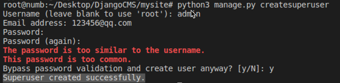

 

登录后台管理平台

在settings.py设置admin后台管理语言为中文

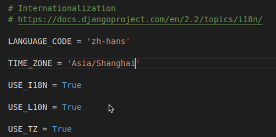

 

Views视图

views视图用于负责整个业务逻辑处理，包括从http请求到回应的过程

功能

根据收到的http Request，执行URL映射

根据url映射调用视图函数，调用models数据

渲染Templates网页文件并返回HTTP Response

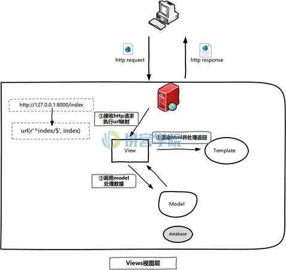

 

URL映射

每个Django项目至少有一个urls.py文件，该文件用于存储URL与视图函数的映射关系

url解析过程由django.conf.urls里面的url模块来实现的

url映射基于正则表达式来实现

正则表达式

^:以xxx开头，比如^admin 

$:以xxx结尾，比如admin$

x|y：匹配x或者y，比如request|reply

[xyz]：匹配所包含的任意一个字符

\[^xyz]: 匹配未包含的任意一个字符

[-]:匹配字符或者数字范围 [a-z],[0-9]

{n}：匹配n次 [0-9]{4}

\w:匹配包括下划线的任意单词字符等价于[a-zA-Z0-9]

\W:匹配包括非单词字符,等价于[^a-zA-Z0-9]

\d:匹配一个数字字符

\d+：匹配一个或多个数字字符

\D：匹配一个非数字字符

 

在django 2.x.x版本中，如果要使用正则表达式的话，要使用函数re_path()

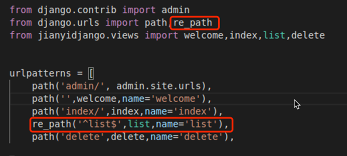

 

URL映射分类

反向URL映射（命名）

通过name属性为url映射条目设置名称，可以在templates和views处理中，解析到对应的view函数

在templates模板文件中，通过设置URL映射，然后解析到对应的view函数

在views配置中，通过reverse、render等方法来映射到对应的views函数

 

带命名参数的URL映射

分布式URL映射（一般用于大型项目中）

 

视图函数

当用户发起http Request到web服务器时，django执行url映射之后，接下来的任务就交给视图函数来处理

视图函数可以调用models的数据（可选）,并渲染templates网页文件，最终返回给用户

视图函数可以通过下面的方式来处理用户请求，并返回HTTPResponse

render 返回html文件并传递参数

HTTPResponse 直接返回内容

HTTPResponseRedirect 重定向到另外的页面 302

HTTPResponseNotFound 返回404

HTTPResponseServerError 返回500

 

视图函数写法分为基于函数的和基于类的

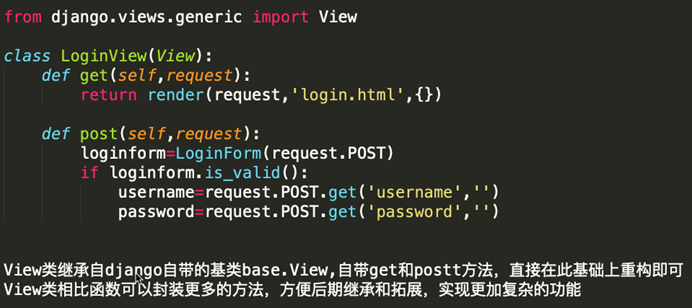

 

View类继承自django自带的基类base.View,自带get和postt方法，直接在此基础上重构即可

View类相比函数可以封装更多的方法，方便后期继承和拓展，实现更加复杂的功能

 

templates模块

templates负责整个表现逻辑，通过内置的模板语言结合html文件，为用户呈现web内容；

templates模板系统是一个独立的语言库，除了与HTML文件结合，也可以与其他文本格式的文档结合，甚至可以独立运行

templates模板系统通过模板标签、过滤器、流程控制、模板继承等方式，实现了web页面的动态展现

 

逻辑标签

 用于实现逻辑判断

```

	<div class=’top1’></div>

	<div class=’top2’></div>

```

用于实现循环/遍历

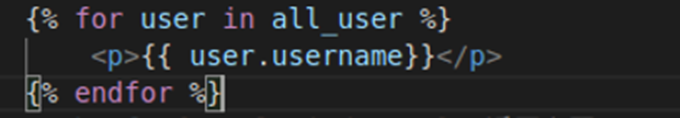

 


模板变量

{{ }}

用于存储模板变量，变量内容可以直接从views函数获取，也可以通过if/for标签来获取

通过模板变量，可以实现网页内容的动态展现

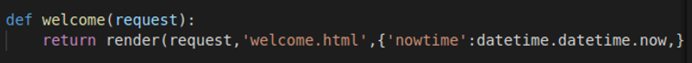


 



跳转到特定url映射的模板变量，变量内容用url_name决定的

 

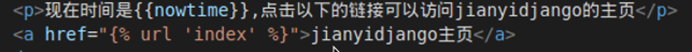

 

过滤器

就在变量后面加上管道符合过滤关键字，可以对模板内容实现进一步的过滤

slice

length

add

upper

lower

date

title

{{ name | upper}}

 

模板继承

属于templates高级功能，通过模板继承能最大程度的减少代码量

当网站的很多页面，header footer aside 等html组件非常类似甚至完全一样，只有少量的组件有差别时，可以采用模板继承

 

可替代内容

 继承语法


模板调用

html文件放在jianyidjango项目的根目录templates下

setting配置

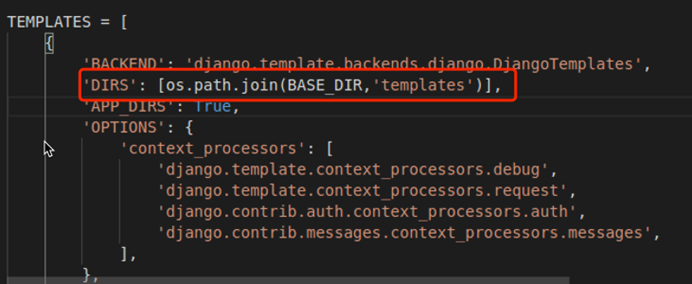

 

css/js/img文件

jianyidjango下新建一个static目录，将这些文件放在static目录下

然后在setting设置static路径

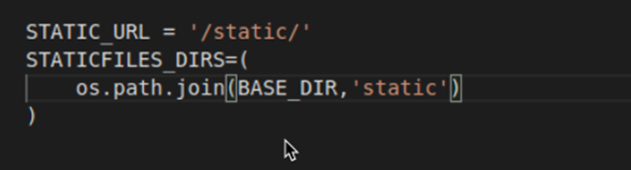

 

templates配置

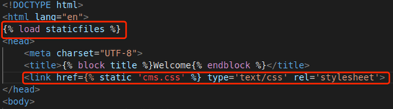