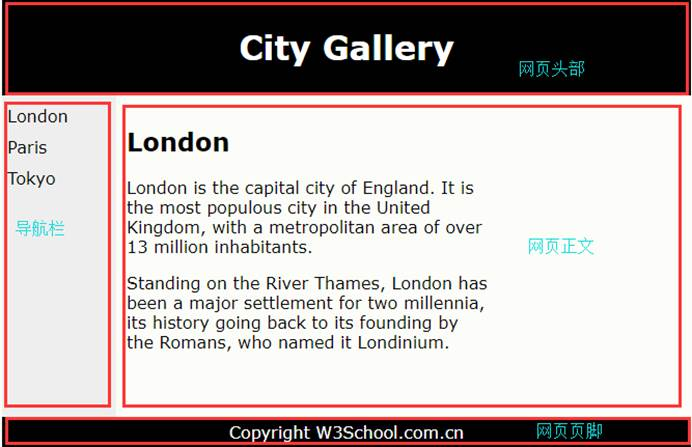
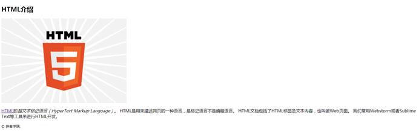
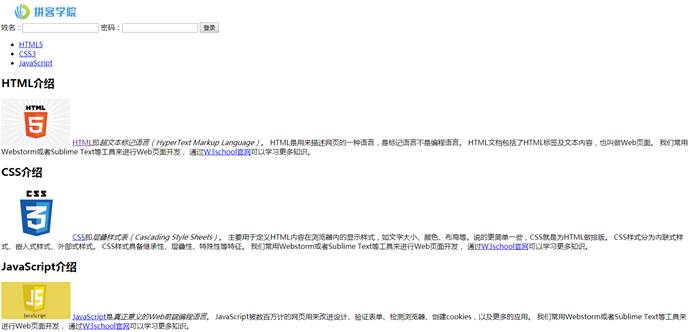
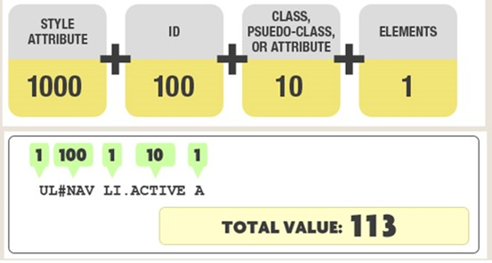
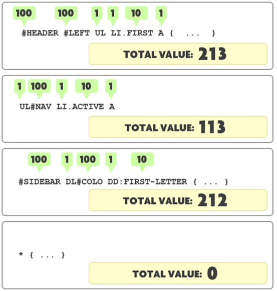
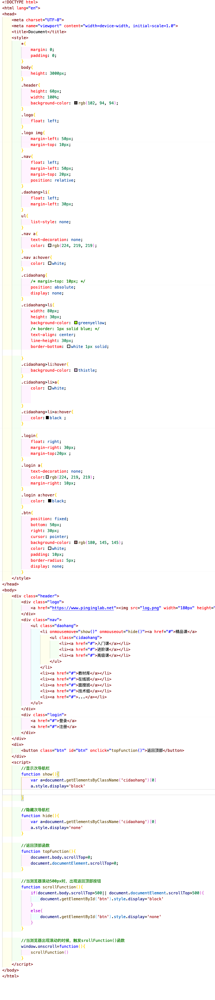

+++
title = "HTML与CSS"
date = 2020-07-01

[taxonomies]
categories = ["安全"]
+++

HTML介绍

超文本标记语言，用来描述网页。用HTML写的文档称为HTML文档，也叫做web页面，包括了HTML标签、图片、视频等内容。
<!-- more -->

 

HTML、CSS、JavaScript之间的关系

HTML主要用于承载网页的内容（文本，图片，语音，视频等）

CSS用于实现网页内容的装饰（字体，颜色，布局等）

JavaScript用于实现网页内容的特效（交换、弹出、滑动等）

 

HTML版本

HTML标准化是由W3C来推动的，当前常见版本为HTML 4.01和HTML 5

 

HTML网页结构

先由一个声明开始，然后是html标签。在HTML标签里面有两个子标签head和body。

Head里面涉及网页标题，字符集，样式，链接等

Body是浏览器呈现给用户的内容，包括标题、文本、段落、链接、图片、媒体等。

所有内容都由html标签来实现

 

标签/元素/属性

HTML页面由标签和内容组成。标签一般情况下都是成对出现的，由开始标签和结束标签组成。

 

元素

指的就是开始标签和结束标签直接的所有代码，元素内容就是开始和结束标签之间的内容

元素的语法：

\1.   元素以开始标签开始

\2.   元素以结束标签终止

\3.   元素内容就是开始和结束标签之间的内容

\4.   某些元素具有空内容

\5.   大多数元素都可以拥有属性

 

 

属性

属性是为元素提供的附件信息，属性一般描述于开始标签，属性总是以（名称-值）对的方式出现

属性名称和值对大小写不敏感

属性的值要放在引号内，单引号和双引号都可以

 

 

 

HTML头部

可以添加在头部中的标签有：

\<title> \<style> \<script> \<meta> \<base> \<link> \<lang>

\<meta charset="utf-8">定义字符集

\<meta name=”keywords”content=”html”>为搜索引擎定义关键词

\<meta name=”description”content=”biao ji yu yan”>为网页定义描述内容

\<meta name=”pinginglab”content=”zuozhe”>为网页定义坐着

\<style>标签，主要用来修改元素的样式

Style属性，放在元素标签里面的，也可以修改元素的样式

 

\<link>标签，用来链接一个外部样式表（CSS）

\<base>用来修改网页链接的默认地址

\<script>用来添加JavaScript代码

\<lang>定义元素内容的语言，一般情况下直接可以在html标签里面添加lang属性来定义

Lang属性在\<base>\<script>\<iframe>等标签中没有效果

 

 HTML标题

标题通过\<h1>-\<h6>来实现

 

水平线\

实现内容上下文的分割

 

HTML段落

通过\
标签来定义

 

折行\ 

在不产生一个新段落的情况下进行换行

 

HTML文本

文本具有多种格式化标签，可以实现文本的加粗、斜体、上下标、计算机输出等处理。

常用的文本标签有文本格式化标签、计算机输出标签、引用标签。

 

文本格式化标签

\<b> 定义加粗文本

\<big> 定义大号字

\<em> 定义着重文字

\<i> 定义斜体字

\<small> 定义小号字

\<strong> 定义加重语气

\ 定义下标字

\ 定义上标字

\<ins> 定义插入字

\<del> 定义删除字

 

计算机输出标签

\<code> 定义计算机代码 不会保留多余的空格或折行

\<kbd> 定义键盘码

\<samp> 定义计算机代码样本

\<tt> 定义打字机码

\<var> 定义变量

\<pre> 定义预格式文本

引用标签

\<abbr> 定义缩写

\<address> 定义地址

\<bdo> 定义文字方向

\<blockquote> 定义长的引用 浏览器会对元素进行缩进处理
 	  \<q> 定义的短的引用

\<cite> 定义引用、引证

 

注释标签

\<!--要注释的内容-->

 

超链接

使用\<a>标签来设置超文本链接

超链接可以是一个字，一个词，也可以是一张图片。

 

HTML列表

无序列表，使用粗体圆点进行表决

 

HTML表格

 HTML图片

通过\标签向网页添加图片。\是空标签，只包含属性，并且没有闭合标签

要在页面显示图片，要使用src属性添加图片的url，使用width和height修改图片的宽度和高度，通过alt属性设置图片加载失败的提示信息。

 

HTML布局

 

 

 

第一种布局就是使用\
标签来实现

第二种布局采用的是HTML5提供的新语义元素

Header 定义文档或者页眉

Nav 定义导航栏

Section 定义文档中的节

Article定义独立的自包含文章

Aside 定义侧边栏

Footer 定义页脚

Details 定义额外细节

Summary 定义details的标题

 

HTML块元素和内联元素

块元素特点：

\1.   总是在新行上开始，占据一整行

\2.   高度、行高以及内外边距都可以控制

\3.   宽度始终与浏览器的宽度一样，与内容无关

\4.   可以容纳内联元素和其他块元素

常见的块元素： address div dl form h1-h6 ol p table ul li

 

内联元素特点：

\1.   和其他元素都在一行上

\2.   高度、行高以及内外边距部分可改变

\3.   宽度只和元素内容有关

\4.   内联元素只能容纳文本和其他的内联元素

 

常见的内联元素：a b em img input select small textarea

 

可变元素

Button

 

我们可以通过CSS来修改元素的类型

Display：block

Display：inline

Display：inline-block

 

 

 

 

CSS基础

层叠样式表，用于定义HTML内容在浏览器内的显示样式，比如文字大小，颜色布局等

CSS语法

由选择器和声明两部分组成

选择器指的是需要改变样式的HTML元素

而声明是由一个属性和一个值组成

body{

background:red；

border:1px solid blue;

}

声明需要用花括号包裹起来

如果不止一个声明，声明之间需要通过分号来隔开

属性和值之间用冒号，如果值有多个单词，则要加引号

CSS注释

HTML\<!--需要注释的内容-->

CSS /*   */

CSS分类

内联式：写在HTML元素内部，通过style属性引入

嵌入式：位于\<head>标签里，通过\<style>标签来实现

外联式：需要从外部导入，在head中通过使用\<link>来引用

三种样式中，内联式的权重是最高的，嵌入式和外联式的权重和书写顺序有关，当对同一个元素设置同一个样式的时候，后面的会覆盖掉前面的样式。不同的属性是不会覆盖的

CSS特点

继承

可以继承的属性：概括为所有关于文字图片大小样式的属性

line-height    color	font

所有关于盒子的，定位的，布局的属性是不能继承的

层叠

如果两个相同的属性作用于同一个标签，它们会发生层叠

后面会覆盖前面的内容

CSS选择器

选择特定的网页元素，再根据选择器选择的网页元素做设置

基本选择器

- 通配符选择器（*）：可以和所有元素匹配

- 元素选择器：最常见的CSS选择器。比如p h1 a body 甚至html本身

- 类选择器：类选择器容许以一种独立于文档元素的方式来指定样式，该选择器可以独立使用，也可以和其他元素结合使用，要使用类选择器，必须得先对文档进行标记才能使用，标签里面设置class属性。然后在头部里面通过“.”来调用。在同一个html文档中，可以同时设置多个类名相同的类选择器

- ID选择器：类似于类选择器，用#来调用，同一个HTML文档中相同名称的ID只能设置一个
  - 类选择器还是ID选择器？
    - 同一个文档中，ID选择器能使用仅且一次
    - ID选择器设置的时候不能使用词组
  
- 后代选择器：包含选择器，可以选择作为某元素后代的所有元素。匹配符是空格。

- 子元素选择器：与后代选择器相比，子元素选择器只能选择作为某元素子元素的元素，匹配符是>

- 相邻兄弟选择器：两者有相同的父元素，且相邻，可以使用相邻兄弟选择器，匹配符是+

- 通用兄弟选择器：用来选择位于同一个父元素之中的某个元素的所有其他种类的兄弟元素，匹配符是“~”

- 群组选择器：同时对

- 伪类选择器：用于向某些选择器添加特殊的效果。语法：选择器：伪类{}
  - 锚伪类：在浏览器中，链接的不同状态都可以有不同的显示方式，活动状态，已被访问状态，未被访问状态，鼠标悬停状态：link,visited,hover,active。
    - hover必须位于link 和visited之后，才是有效的
    - active必须位于hover之后才是有效的
    
  - UI元素状态伪类：指定的样式只用于当元素处于某种状态下才起作用，在默认的状态下不起作用

    - hover 当鼠标指针移动到元素上时

    - active 元素被激活（鼠标在元素上按下去没有松开）

    - focus 当元素获得焦点的时候，主要是文本框获得光标聚焦点

    - enable 当元素处于可用状态时的样式

    - disable 当元素处于不可用状态时的样式

    - read-only 当元素处于只读状态时的样式

    - read-write 当元素处于读写状态时的样式

    - checked 当表单中的单选框或者复选框处于选取状态

    - default 当页面打开时默认处于选取状态的单选框或者复选框的样式

    - indeterminate 当页面打开，一组单选框中没有任何一个单选框被设定为选中状态时，整个单选框的样式

    - selection 当元素处于选中状态时的样式

    - invalid

    - valid

    - required  
    
    - optional
    
      一般用于input select textarea这些元素
      
    - in-range
    
    - out-of-range
    
      结构类
    
    - first-child 匹配属于其父元素的首个子元素的每个元素
    
    - last-child
    
    - first-of-type 匹配属于其父元素的特定类型的首个子元素的每个元素
    
    - last-of-type 
    
    - empty 匹配没有子元素(包括文本节点)的每个元素
    
      empty代表没有文本内容的元素，所以如果是块元素，那么在浏览器中不占空间，所以要看现象就需要设置高度和宽度。
    
    - not 否定选择器：匹配非指定元素的每个元素
    
    - 伪元素
    
      - first-line
      - first-letter
      - before
      - after

- 属性选择器：根据元素的属性及属性值选择元素。在属性选择器选择属性设置值的时候，只能完全匹配，不能只设置匹配值的部分字段

  - [attribute] [target] 选择带有target属性的所有元素
  - [attribute=value] [target_blank]选择target="_blank" 的所有元素
  - [attribute~=value] [title~=flower]选择title属性包含单词 "flower" 的所有元素
  - [attribute|=value] [lang|=en] 选择lang属性值以"en"开头的所有元素
  - [attribute^=value] 匹配属性值以指定值开头的每个元素
  - [attribute$=value] 匹配属性值以指定值结尾的每个元素
  - [attribute*=value] 匹配属性值中包含指定值的每个元素

- 选择器权重：选择器是有优先级的，如果优先级一样，后面的会覆盖前面的样式

​			选择器的级别分为四个等级。每个等级代表一类选择器

​			第一等：内联式 style=””，权重为1000

​			第二等：ID选择器 #nav，权重为100

​			第三等：类、伪类、属性选择器 .active，权重为10

​			第四等：元素选择器 a ，权重为1

​			通配符选择器，子选择器（>）、兄弟选择器<+ ~>不在这四个等级中，所以优先级为0

总结：

- 包含更高权重选择器的一条规则拥有更高权重

- ID选择器权重高于属性选择器

- 与元素“挨得近”的规则生效（比如说内联式，是直接写在元素标签的）

- 最后的定义的规则会覆盖掉前面与之冲突的规则

- 无论有多少个元素选择器，都没有一个类选择器的权重高

CSS背景：用于定义HTML元素的背景，可以通过设置背景颜色或者图片等方式来实现

- background： 把所有关于背景的属性设置在一个声明中
- background-color：设置背景颜色 不能继承，默认值为透明（transparent）
- background-image：设置背景图片
- background-repeat：设置背景图示是否重复以及如何重复
- background-attachment：设置背景图片是固定还是滚动
- background-position：设置背景图片位置

CSS文本

文本属性可以定义文本的外观，包括文本颜色、字符间距、对齐方式、装饰文本以及文本缩进

- color

- direction 设置文本方向，正常的字符排列不会颠倒

- line-height

- letter-spacing

- word-spacing

- text-align

- text-decoration

- text-indent

- text-transform
  - uppercase 
  - lowercase 
  - capitalize

- white-space   不能对手工换行生效\ 

如果要字符反转：\
\<bdo dir="rtl">this is a test\</bdo>\

CSS字体：定义文本的字体系统、大小、加粗、风格和变形

- font:把多个设置放在一个声明中

- font-family：设置字体族（字体系列）

- font-size：设置字体大小

- font-style：设置字体风格

- font-weight：设置字体粗细

- normal 默认值

- bold

- bolder

- lighter

 

100-900

400=normal 700=bold

CSS链接：对链接设置各种属性，包括color background font-family

- text-decoration:none：去除链接的下划线

- background-color: 设置链接的背景颜色

CSS列表：用来设置列表项标志，可以将图片作为列表项标志

- list-style

- list-style-image

- list-style-position

- list-style-type

CSS表格：为表格设置边框、背景、边距、文本对齐

- border-collapse:合并边框

- border-spacing:设置分割单元格边框的距离

- caption-side：设置标题的位置

- text-align vertical-align:设置水平对齐和垂直对齐

- border padding:设置边框和内边距

- width height：设置宽度和高度

CSS边框：可以设置边框圆角、向矩形添加阴影、使用图片来绘制边框

- boder-radius:设置边框圆角

- box-shadow：设置边框阴影

- border-image：设置边框图片(验证一下)

CSS背景：可以设置背景图片的尺寸、定位区域、绘制背景区域

- background:

- background-image:

- background-size:

- background-repeat:

CSS盒模型

CSS网页布局有盒模型、浮动、定位三个技术

盒模型包括元素内容、内边距、边框、外边距

元素可以通过width和height来设置宽度和高度

内边距：元素到边框的距离

边框：内外边距的分界

外边距：距离其他元素的距离

 

设置背景的时候，背景应用的范围是元素+内边距+边框

元素宽度设置为50px，内边距设置5px，边框1px，总宽度是多少？

 

CSS核心的思想：一切皆盒子

元素的类型：块元素、内联元素、内联块状元素

一般情况下，内联元素不能应用盒模型，但可以通过CSS修改元素类型来实现

设置时常见的属性：

- width

- height

- padding

- margin

- border

 

CSS设置之前，需要先删除元素默认的内外边距

*{

  padding：0；

  margin:0;

}

CSS定位

CSS有三种定位机制：普通流、 浮动、 绝对定位，若没有设置定位机制，默认使用普通流，也就是说文档中的元素按照从上到下，从左到右的顺序来排列

定位属性就是对元素进行定位，让元素出现在特定位置

常见的定位属性：

- 绝对定位：相对于离自己最近的最近的已经定位的祖先元素来进行定位。如果没有已经定位的祖先元素，那么它就相对于最初的包含块。元素会脱离原来的文档流不占据空间
- 相对定位：相对于元素原来的位置。元素仍然会占据原来的空间，元素仍然处于正常的文档流中
- 固定定位：将元素固定在浏览器的某一个位置，不会随着浏览器的滚动条的移动而变化，固定定位是相对于当前浏览器的窗口

设置元素溢出使用overflow：默认是scroll，即添加滚动条，可以设置成hidden来隐藏溢出的内容

如果要使用层叠使用 z-index,默认值是零，设为正数代表离用户近

CSS浮动

设置元素会脱离正常的文档流，向左或者向又浮动

浮动的元素会不断地向左或者向右浮动，直到碰到其他元素或者包含块的边缘。因为浮动的元素是脱离了正常文档流，所以会使其他元素重新排列，如果想让其他元素不受浮动属性影响，可以给其他元素设置“清除浮动”属性

float: left

float: right

clear: right/left

CSS布局

根据网页结构来看，分为一列布局，两列布局，三列和混合布局

从布局方法来看，分为流式布局、浮动布局、定位布局

布局技术有盒模型、浮动、定位三种技术

HTML布局

网页分为头部、banner、nav、mainbody、footer

