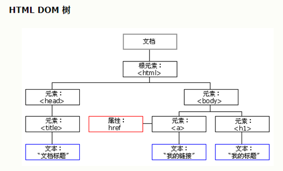

+++
title = "JavaScript"
date = 2020-08-13

[taxonomies]
categories = ["安全"]
+++

JavaScript基础

HTML搭建网页提供内容，实现网页的结构层

CSS修饰网页，实现网页的表现层
<!-- more -->

JS是真正的前端语言，面向对象的，实现网页的行为层

嵌入网页运行，实现网页的动态效果、表单验证、创建cookie、修改HTML等功能


JavaScript组成

ECMAScript+DOM（文档对象类型）+BOM（浏览器对象类型）统称为JavaScript

ECMAScript包括了JS基础

DOM用来描述处理网页的方法和接口

BOM描述了与浏览器进行交互的方法和接口


JS学习内容：

数据类型（变量、数字、字符串、布尔值、数组、字典）

流程控制（条件判断、循环语句）

函数（定义、创建、调用、闭包、高级函数）

面向对象（对象的定义、创建对象、对象的属性和方法）

DOM

BOM

JavaScript使用的位置

脚本可以放在三个位置（head区域、body区域、外部的JS文件）

放在head和body的时候，都需要使用<script>标签包裹JS脚本

如果要引用外部的js脚本，在HTML的head中要使用<script>标签，通过添加src属性来设置外部js脚本的位置。

<script src="test.js" rel="srcript"></script>

JavaScript注释风格

单行注释//

多行注释/* */


JavaScript变量

变量可以是任意的数据类型、变量是存储信息的容器，通过变量可以实现复杂编程，通过变量可以实现复杂运算和高级编程


创建变量的语法：

var a;

a=“hello”;

JavaScript的变量需要提前声明，需要使用关键词var来实现。因为js本质属于动态语言，所以声明变量的时候不需要指定数据的类型，声明之后直接赋值即可

var a=1;

var a=1;b=‘hello’;

变量名称的命名规则：

变量的第一个字符必须是字母、下划线、或者美元符号

剩下的字符可以是下划线、美元符号或者任意的字母或者数字

对大小写敏感

不能使用JS的保留字和关键词，不能用函数名或者变量来命名

保留字：class、export、Boolen、abstract……

关键词：for、else、if、switch、try、var……


变量的命名规则：

驼峰标记法

首字母（单词）是小写的，接下来的字母（单词）都是大写开头

var thisisatest；

var thisIsAText；


Pascal标记法

首字母（单词）是大写的，接下来的字母（单词）都是以大写开头

var  ThisIsAText


匈牙利标记法

在Pascal标记法的前面添加一个字符用来说明该变量属于什么类型。i表示整数，s表示字符串

var iThisIsATest=10;


JavaScript常见的数据类型（基本数据类型）分类：

undefined null Boolean number string

要查看一个变量属于哪一种类型，可以通过typeof（变量）来查看


JavaScript数字

JS的数字对象只有一种数据类型，就是number。不区分整数、浮点数等。支持十进制、八进制、十六进制、科学计数法等，可以实现加减乘除、求余、累积等

因为属于面向对象的编程语言，所以可以给数字设置属性和方法


数字的属性和方法

属性：

NaN：非数字值   isNaN()

max-value

min-value

方法：

tostring

valueof 返回数字对象的数字值


JavaScript字符串

string对象用于处理字符串信息

赋值的时候需要添加引号，也可以设置属性和方法，可以实现字符串相加、查询、相加、匹配、替代等操作


字符串属性：

length：字符串长度


方法：

indexof()

subtring()

toUppercase()

big()

bold()

concat()   连接字符串

fontcolor()


字符串的索引

charAt()    charcodeat():通过下标检索字符

indexof()    lastindexof(): 通过字符检索下标


字符串截取

slice() substring() substr()

```
<script>
    function getMail(){
		var mail=prompt('请输入邮箱：');
		var pos=mail.indexOf('@');
		var name=mail.slice(0,pos);
		var address=mail.substr(pos+1);
	document.write('你输入的邮箱用户名是：'+name+'<br>');
	document.write('你输入的邮箱域名是：'+address+'<br>');
	}
	getMail(); 
</script>
```


字符串的分割替换

split()  将字符串转换成数组    var a=[1,2,3]

replease()


字符串的大小写转换

toUperCase()

toLowerCase()


JavaScript布尔值

布尔对象的作用就是将非逻辑值转换成逻辑值（true或者false）

创建布尔对象的语法：

new Boolean( value)

Boolean(value)


创建值为false的Boolean对象：

var a=new Boolean();

var a=new Boolean(0);

var a=new Boolean(“”)

var a=new Boolean(false)

var a=new Boolean(NaN)

var a=new Boolean(null);


创建值为true的Boolean对象:

var a=new Boolean(1);

var a=new Boolean(true);

var a=new Boolean(‘false’);


布尔运算

判断 ><=

计算 &&||！


JavaScript数组

数组也是用来存储信息的容器，包括数字、字符串、数组、布尔值。

数组也可以设置属性和方法，可以实现数组的索引、相加、截取等操作


创建数组

第一种方法：

var a=new Array();

a[0]=1;

a[1]=‘hello’;

a[2]=[1,2,3]


第二种方法：

var b=new Array(1,’hello’,[1,2,3])


第三种方式：

var c=[1,’hello’,[1,2,3]]


访问数组：

var x=a[1]

数组索引：var x=a[1]

数字长度：var x=a.lenth

数组截取：var x=a.slice(0,2)

数组相连：a.concat(b)

数组搜索：var x=a.indexOf(3)

数组修改a[0]=10


数组的属性和方法

属性

length

方法

concat()

join()  把数组转换成字符串

pop()  弹出数组的最后一个元素，并且显示出来

push()  往数组的末尾添加元素，返回新数组的长度

reverse()  颠倒数组中元素的顺序

shift()  删除数组的第一个元素，并且把删除的元素显示出来

slice()

sort()  对数组的元素进行排序


数组搜索

indexOf()   lastindexOf()

数组在搜索的时候要完全匹配才可以

```
<script>
        var nums=[3,4,5,6,1,'hi',3,'hi','hi'];
        var pos=nums.indexOf('hi',1)
        function ArrayIndexOf(arr,value){
            var a=[];
            for(var i=0;i<arr.length;i++){
                if (arr[i]===value){
                    a.push(i)
                }
            }
            console.log(a)
        }
        var pos2=ArrayIndexOf(nums,1)
</script>
```

双等号==： 

\1.   如果两个值类型相同，再进行三个等号(===)的比较

\2.   如果两个值类型不同，也有可能相等，需根据以下规则进行类型转换在比较：

·    如果一个是null，一个是undefined，那么相等

·    如果一个是字符串，一个是数值，把字符串转换成数值之后再进行比较

三等号===:

\1.   如果类型不同，就一定不相等

\2.   如果两个都是数值，并且是同一个值，那么相等；如果其中至少一个是NaN，那么不相等。（判断一个值是否是NaN，只能使用isNaN( ) 来判断）

\3.   如果两个都是字符串，每个位置的字符都一样，那么相等，否则不相等。

\4.   如果两个值都是true，或是false，那么相等

\5.   如果两个值都引用同一个对象或是函数，那么相等，否则不相等

\6.   如果两个值都是null，或是undefined，那么相等

js里面带“”和不带“”的数字用==的值是一致的，如果是===就不一致，因为类型不一样（带双引号是字符串，不带双引号是数字）


数组增删

push() pop() shift() unshift()


数组的排序

sort()   reverse()   join()

```
<script>
        var nums=[1,2,3]
        var nums1=[-10,6,9,2,100,99,-88]
        var a=nums.reverse()
        console.log(a)
        var b=nums1.sort(function(a,b){return a-b})
        console.log(b)
        // document.write(a)
        // document.write(typeof(a))
        // console.log(nums)
    </script>
```


数组截取

slice()   

splice()   删除掉元素并返回删掉的内容

var a=nums.splice(2,3)是指删掉2之后的3个元素

var a=nums.splice(2,3,888) 删掉2之后的3个元素并用888替换删掉的元素

```
<script>
        var nums=[1,2,3,4,5,6,7,8]
        var nums1=[-10,6,9,2,100,99,-88]
        var a=nums.splice(2,3,888,'hello')
        console.log(a)
        console.log(nums)
</script>
```

concat()


JavaScript字典

字典对象通过映射这个方式实现键值对的数据存储。字典可以访问、修改、判断

```
<script>
        var dict={
            a:1,b:2,c:3,d:'hello',
        }

        var x=dict.a;  //访问字典
        document.write(x)

        dict.d='hi'  //修改字典
        document.write(dict.d)

        var y='hello' in dict;  //in、not in成员操作符，返回值是布尔值
        document.write(y)

    </script>


JavaScript日期
日期对象用于处理时间和日期
语法：
var a=new Date();

常用的方法：
getfullyear()
getmonth()
getDate()
getDay()
getHours()

<body>
    <button onclick="Time()">点击显示日期</button>
    <script>
        function Time(){
            var a=new Date()
            document.write(a)    
        }
    </script>
</body>

<script>
        var a=new Date()
        var weeks=['周日','周一','周二','周三','周四','周五','周六']
        var week=a.getDay()
        var year=a.getFullYear()
        var month=a.getMonth()
        var day=a.getDate()
        var hours=a.getHours()
        var minutes=a.getMinutes()
        var seconds=a.getSeconds()
        
        var time='当前的时间是'+year+'年'+month+'月'+day+'日'+hours+'时'+minutes+'分'+seconds+'秒,'+weeks[week]
        document.write(time)

    </script>


```


JavaScript日期

日期对象用于处理时间和日期

语法：

var a=new Date();


常用的方法：

getfullyear()

getmonth()

getDate()

getDay()

getHours()


JavaScript数学

math对象用于实现数学运算，比如取绝对值，四舍五入，正弦，余弦，平方根等数学运算


属性

PI 返回圆周率

sqrt 计算平方根


方法

abs()

sin()

cos()

tan()

floor()向下取整

ceil()向上取整

round()四舍五入

max()取最大值

min(x,y)

random() 返回0-1之间的随机数

```
<script>
        // var random=Math.random()
        function getRandom(n,m){
            var choice=m-n+1
            return Math.floor(Math.random()*choice+n)
		}
        var a=getRandom(1,10)
        document.write(a)
</script>
```


JavaScript条件语句

流程控制语句包括 if for while switch continue break


if

if else

if elseif else

switch 用来选择多个代码块之一来执行

语法：

if(条件){

代码块

}

elseif{

代码块

}

else{

代码块

}

switch(n){

case1:

​	代码块1;

​	break;

case2:

​	代码块2;

​	break;

default:

​	如果不满足上面的case，则执行default语句

}

```
<script>
        var a=0
        if(a>0){
            document.write(a);
        }
        else if(a<0){
            document.write(Math.abs(a));
        }
        else{
            document.write('haha');
        }
    </script>

<script>
        var a=new Date().getDay()
        var x;
        switch(a){
            case 0:
                x="星期天";
                break;
            case 1:
                x="星期一";
                break;
            case 2:
                x="星期二";
                break;
            case 3:
                x="星期三";
                break;
            case 4:
                x="星期四";
                break;
            case 5:
                x="星期五";
                break;
            case 6:  //也可以换成default
                x="星期六";
        
        }
        document.write(x);
</script>
```


JavaScript循环语句

for循环代码块一定的次数

for/in  循环的时候再做遍历

while

do/while

for(语句1；语句2；语句3){

​	代码块

}

语句一和语句三是可选的，语句二必选

语句一是在循环之前执行

语句三是在循环一次之后执行，也可以写在循环代码块中


for(x in y){

代码块；

}


while(循环条件){

​	代码块

}

do{

​	必须先执行的代码块

}

while{

代码块

}


for循环和while循环的区别

for循环一般情况下，适合运行已知循环次数的代码

while循环适合运行未知循环次数的代码

```
<script>
        var a=0;
        var i;
        for(i=1;i<=100;i++){
            a=a+i;
        }
        document.write(a)
    </script>


<script>
        var a=['abc','def','xyz'];
        var i;
        var b;
        for(i=0;i<a.length;i++){
            b=a[i]
            document.write(b+'<br>')
        }
    </script>

<script>
        var a=0;
        var i=0;
        while(i<10){
            a=a+i;
            i++;    
        }
        document.write(a+'<br>')
</script>

<script>
        var a='hello'
        var i=0
        var b=[]
        while(i<a.length)
        {
            b.push(a[i])
            i++
        }
        document.write(b+'<br>')
    </script>

<script>
        var a='';
        var i=0;
        do{
            a=a+'the number is'+i+'<br>'
            i++
        }
        while(i<10);
        document.write(a)
        
    </script>


<script>
        for(i=1;i<=9;i++){
            for(j=1;j<=i;j++){
                document.write(j+'*'+i+'='+j*i+'&nbsp;&nbsp');
            }
            document.write('<br>')
        }
</script>

```


while循环先做判断再执行

do while 先执行再判断


JavaScript终止语句

braek 

continue

```
<script>
        var a='';
        var i=0;
        for(i=0;i<10;i++){
            if (i==5){
                continue;//也可以换成break，但是效果不同
            }
            a=a+"the number is"+i+"<br>"
        }
        document.write(a)
</script>
```


JavaScript函数

函数指的就是封装好的，可以直接调用的，可以重复使用的代码块。

函数一般由变量、数据类型、表达式、流程控制等语句组成。


语法

基础函数

function functionname(){

​	函数的代码块;

}

带参数函数

function functionname(var1,var2){

函数的代码块

}


带返回值函数

function functionname(){

  函数的代码块

  return x

}

```
<script>
        function abs(x){
            if(x>=0){
                return x;
            }
            else{
                return -x;
            }
        }
        var a=abs(-10)
        document.write(a)
</script>

<script>
        function myfunction(name,job){
            document.write('welcome'+name+',the'+job+'<br>');
        }

        myfunction('xiaoming','xuesheng')
</script>

<script>
        var myobject={
            firstname:'li',
            lastname:'xiaoming',
            fullname:function(){
                return this.firstname+" "+this.lastname;
            }
        }
        document.write(myobject.fullname())
</script>

```


函数的变量和作用域

处于函数内部的变量称为局部变量；处于函数外部的变量称为全局变量。局部变量和全局变量的调用范围是不同的，局部变量只能用于函数内部，全局变量能作用于全局

```
<script>
        function foo(){
            var x,y;
            x=1;
            y=x+2;
            return y;
        }
        document.write(foo())

        function boo(){
            var x,y;
            x=10;
            y=x+20;
            return y;
        }
        document.write(boo())

        var a=10;
        function sum(){
            var b=a+1;
            return b;
        }
        document.write(sum())
        document.write(x)
</script>
```


函数的闭包

函数可以调用外部函数或者全局的变量，闭包可以实现更复杂的计算

```
<script>
        var iBaseNum=10;
        function addNum(iNum1,iNum2){
            function doAdd(){
                return iNum1+iNum2+iBaseNum;//内层函数调用外层函数的参数，这也属于闭包
            }
            return doAdd()
        }
        document.write(addNum(1,2))
</script>
```


arguments作用

计算任意两个数的平均值

arguments可以获取函数参数的内容和长度

获取长度 arguments.length

获取内容 arguments[]

```
<!DOCTYPE html>
<html lang="en">
    <head>
        <meta charset="UTF-8">
        <title>生日计算器</title>
    <script>
        //获取用户生日信息
        //通过parseInt和prompt获取年、月、日，并转化成整数
            var year=parseInt(prompt("请输入您的出生年份"));
            var month=parseInt(prompt("请输入您的出生月份"));
            var day=parseInt(prompt("请输入您的出生日期"));
            //打印最终生日格式，在这里需要调用finalBirth函数并传入这里的year、month、day三个参数
            document.write("您的生日是"+year+"年"+finalBirth(year,month,day)+"天");

        
        //日期计算器
        function finalBirth(year,month,day)
        {
            //定义变量n为天数
            var n;
            //判断是否闰年,能被4整除不被100整除，或者被400整除的
            if((year%4==0&&year%100!=0)||year%400==0)
            {
                if(month==1)
                    n=day;
                else if(month==2)
                    n=parseInt(31)+parseInt(day);
                else if(month==3)
                    n=parseInt(60)+parseInt(day);
                else if(month==4)
                    n=parseInt(91)+parseInt(day);
                else if(month==5)
                    n=parseInt(121)+parseInt(day);
                else if(month==6)
                    n=parseInt(152)+parseInt(day);
                else if(month==7)
                    n=parseInt(182)+parseInt(day);
                else if(month==8)
                    n=parseInt(213)+parseInt(day);
                else if(month==9)
                    n=parseInt(244)+parseInt(day);
                else if(month==10)
                    n=parseInt(274)+parseInt(day);
                else if(month==11)
                    n=parseInt(305)+parseInt(day);
                else if(month==12)
                    n=parseInt(335)+parseInt(day);
            }
            else
            {
                if(month==1)
                    n=day;
                else if(month==2)
                    n=parseInt(31)+parseInt(day);
                else if(month==3)
                    n=parseInt(59)+parseInt(day);
                else if(month==4)
                    n=parseInt(90)+parseInt(day);
                else if(month==5)
                    n=parseInt(120)+parseInt(day);
                else if(month==6)
                    n=parseInt(151)+parseInt(day);
                else if(month==7)
                    n=parseInt(181)+parseInt(day);
                else if(month==8)
                    n=parseInt(212)+parseInt(day);
                else if(month==9)
                    n=parseInt(243)+parseInt(day);
                else if(month==10)
                    n=parseInt(273)+parseInt(day);
                else if(month==11)
                    n=parseInt(304)+parseInt(day);
                else if(month==12)
                    n=parseInt(334)+parseInt(day);
                }
                //判断之后，返回最终天数
                return n;
        }
        //执行函数
            getBirth();
        </script>
    </head>
    <body>
    </body>
</html>
```


JavaScript DOM

DOM(document object model)

文档对象类型是浏览器处理网页的一种方法，包括读、增、删、改等操作

浏览器进行网页加载时，会建立DOM树，并将网页元素放在不同的节点中，不管什么网页，都可以基于DOM来处理




一切皆节点

整个文档是一个文档节点

每一个html元素是元素节点

html元素内的文本是文本节点

html元素的属性是属性节点

注释是注释节点


各个节点之间存在父、子、同胞关系，所以就形成了DOM树


DOM的属性和方法

innelHTML节点的文本值

attribute 节点的属性节点

parentNode 父节点

childNode 子节点


DOM方法

getElementById() 返回带有指定ID的元素

getElementsByTagName()返回带有指定标签名称的所有元素的数组

getElementsByClassName() 包含带有指定类名的所有元素的节点列表

appendchild() 把新的子节点添加到指定节点

removechild() 

replacechild()

insertbefore()

creatElement() 创建元素节点

creatTextNode() 创建文本节点

createattribute() 创建属性节点

getattribute() 返回指定的属性值

```
<body>
    <h1 id='dom'>hello world</h1>
    <h1 class="haha">hi world</h1>
    <h1 class="haha">test</h1> 

    <script>
        var a=document.getElementById('dom'); //获取的是元素
        var b=document.getElementsByClassName('haha'); //把获取到的元素放入一个列表，通过列表遍历来访问
        var c=document.getElementsByTagName('h1') //把获取到的元素放入一个数组，通过数组遍历来访问
        document.write(a.innerHTML+'<br>')
        document.write(b[0].innerHTML+'<br>')  //列表遍历
        document.write(c[2].innerHTML+'<br>') //数组遍历
    </script>
</body>


<div id='div1'>
        <p id="p1">this is test1</p>
        <p id="p2">this is test2</p>
    </div>
    <script>
        var a=document.createElement('p')
        var b=document.createTextNode('this is test3')
        a.appendChild(b)
        var c=document.getElementById('div1')
        c.appendChild(a)
    </script>


<body>
    <div id='div1'>
        <p id="p1" onclick="document.getElementById('p1').style.color='blue'">this is test1</p>
        <p id="p2">this is test2</p>
    </div>
    <a id="pinke" href="https://www.pinginglab.net" target="_blank">拼客学院</a>
    <script>
        //创建并添加新的节点
        var a=document.createElement('p')
        var b=document.createTextNode('this is test3')
        a.appendChild(b)
        var c=document.getElementById('div1')
        c.appendChild(a)

        //改变HTML样式
        document.getElementById('p1').style.color='red';
        document.getElementById('p2').style.fontSize='20px';

        //修改HTML属性
        var d=document.getElementById('pinke')
        d.href="https://www.baidu.com"

        var e=document.getElementsByTagName('p')
        e[2].style.color='blue'
    </script>
</body>
```


DOM事件

事件就是文档或者浏览器窗口中发生的一些特定的交互瞬间

下面这些情况会触发事件：

当用户点击鼠标时

当网页已加载时

当图片已加载时

当鼠标移动到元素上时

当输入字段被改变时

当HTML表单被提交时

当用户触发按键时


事件可以分为鼠标事件、键盘事件、表单事件、拖动事件、打印时间、剪切板事件、多媒体事件、动画事件等


鼠标事件的方法属性

onclick

ondbclick 双击

onmousedown 鼠标按钮按下

onmouseenter鼠标指针移动到元素上

onmouseleave

onmousemove

onmouseup


键盘事件方法属性

onkeydown

onkeyup

onkeypress 按下并松开


表单事件方法属性

onblur失去焦点

onchange表单元素内容被改变时

onfocus获得焦点

oninput获取用户输入时

onselect用户选取文本时

onsubmit表单提交时


剪切板事件方法属性

oncopy

oncut

onpaste


拖动事件方法属性

ondrag 元素正在被拖动时

ondragend

ondragenter

ondragleave


打印事件方法属性

onafterprint 打印完成后

onbeforeprint 即将开始打印时


多媒体事件方法属性

oncanplay  用户可以开始播放时

onabort  多媒体终止加载时

onplay

onerror


框架/对象事件方法属性

onabort 加载被中断

onerror加载发生错误时

onload 完成加载时

onscroll滚动时

onresize窗口被调整大小时


事件绑定

直接将HTML的元素绑定DOM事件

语法：

<tag 事件=“执行脚本”></tag>

执行脚本也可以是一个函数

```
<body>
    <div class="btn" onmouseover="mouseover(this,'yellow')" onmouseout="mouseout(this,'blue')">开始</div>
    <div class="btn" onmouseover="mouseover(this,'green')" onmouseout="mouseout(this,'gray')">结束</div>
    <script>
        function mouseover(btn,bgcolor){
            btn.style.background=bgcolor;
        }
        function mouseout(btn,bgcolor){
            btn.style.background=bgcolor;
        }
    </script>
</body>
```


DOM 0级事件绑定

DOM 0级事件和HTML事件的区别在于0级事件绑定需要先通过DOM方法（比如说getElementById()）获取DOM的对象（HTML元素），然后在DOM对象上面绑定事件。

HTML事件的缺点就是会导致代码非常冗余。0级事件更加灵活，并且代码非常简洁。使用0级事件也可以使HTML代码与JS代码分离。

语法：

element事件=执行脚本

执行脚本可以是函数，也可以是函数的调用


如果要调用函数是函数生效，函数名称后面必须加括号

```
<body>
    <div class="btn">开始</div>
    <div class="btn">结束</div>
    <script>
        var a=document.getElementsByClassName('btn');
        a[0].onmouseover=mouseover;

        function mouseover(){
            alert('hello')
        }
        function mouseout(btn,bgcolor){
            btn.style.background=bgcolor;
        }
    </script>
</body>
```


事件案例

onload

```
<body>
    <!-- <div id="haha">这是一个测试</div> -->
    
    <script>
        var a=document.getElementById('img')
        a.onload=function(){
            this.style.opacity=0.1
        }
        // window.onload=function(){
        //     var a=document.getElementById('haha')
        //     var clicked=function(){
        //         alert('hello');
        //     }
        //     a.onclick=clicked;
        // }
    </script>
</body>
```


onfocus     onblur    事件

```
<body>
    <div class="haha">
        <div class="shuru">
            <input type="text" placeholder="请输入手机号码" id="dianhua">
        </div> 
        <div calss="tishi">请输入正确的手机号码</div> 
    </div>
    <script>
        var a=document.getElementById('dianhua')
        a.onfocus=function(){
            this.style.background='green'
        }
        a.onblur=function(){
            this.style.background='red'
        }
    </script>
</body>

<html lang="en">
    <head>
        <meta charset="UTF-8">
        <title>onfocus_onblur</title>
        <style>
            .box
            {
                padding:50px;
            }
            .left,.tip
            {
                float:left;
            }
            .left{margin-right:10px;}
            .tip{display:none;font-size:14px;}
        </style>
        <script>
            window.onload=function(){
                //第一步，获取文本框和提示框
                var phone=document.getElementById("phone"),
                    tip=document.getElementById("tip");
                //第二步，给文本框绑定激活的事件
                phone.onfocus=function(){
                    //让tip显示出来
                    tip.style.display='block';}
                //第三步，给文本框绑定失去焦点的事件
                phone.onblur=function(){
                    //获取文本框的值,value用于获取表单元素的值
                    var phoneVal=this.value;
                    //判断手机号码是否是11位的数字
                    //如果输入正确，则显示对号图标，否则显示错号图标
                    if(phoneVal.length==11&&isNaN(phoneVal)==false)
                    {
                        this.style.color='green'
                    }
                    else{
                        this.style.color='red'
                        }
                    }
                }
        </script>
    </head>
    <body>
        <div class="box">
            <div class="left">
                <input type="text" id="phone" placeholder="请输入手机号码">
            </div>
            <div class="tip" id="tip">
            请输入有效的手机号码
            </div>
        </div>
    </body>
</html>
```


onchange事件

```
<div class="box">
        选择喜欢的背景色：
        <select id="menu">
            <option value="" hidden disabled selected>请选择</option>
            <option value="red">红色</option>
            <option value="green">绿色</option>
            <option value="blue">蓝色</option>
            <option value="yellow">黄色</option>
            <option value="gray">灰色</option>
        </select >
    </div>
    <script>
        var menu=document.getElementById('menu')
        menu.onchange=function(){
            var bgcolor=menu.options[menu.selectedIndex].value;
            document.body.style.background=bgcolor
        }
</script>
```


onmousedown    nomouseup    onscroll    事件；

```
<html lang="en">
<head>
    <meta charset="UTF-8">
    <meta name="viewport" content="width=device-width, initial-scale=1.0">
    <title>Document</title>
    <style>
        .box{
        width:200px;
        height: 200px;
        background-color: gray;
        overflow: auto;

    }
    </style>
</head>
<body>
    <div class="box" id="box">
        <p>这是测试段落</p>
        <p>这是测试段落</p>
        <p>这是测试段落</p>
        <p>这是测试段落</p>
        <p>这是测试段落</p>
        <p>这是测试段落</p>
        <p>这是测试段落</p>
        <p>这是测试段落</p>
        <p>这是测试段落</p>
    </div class="box">
    <p>test</p>
    <p>test</p>
    <p>test</p>
    <p>test</p>
    <p>test</p>
    <p>test</p>
    <p>test</p>
    <p>test</p>
    <p>test</p>
    <p>test</p>
    <p>test</p>
    <p>test</p>
    <p>test</p>
    <p>test</p>
    <p>test</p>
    <p>test</p>
    <p>test</p>
    <p>test</p>
    <p>test</p>
    <p>test</p>
    <p>test</p>
    <script>
        var box=document.getElementById('box')
        box.onmousedown=function(){
            console.log('我被按下了')
        }
        box.onmouseup=function(){
            console.log('我被松开了')
        }
        window.onresize=function(){
            console.log('我的尺寸被改变了')
        }
        box.onscroll=function(){
            console.log('我被滚动了')
        }
        box.onclick=function(){
            console.log('我被点击了')
        }
        box.onmousemove=function(){
            console.log('我被abc了')
        }
        window.onscroll=function(){
            console.log('我是窗口滚动条')
        }
    </script>
</body>
</html>
```


onkeyup onkeydown 事件

```
<html lang="en">
    <head>
        <meta charset="UTF-8">
        <title>onkeyup</title>
        <style>
            .text span{font-weight:bold;color:black;}
            em{font-style:normal; color: red;}
            b{font-weight:normal;}
        </style>
    </head>
    <body>
        <div>
            <p class="text">
                <b id="showcount">您还可以输入</b>
                <span id="totalbox"><em id="count">30</em>/30</span>
            </p>
            <div class="input">
                <textarea name="" id="text" cols="70" rows="4"></textarea>
            </div>
        </div>
        <script>
            //获取文本框及其他元素
            var text=document.getElementById("text");
            var total=30;
            var count=document.getElementById("count");
            var showcount=document.getElementById("showcount");
            var totalbox=document.getElementById("totalbox");
            //绑定键盘事件
            document.onkeyup=function()
            {
                //获取文本框值的长度
                var len=text.value.length;
                //计算可输入的剩余字符
                var allow=total-len;
                var overflow=len-total;
                //如果allow小于0
                if(allow<0)
                {
                    showcount.innerHTML="您已超出"+overflow;
                    totalbox.innerHTML='';
                }
                else
                {
                    showcount.innerHTML='您还可以输入';
                    totalbox.innerHTML='<em id="count">'+allow+'</em>/30';
                }
            }
        </script>
    </body>
</html>
```


JavaScript BOM

browser object model浏览器对象模型，可以实现JS与浏览器之间的交互。BOMyou下面几种对象：

window对象：是浏览器的实例。在浏览器中，window对象有双重角色，即是通过JS访问浏览器窗口的接口，也是ECMScript规定的全局对象

location对象：用于获取当前页面的地址（URL）并把浏览器重定向到新的页面。location对象提供了与当前窗口中加载的文档有关信息，它既是window对象的属性，也是document的属性

history对象：包含了浏览器的历史

screen对象：包含了用户屏幕的信息

navigator对象：包含了用户浏览器的信息


常用的对象方法

window.alert显示带有一段消息和一个确认按钮的警告框

window.promt如果用户单击提示框的取消按钮则返回一个null值，如果单击确认按钮，则返回输入字段当前的信息

window.confirm显示一个带有指定消息和OK以及取消按钮的对话框

window.open()打开一个新窗口

window.close()

window.moveto()

window.resizeto()

settimeout

setinterval

location.href返回加载页面的完整的URL

location.replace重定向URL地址

location.host返回服务器名称和端口号

location.hostname返回web主机的域名

locaion.port返回web主机 的端口

location.protocal返回web使用的协议

screen.availwidth可用的屏幕宽度

screen.availheight可用的屏幕高度

navigator.useragent返回浏览器的型号信息


screen对象

window.innerWidth/innerHeight      浏览器的宽度和高度

window.screen.availwidth/window.innerheight       屏幕的宽度和高度


navigator对象

