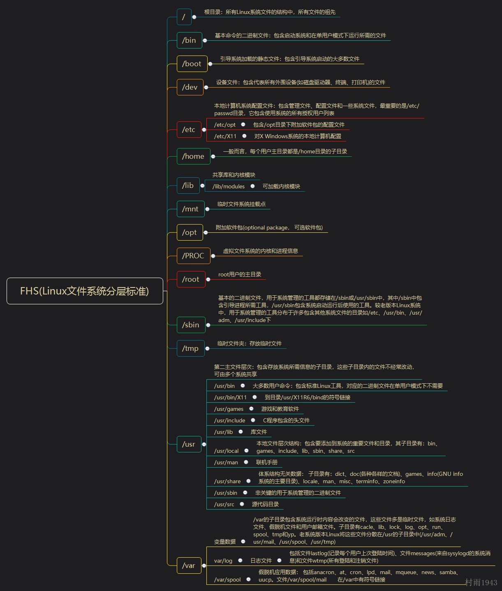

+++
title = "Kali Linux"
date = 2020-07-25

[taxonomies]
categories = ["安全"]
+++

# Linux目录结构

**核心思想：一切皆文件**




------------------


# Linux文件基本属性

Linux是一种典型的多用户系统，终端情况下，可同时登录多个用户。
<!-- more -->

```
0   位   确定文件类型
1-3 位   确定属主（该文件的所有者）拥有该文件的权限
4-6 位   确定属组（所有者的同组用户）拥有该文件的权限
7-9 位   确定其他用户拥有该文件的权限
```

文件类型：

```
d 表示目录
- 表示文件
/ 表示链接文档（link file）
b 表示装置文件里面的可供储存的接口设备（可随机存储装置）
c 表示装置文件里面的串行端口设备，例如键盘、鼠标（一次性读取装置）
```

文件权限：

```
r read 4
w write 2
x execute 1
```

---------------------


# Linux文件操作

### Linux基础命令

**文件管理：**

```
whatis<command>     查看命令的作用
ls                  列出当前目录下的内容
ls -a               列出所有文件，包括隐藏文件
ls -l               列出常数据串（文件属性和权限）
ls -al              
ls -al<目录>         
man<command>        查询命令的说明文档
which               查看文件所在的路径
cd                  进入指定目录
/                   根目录
~                   当前的用户目录
.                   当前目录
..                  上级目录
pwd                 显示当前的路径
mkdir               创建一个新目录
mkdir -m 666        创建并赋予权限
mkdir -p ......     递归创建
touch               创建一个新的文件
cat                 查看文件内容
cp 源文件 目标文件    复制文件
mv 源文件 目标文件    移动（或重命名）文件
mv -f               强制移动，不会询问是否覆盖
mv -i               若目标文件存在，询问是否存在
mv -u               若目标文件存在，且源文件比较新，才会更新
mv /dir/* .       将目录dir下的文件移动到当前目录
file<file>          显示指定文件的文件类型
file -i<显示>        显示MIME类别
chmod               修改文件权限
chmod + ...
chown               将指定文件的拥有者改为指定的用户和 用户组，用户可以是用户名或者用户id，组可以使用组名或者组id
su root             变更使用者身份
su pinginglab       变更使用者身份
sudo                以管理员权限执行命令
sudo -l             列出当前的权限
/etc/sudoers
chown -R            更改指定目录下的所有文件及其子文件的拥有者和所属组
chown -R xxx:xxx*   更改当前目录下的所有文件及其子文件的拥有者和所属组
rmdir               删除空目录
rmdir *             删除所有空目录
cp 源 目             复制文件
cp -i 源 目          若目存在，则覆盖时会询问
cp -r dir dir       递归复制
cp -r 04 05 09 03   复制多个文件到03
cp -s               复制成为符号链接，也叫做捷径文件
rm                  删除文件
rm -f               强制删除，忽略不存在的文件，不会出现警告
rm -i               互动模式，删除之前会问你是否删除
rm -rf xxx          删除指定目录
rm -rf *            删除当前目录下的所有文件
```

**文件内容查看：**

```
cat                  由第一行开始显示内容
cat -n               添加行号显示，空行亦有
cat -T               将Tab键以^I显示出来
cat -v               列出一些看不出来的特殊符号
cat -E               将结尾处的换行符用美元符号显示出来
tac                  从最后一行开始显示，跟cat相反
nl                   添加行号显示，相当于cat -b
more                 一页一页的显示文件内容（查看大型文件）
less                 他可以往前翻页
head                 查看文件前几行，默认是前行
head -n 20           查看文件前20行
tail                 查看文件最后的几行，默认是10行
tail -n 20           
>
null
cat null > xxx
echo                 用于输出字符串或提取shell变量的值
echo"hello">04.txt   覆盖写
echo'命令'            执行命令并将其结果输出到终端
\n                   换行符，相当于回车
echo -e
grep                 用来查找文件里符合条件的内容
grep<要搜索的字符串><要搜索的位置>
grep -r http conf/etc/xxx.conf
| >                  管道符                 
||                   或
&                    后台执行
&&                   与
curl                 下载文件
curl -u              下载文件，提供用户名和密码
zip -r xxx.zip xxx   压缩
unzip xx             解压
tar zcf xxx.tar.gr   压缩
tar zxf              解压
```

**系统管理：**

```
sudo                   以管理员权限运行，必须拥有姓名
su xxx                 变更使用者身份
exit                   退出当前shell
reboot                 重启计算机
shutdown               关机
power off              关闭计算机电源
find                   查找和搜索文件
find<目录> -name<文件名> 查找指定目录下的文件，支持通配符
find      -iname        大小写不敏感
find<目录> -size<大小>   查看指定目录下满足某大小条件的文件
find.                   查找当前目录及其子目录下的所有文件
unname -a               显示系统用户名、 内核版本号、cpu等信息
date                    查看时间
ps -ef                  用于显示所有进程信息
ps -A                   
ps -ef | grep<关键词>    查看指定进程信息
top                     用于实时显示进程的动态
kill                    用于删除执行中的程序
kill<PID>               终止进程
kill -KILL pid          强制杀死进程
kill -9 pid             彻底杀死进程
whoami                  显示用户名
who                     显示当前登录的用户
who -l -H               显示用户登录来源
whois                   查看域名描述信息
whois -p                指定端口查询域名
free                    显示内存使用信息
history                 查看用过的命令
```

**网络：**

```
ping                     检测网络连通性
ing -c 4                 ping 4个包
ping -t                  一直ping
ifconfig                 ipconfig
ip add                   查看网络和配置信息
dhclient                 使用dhcp配置网络接口的网络参数
dhclient eth0            指定网卡上发送dhcp请求
dhclient -r              释放ip地址
nslookup                 显示域名基本信息
ssh root@92.168.1.1      登录指定用户名的主机
ssh 192.168.1.1          登录服务器
ssh root@192.168.1.1 -p 22   登录指定用户名和端口的主机
ssh -t remoteserver1 ssh remoteserver2  从远程主机1跳到远程主机2
ssh l name remoteserver <command>  连接到远程主机并执行远程主机的命令
netstat                  用于显示各种网络相关信息，如路由表、接口状态
netstat -a               
netstat -i               显示网卡列表
netstat -at              显示所有tcp连接
netstat -au              显示所有udp连接
netstat -l               列出监听中的连接
sodu netstat -ntlp       查看进程名、进程号pid、用户id等
netstat -r               显示路由信息
sudo netstat -anp | grep python   检查指定服务是否正常运行
sudo netstat -anp | grep :8000    检查指定端口的服务是否正常运行
nc -nvv 192.168.68.130 8000       扫描8000端口
nc -nvv -w2 -z 192.168.68.130 7900-8000   扫描7900-8000所有端口
nc -l -p 8888             监听本机的80端口
nc -nvv 192.168.1.1 8888  连接到192.168.1.1的tcp8888端口

```

**用户和用户组管理**

/etc/passwd

用户账户的添加、删除、修改

```
useradd或者adduser
suod useradd<用户名>   三无账号：home下没有相应的目录；无密码；无系统shell
adduser<用户名>        创建新账户
useradd -m(创建home目录) -s(用户登陆后使用的shell) /bin/sh blazeboard -g pinginglab   创建新账户
passwd blazeboard     添加新密码
sudo username -g 1000 blazeboard  更改指定用户的组标识号
groupadd blazeboard   创建用户组
groupdel blazeboard   删除用户组
groupmod -n<目标用户组><源用户组>   改名
groupmod -g 1005<用户组名>        更改用户组标识号
```

用户口令的管理

```
passwd  blazeboard     更改用户密码
```

**vim编辑器基础**

三种模式：普通模式、编辑模式、命令模式

```
普通模式:
i进入编辑模式
k j h l光标上下左右移动
x删除当前光标所在的一个字符
dd删除当前行，并把删除的行保存到剪切板中
p粘贴剪切板
a在光标后插入
o（小）在当前行后插入一个新行
O（大）在当前行前插入一个新行
cw替换当前位置到下一个单词结尾
0（零）到行头
$到行尾
yy复制当前行
y复制选中内容
p粘贴
^
g
```

```
编辑模式:
esc从编辑模式退出到普通模式
```

```
命令模式:
:wq保存并退出
:q退出
:q!强制退出
:e<文件路径> 打开一个文件
```


### 换元与软件

sudo nano /etc/apt/sources.list

```
#阿里云
deb http://mirrors.aliyun.com/kali kali-rolling main non-free contrib    
deb-src http://mirrors.aliyun.com/kali kali-rolling main non-free contrib
#中科大                                                           
deb http://mirrors.ustc.edu.cn/kali kali-rolling main non-free contrib   
deb-src http://mirrors.ustc.edu.cn/kali kali-rolling main non-free contrib
```


```
apt updata

```

