+++
title = "Python"
date = 2020-08-27

[taxonomies]
categories = ["安全"]
+++

Python简介

1989年圣诞节开始写Python的编译器

1991 2第一个Python编译器诞生

1994 1Python1.0正式发布
<!-- more -->

2000.10.16 Python2.0发布

2008.23.3 Python3.0发布


版本命名

例如3.8.5

3代表大版本号，一般当整体重写或出现不向后兼容的改变时增加

8表示功能更新，出现新功能时增加

5表示小的改动（比如修复bug），只要有修改就增加


Python的优缺点

优点

1. 简单和明确，做一件事只有一种方法
2. 学习曲线低，容易上手
3. 开源，有强大的生态圈
4. 解释型编程语言，可跨平台支持
5. 对面向对象编程和函数式编程都提供支持
6. 可扩展性和可嵌入性
7. 代码规范程度高，可读性强
8. 使用者广泛

缺点：

1. 执行效率低
2. 代码无法加密
3. 开发的时候可选择的框架太多


应用领域和职位

Python环境搭建

理解程序运行

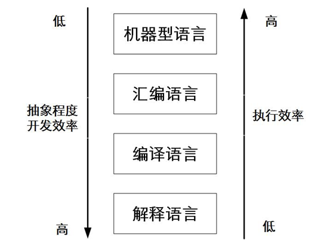


低级语言：
		机器型语言：二进制的0和1，CPU内部工作指令，只有硬件才能读懂，灵活、直接执行和速度快

汇编语言：是一种用于电子计算机、微处理器、微控制器或其他可以编程器件的语言，也称为符号语言，用一些容易理解和记忆的字母或单词来代替一个特定的指令，比如用“ADD”来代表数字逻辑上的加减

高级语言：

编译语言：C/C++

解释型语言：Python   Ruby   Perl

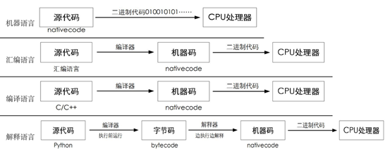


机器语言是二进制执行的，无需翻译过程，CPU可以直接读取。其他语言最终都需统一编译为机器语言执行

汇编语言需要经过一次编译处理，硬件相关无法移植，抽象程度低可读性差，执行效率很高，开发效率很低

编译语言需要一次编译过程，硬件无关可移植，抽象程度高可读性强，执行效率较高，开发效率较高

解释型语言需要经过两次翻译，硬件无关可移植，抽象程度超高，可读性最强，执行效率较低，开发效率最高


Python对象和语言元素

Python的对象

编程的本质便是围绕着“do things”，编程就是”一动一静“

动：解决、处理、执行

静：事情、问题、东西


如何编程？

- 围绕do来做编程，称为面向过程的编程（POP）
- 围绕thing来做编程，称为面向对象编程（OOP)


例如：我要好好学python

从面向过程来看：

1. 收集学习教程：教程   文档    视频
2. 学习语法
3. 项目练手
4. 完成学习

从学习流程入手


从面向对象来看：

对象1：我（人）

对象2：python（物）

对象3：学习（教程   视频   文档）

从学习这件事的对象分解开始


什么是对象？

在python中一切皆对象！

python中，能够被处理、被解决的“东西”，都称之为对象（object）

对象有各自的特性和行为


对象的组成

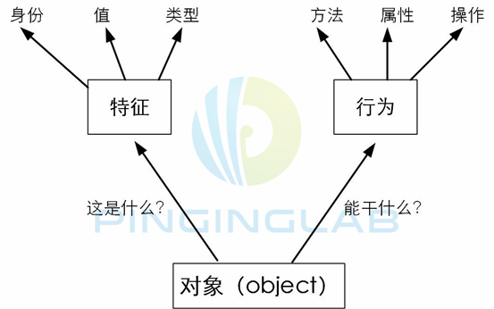


对象的特征：

对象的数据、对象的状态，这是一个静态的信息

值 value ：对象表示的数据项

身份ID：唯一的身份标识，是该对象的内存地址，可以用内建id()来查看

类型type：对象的类型决定了该对象可以保存什么类型的值，可以进行什么类型的操作，以及遵循什么规则，可以通过内建函数type()获得


对象的行为：

对象的操作、功能、方法等，是一种动态信息

方法：通过内建函数dir()来获得


例子：人/程序员/小明

​		   特征：名字   小明   身高 170   体重60kg   年龄18

​		   行为：吃饭   睡觉   学习


对象的类型：

基础对象类型：数字、字符串、列表、元组、字典、集合

进阶对象类型：文件、函数、模块、类

自定义对象类型：类


变量：

在程序设计中，变量是存储数据的载体。


常用的数据类型：

- 整型    在python中只有一个int型，支持二进制、八进制、十六进制等表示法
- 浮点型    除了数学写法（1.23）还支持科学计数法（1.23e2）
- 字符串型    通过单引号或者双引号括起来的任意文本”hello”
- 布尔型    Ture    False    也可以通过布尔计算得出布尔值
- 复数型    与数学上的复数表示一样 3+5j


变量的定义：

变量是一种对象的引用，好比一个链接，指向任意的数据/对象类型

变量→对象（数字、列表、字符串、元组、字典、集合等）

a=1


变量赋值的原理

第一步：创建内存空间，生成对象（1）

第二步：创建变量，名称为a

第三步：将变量a指向对象1


变量的特征

1. 变量在第一次赋值时被创建（内存中）
2. 再次使用该变量时，内存中无需再创建该变量，直接调用。
3. 变量和对象一样，开始的时候不需要进行类型说明
4. 变量在表达式中使用之前必须先赋值
5. 变量在表达式中使用将替换为它们所指向的值
6. 变量如果没有指向一个对象，就会被垃圾回收


变量赋值：

赋值语句：var=value


变量命名规则

硬性规则

变量名由字母、数字和下划线构成，数字不能开头。

变量名长度不受限制，不能使用空格、连字符、标点符号、引号或者其他字符

变量对大小写敏感

不能跟关键字、系统保留字冲突


[-5,256]这个范围内的整数（int），python是用一个smallint数组来维护的，这个范围内的int已经在内存空间创建了内存空间地址。超出这个范围，则会在每次声明的时候分别创建内存空间地址。float和tuple同理


在对变量类型进行转换的时候可以使用python的内建函数

itn()将一个数值或者字符转换成整数

float()将一个字符串转换成浮点数

str()将对象转换成该编码对应的字符串

chr()编码转换成字符

ord()将字符转换成编码


运算符

等于==   不等于!=

身份运算符 is is not

成员运算符 in not in

逻辑运算符 and or not

赋值运算符 = += -= *=

指数 **

下标[]  切片[0:2]


运算符优先级

**优先级最高

乘、除、取模、取整、整除次之

加减再次

/>>右移   <<左移

^|位运算符

比较运算符<= < > >=

赋值运算符

身份运算符

成员运算符

逻辑运算符


\# 通过年份判断是不是闰年（如果是闰年输出True）

\# 4的倍数且不是100的倍数 或者 400的倍数

 

```python
year=int(input('请输入年份'))

 

runnian=(year%4==0 and year%100 !=0 or year%400==0)

print(runnian)
```


Python对象类型之数字

整数：就是我们平常使用最多的数字 1 0 -1

通过进制来区分，分为十进制、八进制（python3:0o）、十六进制（0x）

整数的范围是无穷大，在Python中取决于内存的大小（2**100）


浮点数：就我我们平常使用的小时 10.12

浮点数的范围占8个字节（64比特）正负10的308.25次方

不建议用浮点数做精确计算，会出现误差（计算机在存储数据的时候需要转换成二进制，很多小数转换成二进制是无穷大的，而计算机的存储是有限的，所以需要截取处理）

浮点数计算的时候结果会溢出，整数不会


复数

复数由实部和虚部组成 1+2j

1.1+2.2j


布尔型：

Ture 和 False（首字母必须大写）用于逻辑判断，多用于判断语句中


其他：

分数

空值 None

常量 不变化的量


数字操作运算符

\+ - * / // % ** 

== >= <= < > (布尔值)

and or not 


数字操作内建函数

1. 数值计算函数：

   abs()取绝对值；

   pow()用于进行指数运算；

   round()四舍五入（返回值是整数）round(3.45,1) 1表示保留小数点后一位；

   math.floor()向下取整 必须先导入math模块，才能使用math.floor函数；

   int()直接截取小数部分（返回的是整数）；

   divmod()把除法和取余结合，返回一个包含商和余数的元组divmod(10,3)

2. 类型转化函数

   int()

   complex()将其他数字类型转换为复数 complex(1)

   float()将其他数字类型转换为浮点数float(1)

   bool()转换为布尔值

   布尔类型转换时’’,””0，（）空元组，[]空数组，{}空字典 、0L(长整数)、 0.0+0.0j、 Fasle等转换为布尔值都是False，其他都为True

3. 进制转换函数

   hex() 返回十六进制

   oct() 返回八进制

   bin() 返回二进制

4. ASCII转换函数

   ord() 接收一个字符，转换成对应的数字

   chr() 接收一个数字，转换成对应的字符


数字操作之内置模块

1. math 高级数学计算模块，包含了很多预先编写好的函数代码

   cos()

   sin()

   Pi()

   sqrt()

   

   要使用内置模块，得先将它导入python内存中，通过import命令

   导入之后通过.来进行调用

2. random 随机数学模块。

   randrange() 随机返回（最小值，最大值）之间的一个整数，不包括最大值的

   uniform() 返回两者之间一个浮点数

   choice() 随机返回给点列表的一个元素 random.choice([1,2,3])

3. NumPy

   提供了许多高级数值编程工具，专门为进行严格数字处理而产生的


Python对象类型之字符串

一组有序的字符组合，由字母、数字、符号等信息组成

用于存储和表现基于文本的信息


变量=字符串

s=’hello,world!’

字符串可以通过单引号、双引号、三引号进行包裹

字符串特征：

有序 字符串中的元素按照顺序（从左到右）存储

不可变 

python对象类型根据对象内容本身是否可修改，分为可变对象和不可变对象

可变对象：列表、字典

不可变对象：数字、字符串、元组


字符串操作之操作符

1. 索引操作符 []

   正向索引字符串的下标从0开始，逆向索引从-1开始

2. 切片操作符 [:]

   逆向切片索引从小到大来写 a[-3,-1]

3. 连接操作符 +

4. 重复操作符*

5. 成员操作符 in not in


字符串操作之内置函数

1. 判断函数

s.isalnum() 判断字符串s是否只包含字母和数字，如果是返回True

s.isalpha() 判断字符串s是否只包含字母，如果是返回True

s.isdigit() 判断字符串s是否只包含数字，如果是返回True

s.islower() 判断字符串s是否只包含小写字母，如果是返回True

s.isupper() 

s.isspace() 判断字符串s是否只包含空白(空格)字符，如果是返回True

s.startswith(t) 判断字符串s是否以字符t开头

s.endswith(t)

2. 搜索函数

s.count(t) 搜索字符t并返回出现的次数

s.find(t) 搜索字符t,如果没有找到，返回-1，否则返回t在s中的起始位置下标

s.index(t) 与find相同，返回t在s中的起始位置下标，如果找不到，会触发ValueError异常

s.rfind()

s.rindex()

3. 格式函数

s.center(n,t) 包含n个字符的字符串，其中s位于中间，两边通过字符t填充，t可选

s.ljust(n,t) s位于左边，剩下通过t填充至n

s.rjust(n,t)

s.format(vars) 格式化字符串，类似%

'{0},{1}'.format('hello','world')

'{A},{B}'.format(B='hello',A='world')

4. 剥离函数

s.strip(t) 删除s开头和末尾的t字符，如果t为空默认删除空格，字符串中间的t字符不受影响

s.lstrip(t) 删除s开头的t字符

s.rstrip(t) 删除s末尾的t字符

5. 拆分函数

s.partition(t) 将s拆分为三个字符串（head、t、tail）

s.rpartition(t)

s.split(t)以t为分隔符，将s划分为一系列的子串，并将子串放入一个列表返回

s.rsplit(t)

s.splitlines()返回一个由s中的各行组成的列表

6. 替换函数

s.replace(old,new)将s中的每个old替换为new

s.expandtabs(n)将s中的每个制表符tab替换为n个空格

7. 大小写函数‘

s.lower()

s.upper()

s.captilize()将s的第一个字符改为大写

s.swapcase()将s中的小写字母转化为大写，大写转化为大写

s.title()将s中的每一个单词的首字母大写，其他字母都是小写


字符串操作之字符编码

字符编码

计算机只能读懂二进制的0和1，处理字符时，需要将字符转化为数字存储并处理

将字符与数字相互对应的编码规则就称为字符编码


’A‘    65    01000001


编码分类

1. ASCII 属于最早的编码规则，美国标准信息交换代码，范围是0-127，总共128个字符。采用一个字节八个比特来表示字符，总共支持最多255个字符

语言支持：只能支持英文


2. Unicode  统一码或者万国码

采用2个字节或者4个字节来表示字符，一般采用两个

编码方式UCS

UCS-2   UCS-4

语言支持：所有国家

3. UTF-8

在Unicode中有些字符并不需要两个字节进行存储和传输，例如英文只需要一个字节就可以。Unicode可以看做是一个字符编码的规范，UTF-8是Unicode的存储和传输的实现方式。UTF-8就是在互联网上使用最广泛的一种Unicode的实现方式。

实现方式：

UTF-8 采用八个比特一个字节来作为基础单元

UTF-16

UTF-32


可变长编码，采用1到6个字节来存储和传输字符，一般英文用一个字节，汉语用三个字节，比较复杂 的用四到六的字节，可以有效节省空间

语言支持：所有国家


编码设置，在python中为UTF-8

查看当前编码的方法

import sys

print(sys.getdefaultencoding())

修改编码方式：

可在脚本开头添加：


字符串操作之转义字符

通过转义字符可以在字符串中实现特殊需求，比如回车、换行等功能

如果要使用转义字符，python中用\转义


常见的转义字符

续行符\

反斜杠符\\

单引号\\'

双引号\\"

换行\\n

横向制表符\\t

纵向制表符\\v

回车\\r

退格\\b

响铃\\a

换页\\f

八进制数\\ott     tt代表字符

十六进制数\\xtt


有的情况下需要关闭转义。比如字符串中出现路径的时候

file=open(r ‘C:\new\test.txt’,’w’)     加r


字符串操作之格式化字符串

通过引入字符串，可以实现更加复杂的字符串表达

格式化容许在一条字符串语句执行多字符替换

格式化字符串采用%来引用


格式化语法

‘字符串%d %s’ %(元素1，元素2)

格式化字符串


格式化整数


其他格式化字符

%f格式化浮点数，可以指定精度%.1f

%c格式化字符及其ASCII码


python对象之列表

是一组有序的集合对象类型，可以包括数字，字符串甚至列表等信息

用于存储其他对象信息，支持复杂的数据存储和处理


变量=[元素1，元素2，元素3……]

L=[‘hello’,123,[1,2,3]]

列表的特征：有序  可变


列表操作之操作符

1. 索引操作符[]
2. 切片操作符[:]
3. 连接操作符+
4. 重复操作符*
5. 成员操作符 in not in


列表操作之内置函数

len()获取列表的元素个数（长度）

max()获取列表中最大的值

min()

sum() 将列表元素相加返回和


列表操作之列表内置函数

l.append() 添加元素到列表末端

l.insert() 添加元素到具体索引位置 l.insert(1,10)  1代表下标

l.extend() 在本列表末尾添加其他列表的元素，等于连接操作符


列表删除

l.pop() 默认删除列表末尾的元素并返回删除掉的元素，也可以指定索引删除

l.remove() 删除某个指定的元素（如果出现重复，匹配第一个选项）


列表搜索

l.count() 统计某个元素在列表中出现的次数

l.index()找出列表某一个元素第一次出现的索引位置


列表排序

l.reverse() 翻转列表位置

l.sort() 对列表进行由小到大的排序


列表操作之列表解析

列表解析就是通过特定的表达式简洁方便生成新的列表，包括列表迭代和列表生成式

语法：[X for Y in Z]\[X for Y in Z if]

X是需要得到的结果，Y是遍历的参数，Z是遍历对象


Python对象类型之元组

元组（tuple）是一组有序不可变的集合对象类型，可以包括数字，字符串甚至是列表、元组等信息。与列表相比，元组的内容不可变，并且采用小括号来创建，其他特性基本相同


那什么时候用列表什么时候用元组？

若对象内容操作时要求是只读的，建议用元组，更加安全

若经常需要修改对象内容时，建议用列表，否则每次对元组进行修改时，就必须创建新的元素

通过list()    tuple()可以进行互相转换


元组语法：变量=(元素1，元素2，元素3……)

T=(‘hello’,123,(10.20))

如果要创建一个单元组，元素后面必须加逗号

单元素列表不存在这个问题


元组的特征：有序   不可变


元组操作之操作符

1. 索引操作符[]
2. 切片操作符[:]
3. 连接操作符+
4. 重复操作符*
5. 成员操作符


元组操作之内置函数

t.count()统计某一个元素在元组中出现的次数

t.index()找出元组中某一个元素第一次出现的索引位置


Python对象类型之字典

字典是一种无序集合对象类型，可以存储任意的数据类型

字典也是Python中唯一的映射类型，通过“key-value”键值对方式来存储数据

与列表相比，字典是无序的，列表是有序的；列表采用的是偏移位置来存取，字典采用的是键/散列映射来存取，速度快效率高。列表虽然速度慢，但是内存消耗小。


字典的语法：变量={键1:值1,键2:值2,…}

d={‘A’:1,‘B’:2,’C’:3}


字典原理

字典哈希原理

哈希的作用：一般是用来做完整性校验，通过哈希算法（md5  sha 等）将不同大小的输入，输出一个固定值（128bit或者160bit）

特点：不可逆，雪崩效应，唯一性

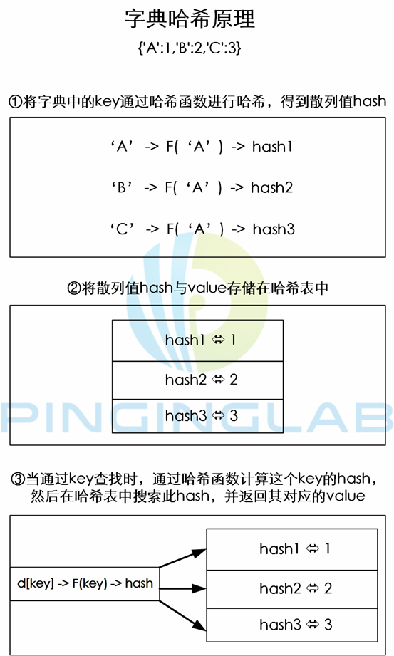

字典特征：

无序：字典没有按照索引位置存储，而是按照散列映射关系存储

可变：键是不可变的，并且必须是唯一的，而值是可变的，相同的值可以出现在同一个字典里


键只能由数字、字符串、元组等不可变的对象组成，不能用列表

一个键只能对应一个值，如果有多个值，后面的值会覆盖前面的值


字典操作之操作符

1. 查找操作符 

   d[k]   通过键k查找字典中元素的值

   d[k]=v  通过键k，给字典某元素赋值为v，如果没有键k，则创建。

2. 成员操作符 in not in

字典操作之内置函数

d.items() 返回一个由字典d的键-值组成的视图

d.keys()返回一个由字典d的键组成的视图

d.values()返回一个由字典d的值组成的视图

d.get(key)返回与key相关联的值

d.pop(key)删除键key并返回相关联的值

d.popitems()删除某个键值对，返回删除掉的键值对

d.clear()清空字典

d.copy()复制字典

d.update(e) 将e中的键值对添加到d中

d.setdefault(key,value)如果键key包含在字典d中，则返回其值，否则，返回value并将(key,v)添加到字典d中。


Python对象类型之集合

集合（set）是一种无序不重复对象类型。类似字典，但是只有键没有值

消除重复元素，可以实现交并补差等数学运算


集合语法：set(列表/字符串)

list=[1,2,3,1,2,4]

s=set(list)


集合特征

无序：类似字典，没有索引，不支持切片和索引访问

不重复：每个元素在集合中都是唯一的

可变：set()可以增加删除元素

不可变：frozenset()不可以增删元素


集合操作之操作符

1. 交集 &
2. 并集 |
3. 差集 -(获取集合中不同元素，不同元素在s1中) ^(获取集合中不同元素，元素在不同集合中，并集减去交集)


集合操作之内置函数

s.intersection() 交集

s.union() 并集

s.difference() 等于差集-

s.symmetric_difference 等于差集^

s.add() 增加元素

s.update() 增加集合中的元素（集合叠加）

s.remove()删除特定元素，如果没有该元素则报错

s.discard() 删除特定元素，如果没有该元素不报错

s.pop() 删除一个元素

s.clear() 清空集合

s.issubset() 判断是不是子集

s.issuperset() 判断是不是包含集合


Python的流程控制

条件语句

if 条件判断1:

​	代码块1

elif 条件判断2:

​	代码块2

elif 条件判断3:

​	代码块3


条件表达式

也称为三元操作符，是if语句的缩写格式

A=Y if X else Z  如果X为真，A=Y，否则A=Z

```python
if x:

	A=Y

else:

	A=Z
```


循环语句

while循环

语法：

while 条件判断：

  循环代码块

for循环

循环控制

 

while循环例子

 

输出1到10

```python
n=0

while n<10:

  n=n+1

  print(n)
```

 

输出1到10数字相加的结果

```python
n=0

sum=0

while n<10:

  sum=sum+n

  n=n+1

 

print(sum)
```

 

while也可以和else结合

```python
while n<10:

  n=n+1

  print(n)

else:

  n=-n

  print(n)
```

 

for循环

语法 for X in Y

X是变量，Y是可迭代对象（可以是字符串、列表、元组、字典、函数等）

 

遍历字符串

 

for循环结合else语句

```python
l=[1,2,3,4,5]

for x in l:

  l=x*x

  print(l)

else:

  print(x)
```

 

当循环执行完之后则执行else语句

 

for循环结合range()

range()函数可以生成整数列表

range(x,y)会生成x到y-1的整数列表

range(start,end,step) step代表每次递增多少，默认是1

range的返回值不等于end，可以等于start

 

for x in range(1,10,2):

  print (x)

 

 

循环控制

break：用于for循环或者while循环中，用来终止整个循环语句

```python
n=0

while n<10:

  n=n+1

  if n==8:

​    break

  print(n)
```

 

continue：用于for循环或者while循环中，用来终止本次循环

```python
n=0

while n<10:

  n=n+1

  if n==8:

​    continue

  print(n)
```

 

pass：用于循环语句、条件语句、函数语句中，主要作用是占空，保证语句的完整。

 

猜数字游戏

随机一个1-100的数字来猜，根据猜测的数字分别给一个提示（大了，小了或者猜对了），猜对之后返回猜测了几次

```python
import random
answer=random.randint(1,100)
counter=0
while True:
	counter+=1
	number=int(input('请输入猜测的数字:'))
if number>answer:
	print('猜大了')
elif number<answer:
	print ('猜小了')
else:
	print('恭喜你猜对了')
	break
if counter>8:
	print("你是傻子吗？")
print ('随机数是%d'%answer)
print('你总共猜了%d次'% counter)
```

 

输出一个九九乘法表

 

```python
for i in range(1,10):
	for j in range(1,i+1):
		print('%d*%d=%d'%(i,j,i*j),end='\t')
print()
```

 

迭代器

 

迭代（Iteration）指的是对可迭代对象进行从头到尾遍历的过程，例如for循环的底层原理就是一个迭代

迭代器（iterator）指的是通过iter()函数返回的一个支持next()方法的对象

迭代方法

iter() 通过iter()可以获得可迭代对象，默认可迭代对象没有next()函数，通过iter()迭代函数赋予next()

 

next（）返回可迭代对象中的下一个元素，如果检查到StopIteration异常终止迭代

 

可迭代对象：列表、元组、字符串、字典、文件

 

迭代的原理？

可迭代对象在进行遍历的时候，自动调用iter()获取迭代器，自动调用next()方法获取下一个元素

 

```python
for i in [1,2,3]
l=[1,2,3] ----> iter(l)--next(l)
```

 

手工迭代列表

```python
l=[1,2,3]
I=iter(l)
I
next(I)
```

 

```python
class Fab(object):
    def __init__(self,max,):
        self.max=max
        self.n,self.a,self.b=0,0,1
    def __iter__(self):
        return self
    def __next__(self):
        if self.n < self.max:
            out = self.b
            self.a,self.b=self.b,self.a+self.b
            self.n = self.n+1
            return out
        raise StopIteration()
    
for i in Fab(6):
    print(i)
```


通过try…except…自动迭代列表

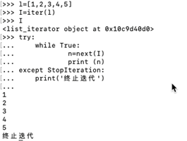

 

 

通过for循环自动迭代列表

 

列表解析

动态的创建列表

列表解析是迭代技术的一个应用，采用for循环和迭代函数动态生成列表，简洁方便

 

[X for Y in Z]

[X for Y in Z if J]

 

生成器表达式

生成器（generator）是特定的函数，容许返回一个值，然后“暂停”代码的执行，稍后恢复

 

生成器函数

在Python中，带有yield的函数称之为生成器，使用yield语句一次返回一个结果，在每一个结果之间挂起和继续它们的状态。

 

生成器表达式是生成器的应用，是列表解析和生成器的结合。

生成器表达式是按需返回产生结果的一个对象，而不是返回一整个结果列表

列表解析是直接生成最终的列表，而生成器表达式按需生成更加节省内存空间

 

语法

（X for Y in Z）

列表解析用中括号，生成器表达式用小括号

 

练习1：寻找水仙花数

如果一个位数等于其他各位数字的立方和，则这个数就称为水仙花数

求100-999之间的水仙花数

 

```python
for i in range(100,1000):

  a=i//100

  b=(i-a*100)//10

  c=(i-a*100-b*10)

  if i==a**3+b**3+c**3:

​    print(i)
```

 

 

```python
for i in range(100,1000):

  a=int(str(i)[0])  # '153'

  b=int(str(i)[1])

  c=int(str(i)[2])

  if i == a**3+b**3+c**3:

​    print(i)
```

 

练习2：寻找1000以内的完美数

找出一个数的所有因数（约数），如果这些因数（除去它本身）的和等于该数，则它就是完美数

 

```python
l=[]

for i in range(1,1001):

  k=0

  for j in range(1,i):

​    if(i%j==0):

​      k=k+j

  if i==k:

​    l.append(i)

print(l)
```

 

 

 百鸡百钱问题

 

百钱买百鸡：现有100钱，公鸡5文钱一只，母鸡3文钱一只，小鸡一文钱3只 要求：公鸡、母鸡，小鸡都要有，把100文钱花完，买的鸡的数量正好是100。 问：一共能买多少只公鸡，多少只母鸡，多少只小鸡？

 

\

```python
# a+b+3c=100

\# 5a+3b+c=100

for a in range(1,20):

  for b in range(1,34):

​    for c in range(1,100):

​      if a+b+3*c==100:

​        if 5*a+3*b+c==100:

​          print("公鸡：%d只\n母鸡：%d只\n小鸡：%d只\n"%(a,b,3*c))
```

 

 

```python
for gongji in range(1,101):

  for muji in range(1,101):

​    for xiaoji in range(1,101):

​      if gongji*5+muji*3+xiaoji==100:

​        if gongji+muji+3*xiaoji==100:

​          print('公鸡有%d只,母鸡有%d只,小鸡有%d只'%(gongji,muji,3*xiaoji))
```

 

```python
for gongji in range(5,101,5):

  for muji in range(3,101-gongji,3):

​    for xiaoji in range(1,101-gongji-muji):

​      if gongji//5+muji//3+xiaoji*3==100 and gongji+muji+xiaoji==100:

​        print('公鸡有%d只,母鸡有%d只,小鸡有%d只'%(gongji//5,muji//3,xiaoji*3))
```

 

 

Crap摇骰子游戏

玩家摇两颗骰子，如果第一次摇出7点或者11点，玩家胜

如果摇出2点、3点、12点，庄家胜

其他情况继续游戏

玩家再次摇骰子，如果摇出7点，庄家胜

如果摇出第一次摇的点数，玩家胜

否则游戏继续，玩家继续摇骰子

玩家进入游戏的时候有1000元赌注，全部输光游戏结束

 

```python
from random import randint #从random模块导入randint函数

 

money=1000

while money>0:

  print('你的资产为：',money)

  needs_go_on=False

  while True:

​    xiazhu=int(input('请下注:'))

​    if xiazhu>0 and xiazhu<=money:

​      break

 

  first=randint(1,6)+randint(1,6)

  print('玩家摇出的点数是%d点：'%first)

  if first==7 or first==11:

​    print('玩家胜！')

​    money+=xiazhu

  elif first==2 or first==3 or first==12:

​    print('庄家胜！')

​    money-=xiazhu

  else:

​    needs_go_on=True

​    

  while needs_go_on:

​    second=randint(1,6)+randint(1,6)

​    print('玩家摇出的点数是%d点：'%second)

​    if second==7:

​      print('庄家胜！')

​      money-=xiazhu

​      needs_go_on=False

​    elif second==first:

​      print('玩家胜！')

​      money+=xiazhu

​      needs_go_on=False

 

print('你已经破产了！')  
```


Python函数

函数是一组可重复使用，有特定功能的代码块

 

函数功能：

可以重复使用

减少程序代码量

提高代码的可读性

 

函数的原理

调用函数 （调用Python内建函数）

通过为函数传入参数，即可得到相关的返回结果

函数使用过程中，我们无需知道函数内部的实现原理

不同函数需要参数的个数和类型是不同的

 

创建函数

def 函数名（参数）：

   ‘函数说明’

   函数代码块（函数体）

   return xx

 

函数名与变量的命名规则是一样的，可以包括下划线、数字、字母等

括号内可以设置参数，也可以没有参数

函数说明是可选，用于解释该函数的功能，对程序员更加友好

函数代码块采用的是4个空格缩进，由变量、参数、表达式等语句组成

return为函数的可选部分

若不包括return，这个函数被称为“不返回值函数”，相当于return None

若包括return，这个函数被称为“返回值函数”

不带参函数

```python
def hello():

  print('hello,world')

 

hello()
```

 

带参函数

```python
def hello(name):

  print('hello',name)

 

hello('xiaoming')

 
```

返回值函数

```python
def hello(name):

  print('hello',name)

  return name*2

 

hello('xiaoming')
```

 

带函数说明函数

```python
def hello(name):

  '''这是一个hello函数'''

  print('hello',name)

  return name*2

 

hello('xiaoming')

print(hello.__doc__) #用来查看函数说明
```

 

函数参数

\1.   位置参数

函数根据位置顺序将参数传入函数

```python
def sum(a,b)

  return a+b

 

sum(1,2)
```

 

\2.   默认参数

函数将部分参数指向默认值，后续可以不用为此参数传入值。如果默认参数所在位置有传入值，则默认参数指定的值被覆盖

\3.   关键字参数

使用关键字参数容许函数在调用时参数的顺序与声明时不一致。

```python
def sum(a,b):

  c=a+b

  print(c)

 

sum(b=2,a=3)
```

 

\4.   可变长参数

非关键字可变长参数（*元组）

def func(*tuple)

通过*获取可变数量的参数，并全部放入元组

```python
def f(*args):

  print(args)

 

f(1,2,3)
```

 

关键字可变长参数（**字典）

def func(**字典)

通过**获取可变数量的参数，并全部放入字典

```python
def f(**dict):

  print(dict)

 

f(a=1,b=2,c=3)
```

 

```python
def doprint(name,age=18,*list):

  print("姓名:%s 年龄:%d"%(name,age))

  for i in list:

​    print(i)

 

doprint('xiaoming',19,'hello','world')
```

 

\5.   混合参数

函数在定义参数列表时，可以同时包含位置参数，默认参数，关键字参数，可变参数

混合参数需要按照特定位置放置：位置参数-默认参数-可变参数

```python
def func(x,y=1,*tuple,**dict):

  print(x)

  print(y)

  print(tuple)

  print(dict)

 

func(10,20,30,40,j=33)
```

 

在混合参数中，不能使用关键字参数，在调用函数传参的时候，不要使用赋值语句（字典传参例外）

 

变量作用域

在函数内部定义的变量称为局部变量

变量的作用域指的是该变量能够被使用的范围

局部变量只能在其所属函数中使用

在函数外面，不能访问函数的局部变量

```python
def A():
    a=1
    print(a)

def B():
    a=2
    print(a)

a=3
print(a)
```

全局变量

在函数外部定义的变量称为全局变量

全局变量能够被整个程序范围调用

```python
def C():
    c=a+b
    print(c)

a=10
b=10

C()

name='xiaoming'
def hello():
    global name #调用外部变量
    name='haha' #重新赋值
    print('Hi',name)

hello()
print(name)
```


函数式编程

函数式编程是一种高级的编程方法，采用一系列的函数来解决问题，函数式编程是一种面向过程的实现，数据经过不断的输入输出处理。函数式编程采用高阶函数来实现复杂的处理。支持递归、闭包、装饰器等高级特性。


什么是高阶函数？

高阶函数至少包含以下条件之一：

函数作为参数被传入

函数作为结果被输出

lambda/map/reduce/filter 等内置函数、返回函数、递归函数、装饰器等都是高阶函数的应用和实现


内置高阶函数

lambda函数：

匿名函数，当需要一个函数但是不需要这个函数名称的时候，就可以通过lambda表达式来实现 


语法：lambda 参数:表达式

​			lambda x,y:x+y

```python
a=lambda x,y:x+y
print(a(1,2))
```

 

map函数

map函数接收两个参数，第一个是函数，第二个是列表（可迭代对象）

将函数作用在列表的每个元素上，然后创建由每次函数应用组成的返回值里面

map函数能够用列表解析表达式来实现

map(函数,列表) 

```python
a= map((lambda x:x*x),[1,2,3])
print(a)
显示的结果是map对象，不会出现列表[1,4,9]

a=list(map((lambda x:x*x),[1,2,3])) #转换为列表对象
print(a)

等价于：
def a(x):
    return x*x
l=[1,2,3]
map(a,l)
```


reduce函数

与map类似，也是接收函数和列表

区别在于reduce将列表中两个元素放入函数计算得到值，然后将值和列表中的下一个元素再放入函数计算得到另一个值，最终会得到一个值

语法：

reduce(函数,列表)

reduce(func,[1,2,3]) 

```python
from functools import reduce
a=reduce((lambda x,y: x+y),[1,2,3,4])
print(a)
```

Python2中可以直接调用reduce函数，Python3需要从模块functools先导入


filter函数

是一个过滤函数，根据Ture或者False来决定最终的结果，如果是True则保留下来


filter(函数,列表) 

```python
def pos(n):
    return n>0
a=list(filter(pos,[-1,1,0,2,-2,3])) #可以转换成list来查看结果
print(a)
```

返回函数

函数作为结果被输出

```python
def sum(x,y):
    def sum1():
        return x+y #里层函数调用外层函数的参数，属于闭包
    return sum1  #sum1是里层函数，在这里被当做结果输出，所以这是一个返回函数

a=sum(1,2) #创建变量a，赋值为函数sum()，传入参数1，2
print(a())

def closure():
    i=10
    def clo2():
        return i*i #底层调用外层函数的变量，也属于闭包

    return clo2

a=closure()
print(a())
```

闭包

如果在一个内部函数里，对在外部作用域（但不在全局作用域）的变量进行引用，那么内部函数就被认为闭包（closure） 


装饰器（闭包是调用变量，装饰器调用函数）

decorator采用函数作为参数，然后对此函数进行装饰，增强其功能。装饰器可以为函数增加功能，但是无需修改原有函数内部结构

装饰器是闭包的高阶应用

闭包是内部函数调用外部函数的变量，装饰器是调用函数


1. 定义装饰器

   ```python
   def deco(func):
   
   ​	def wrapper()
   
   ​		函数体包括func
   
   ​	return wrapper
   ```

   

2. 定义函数

   ```python
   def func():
   	函数体
   ```

   

3. 装饰函数

   ```python
   @deco
   
   def func():
   
   ​	函数体
   ```

例子1：不带参数的装饰器

```python
def deco(func):
    def wrapper():
        print('this is a decorator')
        return func()
    return wrapper

@deco
def f():
    print('this is a function')

f()
```

例子2：带参数的装饰器

```python
def deco(func):
    def wrapper(n):
        print('this is a decorator',n)
        return func(n)
    return wrapper

@deco
def f(n):
    print('this is a function')

f('test')
```

 **注意：：：**

```python
def f():
    print('this is a function')
    return 555
print(f()) 
# 输出：
# this is a function
# 555
```


```python
def deco(func):
    def wrapper():
        print('this is a decorator')
        return func()
    print(wrapper)
    return wrapper

@deco
def f():
    print('this is a function')

f()

# 输出：
# <function deco.<locals>.wrapper at 0x04C02268>
# this is a decorator
# this is a function
```


```python
def deco(func):
    def wrapper():
        print('this is a decorator')
        return func()
    print(wrapper())
    return wrapper

@deco
def f():
    print('this is a function')

f()

# 输出：
# this is a decorator  第5行输出
# this is a function   第5行输出
# None                 第5行输出
# this is a decorator  第4行输出（由于第6行的存在）
# this is a function   第4行输出（由于第6行的存在）
```


```python
def f():
    print('this is a function')

def wrapper():
    print('this is a decorator')
    return f()
print(wrapper())

f()

# 输出：
# this is a decorator  第7行输出
# this is a function   第7行输出
# None                 第7行输出
# this is a function   第9行输出
```


递归函数

若函数内部调用自身，这个函数就是递归函数

```python
def fact(n):
    if n==1:
        return 1
    else:
        return n*fact(n-1)

print(fact(5))
```


生成器

在Python中，带有yield的函数被称之为generator（生成器）

生成器是特定的函数，允许返回一个值，然后“暂停“代码的执行，稍后恢复

使用yield语句一次返回一个结果，在每个结果之间挂起和继续它们的状态

通过生成器，可以节省内存空间，使得函数的结果散落在不同时间的请求上


```python
#编写一个生成器函数
def num():
    print('first')
    yield
    print('second')
    yield
    print('third')
    yield
    print('over')

#产生生成器对象
a=num()
print(next(a))
```


return和yield区别

return返回结果并结束函数

yield返回结果并挂起当前状态，并与下次再执行


```python
def abc(N):
    sum=0
    for i in range(N):
        sum+=i
        yield (sum)
```


Python模块

模块是一系列函数、变量、类的组成

Python程序是有一系列的模块文件组成，一个.py的文件就是一个模块

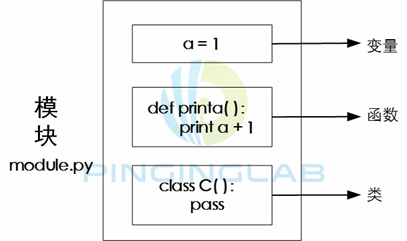

模块的功能

提高代码重用率：需要用到某些函数，直接调用某个模块即可，无需重复编写

提高程序层次性：不同功能函数放入不同模块，可以提高逻辑性和层次性

方便协作防止冲突：函数和变量在不同模块下可以有同样命名，但是不会冲突。这样多人协作时，即便命名冲突也不会干扰


模块原理

1.模块创建

用代码编辑器编写代码并保存为py文件

 

2.模块导入

import Module

导入整个模块到内存

采用点号调用函数或者变量 Module.func1

不会覆盖本地命名（变量、函数等）

 

from Module import Func

导入模块某个函数或变量到内存中

直接调用此函数或者变量

会覆盖本地某个相同命名（变量或者函数等）

 

from Module import *

导入整个模块到内存

直接调用此模块所有函数或者变量

会覆盖本地某个相同命名（变量或者函数等）

 

Python只会导入同一个模块一次，若再次通过import或者from命令导入同一个模块，Python不会重新加载，而是直接从内存中寻找

 

reload Module 重新加载模块

 

模块导入的流程

\1. 搜索模块路径

\2. 编译成字节码（执行更快）

\3. 将模块定义的函数、变量、类等导入运行

 

模块路径

搜索路径

\1. 程序运行目录（Python安装目录）

\2. 环境变量设置的（PYTHONPATH）

PYTHONPATH是设置包括Python程序文件的目录的列表，这些目录可以是用户自定义的或者平台特定的目录名

\3. 标准库模块目录

标准库模块目录存储python内置的模块文件。Python会自动搜索标准库模块的路径

\4. .pth文件

查看路径

sys.path

pytthon会将模块搜索路径统一存储在sys模块中的path变量中

sys.path包括程序运行路径、PYTHONPATH、标准库路径，这些路径都以列表来存储

 

配置路径

\1. 通过sys.path来添加模块搜索路径

sys.path.append(‘路径’)

 

\2. 通过环境变量PYTHONPATH增加模块搜索路径

set PYTHONPATH=’路径’

 

\3. 通过文件.pth增加模块搜索路径

在site-packages路径增加一个路径文件，如sitepath.pth，再往该文件中添加模块所在路径即可。


模块互导

模块和模块之间可以相互导入

 

拓展

if __name__==’__main__’:

当模块直接执行时，模块的名字为‘__main__’

当模块被导入时，模块的名字是模块本身

一般情况下，在模块里面的测试代码例如print等输出，我们可以放置在这个判断语句后面，这样其他人调用我们的模块时，就不会有额外的输出

 

模块进阶

\1.   命名空间和作用域

命名空间是名字和对象的映射，命名空间是一个字典，其中键是名字，值是对象。

内建函数、函数、模块、类都有自己的命名空间

命名空间分为：

python的built-in names（内置命名，包括内置函数，内置常量，内置类型）

模块的全局名称 global names（模块命名，这个模块定义的函数，类，变量）

函数的局部名称 local names（函数命名）

 

函数命名-本地命名空间

模块命名-全局命名空间

内置命名-外层命名空间

 

命名空间通过__dict__属性和dir()函数来查看，可以看到模块能使用的方法属性，以及模块中的函数和变量

 

\2.   作用域

表示命名空间可被访问的范围

根据Python的命名空间，作用域有下面几个：

内部函数的局部作用域

外层函数的局部作用域

模块的全局作用域

Python内置对象的外层作用域

 

函数定义了本地作用域，模块定义了全局作用域

 

\3.   LEGB查找规则

当引用一个变量时，python按照以下顺序来查找：

先从内层函数的本地作用域查找，如果没有再查找外层函数的本地作用域，如果没有再查找全局作用域，最后查找外层作用域

 

LEGB规则：Local-Enclosed-Global-Built-in

本地作用域例子

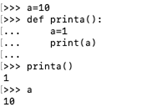

 

enclosing作用域

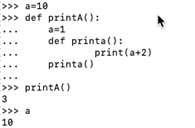

 

global作用域

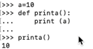

 

built-in作用域

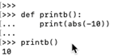

 

\4.   模块互导作用域的影响

验证import Module

验证 from Module import x

验证 from Module import *

 

 

包

包是一种层次化的程序组织结构，由一系列的子包和模块组成

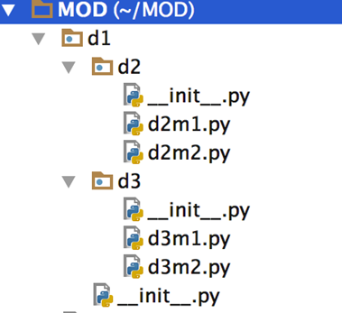

包类似于模块，也可以通过import和from导入，通过点号进行访问

与模块最大的不同是，包通常是由模块和__init__文件组成

包导入语句的路径中，每一个目录内都必须有__init__.py文件，如果没有导入包会失败

__init__.py是一个初始化模块，Python首次导入某个目录时，会自动执行该目录下__init__.py文件中的所有代码

__init__.py可以是一个空文件，也可以为包执行初始化语句或设置变量等

 

导入语法

import d1

from d1.d3 import d3m1

 

包的功能：

解决模块命名冲突

简化模块搜索路径设置

实现模块与模块之间的关联

方便大型程序层次化组织

方便第三方组件拓展（第三方组件可以通过包来进行分发）

 

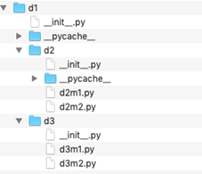

如果包目录中，所有模块的名字是唯一的，导入的时候可以使用from…import语法来导入

如果模块名字有重叠，就通过import来导入，调用的时候采用点号方法，保证唯一性

 

包管理工具

包管理涉及打包、分发、下载、编译、安装等环节，不同环境由不同的包管理工具来执行

常见的包管理工具

distutils 可以实现包分发、安装等功能，是Python内置的包管理工具 通过setup.py执行

setuptools distutils的增加版，实现包分发、安装、下载、管理功能 通过ez_setup.py来安装setuptools

 

easy_install 

pip

distribute 是setuptools的增强版

 

 

打包例子

打包的准备工作：

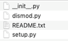

下面是setup.py的设置


 

执行打包的命令，在setup.py文件的路径下，调用python

python3 setup.py +发布格式

发布格式有两种：sdist bdist

sdist:创建源码发行包 默认的发布格式为gztar tar zip等（tar.gz）

bdist:创建二进制发行包 发布格式有rpm msi wininst (exe)

 

打包好之后可以把它发布到互联网，其他人下载之后可以这样来安装：

tar -zxvf d1-1.0.tar.gz 解压

cd d1-1.0 进入解压后的目录下

python3 setup.py install 执行包安装

 

如果要在windows安装，打包的时候发布格式可以选择bdist（python3 setup.py bdist_wininst）会生成exe安装文件，安装的时候直接双击安装即可。


Python面向对象-类

类的定义

类（class）是设计蓝图，用来创建不同类型的对象。Python内置有数字、字符串、列表、字典等对象，这些内置对象已经有规定好的属性和方法。如果需要创建新的对象类型。则需要使用类。

类是一种数据结构，可以用来定义对象，将数据值和行为特征结合在一起

类指定了对象将包含哪些数据和函数，数据一般是变量，函数一般我们称之为方法

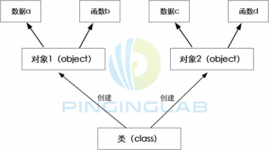


人（类）—小明（实例）—10岁，吃饭

​			   —小红（实例）—9岁，睡觉


类的功能：

对事物进行高度的抽象，提高代码的重用率（类可以创建子类和超类），提高程序的层次性（类支持继承）


类的语法：

class ClassName:

​	‘类的说明’

​	类的主体（定义类的数据属性和方法）

```python
class Person:
    'the person class'
    name='xiaoming'  #变量属于类的数据属性
    age=10

    def printname(self): #函数属于类的方法属性
        print(self.name)

    def printage(self):
        print(self.age)
```


构造函数，用于给实例/对象初始化参数，构造函数中第一个参数必须是self，代表实例或对象本身

```python
class Person:
    'the person class'
    def __init__(self,name,age,gender): #构造函数
        self.name=name
        self.age=age
        self.gender=gender

    def printage(self): 
        print('%s:%d'%(self.name,self.age))

    def printgender(self):
        print('%s:%s'%(self.name,self.gender))
```


类的实例

类是现实世界的抽象的实体，以编程的形式出现，而实例（instance）则是这些对象的具体化

通过实例化，类的方法属性才可以被调用，类的数据属性才可以被访问

```python
class Person:
    'the person class'
    def __init__(self,name,age,gender): #构造函数
        self.name=name
        self.age=age
        self.gender=gender

    def printage(self): 
        print('%s:%d'%(self.name,self.age))

    def printgender(self):
        print('%s:%s'%(self.name,self.gender))

Xiaoming=Person('xiaoming',10,'male')  #创建实例，并传入三个参数给构造函数
Xiaohong=Person('xiaohong',9,'female')

print(Xiaoming.name)  #访问实例的数据属性
print(Xiaoming.age)
print(Xiaoming.gender)

print(Xiaohong.printage())  #访问实例的方法属性
print(Xiaohong.printgender())
```


类的属性

类的属性由数据和方法两部分组成，可以通过点号方式来访问

数据属性存储数据和变量值，方法属性存储操作数据的函数


调用语法：

实例.value

实例.method


属性访问

访问数据属性

数据属性仅仅是所定义的类的变量，数据属性就是静态变量和静态数据


类.value

实例.value

```python
class Person:
    version=1.0  #数据属性
    'the person class'
    def __init__(self,name,age,gender): 
        self.name=name
        self.age=age
        self.gender=gender

    def printage(self): 
        print('%s:%d'%(self.name,self.age))

    def printgender(self):
        print('%s:%s'%(self.name,self.gender))

Xiaoming=Person('xiaoming',10,'male')  
Xiaohong=Person('xiaohong',9,'female')

print(Xiaoming.version) #通过实例来访问数据属性
print(Person.version)  #通过类来访问数据属性
```


访问方法属性

类中定义的函数，称之为方法，方法有应用范围，只能在类里面，要调用方法，必须先实例化。

类中函数的原理：

1. 类内部的函数与其他的函数没有太大的区别，也可以设置默认参数、关键字参数等
2. 类中所有的函数的第一个参数必须是self，创建实例时，实例名来代替self

下面这个例子是方法属性有self参数

```python
class Person():
    version=1.0
    def printver(self):
        print(self.version)

P=Person()
P.printver()
```

下面这个例子是方法属性没有self参数

```python
class Person():
    version=1.0
    def printver():
        print(self.version)

P=Person()
P.printver()
```

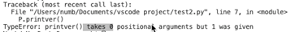

调用函数时，实例P将自己传入，但是因为没有参数self，所以传入失败

3. 很多类的第一个函数是构造函数，如果有构造函数，类在实例化的时候，不能传入空参数，必须传入与构造函数里面设置的参数匹配的参数

下面这个例子没有构造函数：

```python
class Person():
    version=1.0
    def setversion(self,v):
        self.v=v

    def printver(self):
        print(self.v)

P=Person()
print(P.version)
P.setversion(2.0)
print(P.printver())
```

下面这个例子有构造函数：

```python
class Person():
    version=1.0
    def __init__(self,v):
        self.v=v

    def printver(self):
        print(self.v)

P=Person(3.0)
print(P.version)
print(P.printver())
```

绑定限制：

```python
class Person:
    version=1.0  #数据属性
    'the person class'
    def __init__(self,name,age,gender): 
        self.name=name
        self.age=age
        self.gender=gender

    def printage(self): 
        print('%s:%d'%(self.name,self.age))

    def printgender(self):
        print('%s:%s'%(self.name,self.gender))

Xiaoming=Person('xiaoming',10,'male')  
Xiaohong=Person('xiaohong',9,'female')

print(Person.printgender()) #Python有严格要求，没有实例，方法/函数都不能被调用，这种限制称为绑定
```

属性修改：

```python
class Person:
    version=1.0  #数据属性
    'the person class'
    def __init__(self,name,age,gender): 
        self.name=name
        self.age=age
        self.gender=gender

    def printage(self): 
        print('%s:%d'%(self.name,self.age))

    def printgender(self):
        print('%s:%s'%(self.name,self.gender))

Xiaoming=Person('xiaoming',10,'male')  
Xiaohong=Person('xiaohong',9,'female')

print(Person.version)
print(Xiaoming.version)

Xiaoming.version=2.0
print(Xiaoming.version) #实例属性修改不影响类属性
print(Person.version)

print(Xiaoming.age)
Xiaoming.age=11
print(Xiaoming.age)
```

属性增加：

```python
Xiaoming.aihao='xuexi'
print(Xiaoming.aihao)
```

查看属性：

dir（）__ __dict____


特殊类属性：

特殊类属性的命名方式以__value__方式命名，前后都有两个下划线

特殊类属性是Python的内置属性，所有创建的类默认都有


c.__doc__ 查看类c的文档字符串

c.__dict__ 查看类c的属性

c.__name__ 查看类名      

c.__module__ 查看类c定义所在的模块

c.__base__ 查看类的所有父类构成元素


类的继承：

当编写一个类的时候，可以从之前的类继承，这样就可以获取之前类的所有属性


新的类我们称为子类，而被继承的类称为父类/基类/超类


人（超类）—男人（子类）—小明（实例）


继承的语法：

class Parent():

​	…

class Child(Parent):  子类在父类上创建

```python
class Person:
    'the person class'
    version=1.0  #数据属性
    def __init__(self,name,age,gender): 
        self.name=name
        self.age=age
        self.gender=gender

    def printage(self): 
        print('%s:%d'%(self.name,self.age))

    def printgender(self):
        print('%s:%s'%(self.name,self.gender))

class Male(Person):  #创建子类
    'the Male class'
    pass

class Female(Person):
    'the Female class'
    pass

Xiaoming=Male('xiaoming',10,'male')  #实例化通过子类来实现，子类会继承父类的数据和方法
Xiaohong=Female('xiaohong',9,'female')

print(Xiaoming.gender)
print(Xiaohong.printage())
```


继承判断函数：

isinstance()

```python
isinstance()
issubclass()

print(isinstance(Xiaohong,Female))
print(isinstance(Xiaohong,Male))
print(issubclass(Female,Person))
```


方法定制：

类中继承方法的搜索规则：实例—子类—父类

子类除了继承父类的属性，还可以自己添加、定制、拓展更多功能。

若子类的属性和父类的属性名字相同，则以子类属性为主，即子类将父类的方法重写或扩展

```python
class Person:
    'the person class'
    version=1.0  #数据属性
    def __init__(self,name,age,gender): 
        self.name=name
        self.age=age
        self.gender=gender

    def printage(self): 
        print('%s:%d'%(self.name,self.age))

    def printgender(self):
        print('%s:%s'%(self.name,self.gender))

class Male(Person):  #创建子类
    'the Male class'
    def printgender(self):
        print('He is %s'%self.gender)

class Female(Person):
    'the Female class'
    def printgender(self):
        print('She is %s'%self.gender)

Xiaoming=Male('xiaoming',10,'male')  #实例化通过子类来实现，子类会继承父类的数据和方法
Xiaohong=Female('xiaohong',9,'female')

print(Xiaoming.printgender())
print(Xiaohong.printgender())
```

定制构造函数：

```python
class Person:
    'the person class'
    version=1.0  #数据属性
    def __init__(self,name,age,gender): 
        self.name=name
        self.age=age
        self.gender=gender

    def printage(self): 
        print('%s:%d'%(self.name,self.age))

    def printgender(self):
        print('%s:%s'%(self.name,self.gender))

class Male(Person):  #创建子类
    'the Male class'
    def __init__(self,name,age): #给子类设置构造函数
        Person.__init__(self,name,age,'male') #子类调用父类的构造函数，并进行修改。在这里直接将父类的gender设置为‘male’

    def printgender(self):
        print('He is %s'%self.gender)

class Female(Person):
    'the Female class'
    def __init__(self,name,age): 
        Person.__init__(self,name,age,'female') 
    def printgender(self):
        print('She is %s'%self.gender)

Xiaoming=Male('xiaoming',10)  #实例化的时候，就不需要再次传入性别参数
Xiaohong=Female('xiaohong',9)

print(Xiaoming.printgender())
print(Xiaohong.printgender())
```


多重继承：

多重继承用于实现子类对多个父类的继承

通过多重继承，可以混合不同类的功能，实现更加复杂的要求

人(超类)

男（子类）女（子类）胖（子类）瘦（子类）

男胖 男瘦 女胖 女瘦

男胖小明（实例） 女瘦小红（实例）

```python
class Person:
    'the person class'
    version=1.0  #数据属性
    def __init__(self,name,age,gender): 
        self.name=name
        self.age=age
        self.gender=gender

    def printage(self): 
        print('%s:%d'%(self.name,self.age))

    def printgender(self):
        print('%s:%s'%(self.name,self.gender))

class Male(Person):  #创建子类
    'the Male class'
    def __init__(self,name,age): #给子类设置构造函数
        Person.__init__(self,name,age,'male') #子类调用父类的构造函数，并进行修改。在这里直接将父类的gender设置为‘male’

    def printgender(self):
        print('He is %s'%self.gender)

class Female(Person):
    'the Female class'
    def __init__(self,name,age): 
        Person.__init__(self,name,age,'female') 
    def printgender(self):
        print('She is %s'%self.gender)

class Fat(Person):
    'the fat class'
    def printweight(self):
        print('fat')

class Thin(Person):
    'the thin class'
    def printweight(self):
        print('thin')

class MaleFat(Male,Fat): #多重继承
    pass

class FemaleThin(Female,Thin): #多重继承
    pass

Xiaoming=MaleFat('xiaoming',10)  #实例化的时候，就不需要再次传入性别参数
Xiaohong=FemaleThin('xiaohong',9)

print(Xiaoming.printgender())
print(Xiaoming.printweight())
print(Xiaohong.printgender())
print(Xiaohong.printweight())
```


类的多态：

多态是面向对象语言的基本特征，多态意味着变量并不知道引用的对象是什么，根据引用对象的不同表现不同的行为方式

```python
from random import choice

class Person:
    'the person class'
    version=1.0  #数据属性
    def __init__(self,name,age,gender): 
        self.name=name
        self.age=age
        self.gender=gender

    def printage(self): 
        print('%s:%d'%(self.name,self.age))

    def printgender(self):
        print('%s:%s'%(self.name,self.gender))

class Male(Person):  #创建子类
    'the Male class'
    def __init__(self,name,age): #给子类设置构造函数
        Person.__init__(self,name,age,'male') #子类调用父类的构造函数，并进行修改。在这里直接将父类的gender设置为‘male’

    def printgender(self):
        print('He is %s'%self.gender)

class Female(Person):
    'the Female class'
    def __init__(self,name,age): 
        Person.__init__(self,name,age,'female') 
    def printgender(self):
        print('She is %s'%self.gender)

Xiaoming=Male('xiaoming',10)  #实例化的时候，就不需要再次传入性别参数
Xiaohong=Female('xiaohong',9)

obj=choice([Xiaoming ,Xiaohong])
print(obj.printgender())
```


类的私有变量

默认情况下，类的内部所定义的变量我们是通过点号来访问并修改的，这种变量称为公有变量，公有变量可以被用户修改，导致类的内部状态不一致，此时需要设置私有变量


通过私有变量限制访问

```python
from random import choice

class Person:
    'the person class'
    version=1.0  #数据属性
    def __init__(self,name,age,gender): 
        #这些变量是私有变量
        self.__name=name
        self.__age=age
        self.__gender=gender

    def printage(self): 
        print('%s:%d'%(self.name,self.age))

    def printgender(self):
        print('%s:%s'%(self.name,self.gender))

Xiaoming=Person('Xiaoming',10,'male')
# print(Xiaoming.age)

#可以访问私有属性，但是不建议这么做
print(Xiaoming._Person__age)  #通过点号加入类名可以访问

# Xiaoming.age=20
# print(Xiaoming.age)
```


通过设置函数来设置变量

```python
from random import choice

class Person:
    'the person class'
    version=1.0  #数据属性
    def __init__(self,name,age,gender): 
        #这些变量是私有变量
        self.__name=name
        self.__age=age
        self.__gender=gender
    
    #两个set函数是设置函数
    def set_gender(self,gender):
        self.__gender=gender

    def set_age(self,age):
        self.__age=age

    def printage(self): 
        print('%s:%d'%(self.__name,self.__age))

    def printgender(self):
        print('%s:%s'%(self.__name,self.__gender))

Xiaoming=Person('Xiaoming',10,'male')
print(Xiaoming.printgender())

Xiaoming.set_age(20)
print(Xiaoming.printage())
```


装饰器

在变量私有变量中，我们通过获取和设置函数，可以实现更安全的访问，但是在进行访问和设置的时候，比较麻烦，那就可以通过装饰器来实现

装饰器既能检测参数，又能像属性一样方便的访问和修改类的变量

```python
class Person:
    def __init__(self,name,age,gender): 
        self.__name=name
        self.__age=age
        self.__gender=gender
    
    @property #加入@property装饰器，表示这是一个获取函数，实现函数只读
    def age(self): #这是一个获取函数，主要功能就是获取变量
        return self.__age

    @age.setter  #@property+@.setter实现函数的可读写功能。设置函数主要功能是实现变量有条件的赋值
    def age(self,value):
        if value<0 or value>100:
            raise ValueError('Invalid age!') #通过raise语句触发异常
        self.__age=value

Xiaoming=Person('Xiaoming',10,'male')
print(Xiaoming.age)
Xiaoming.age=80
print(Xiaoming.age)
```


通过类定义一个数字时钟

```python
import time
class Clock():
    '''这是一个数字时钟'''

    def __init__(self,hours=0,minute=0,second=0):
        self.__hours=hours
        self.__minute=minute
        self.__second=second

    def run(self):
        '''设置时钟走字'''
        self.__second+=1
        if self.__second==60:
            self.__second=0
            self.__minute+=1
            if self.__minute==60:
                self.__minute=0
                self.__hours+=1
                if self.__hours==24:
                    self.__hours=0

    def show(self):
        '''用来显示时间'''
        return '%2d:%2d:%2d'%(self.__hours,self.__minute,self.__second)

def main():
    clock=Clock(23,59,58)
    while True:
        print(clock.show())
        time.sleep(1)
        clock.run()

if __name__=='__main__':
    main()
```


Python输入输出

什么是输入输出？

内存—硬盘

CPU-内存

键盘-屏幕

 

屏幕输出print

用于打印（输出）信息到屏幕

 

键盘输入input

用于接收键盘输入，输入内容可以是表达式

s=input('请输入你的公式：')

print('结果是：',eval(s))

 

文件处理

文件打开

```python
file_object=open(file_name,access_mode,buffering)
```

 

文件分类

文本文件：可以被我们阅读和理解，使用文本编辑器来修改，html doc xls ppt txt 体积更多

二进制文件：程序能阅读和理解的，需要专门的文件编辑器来打开 jpg gif mp4 mkv 体积小

 

文件名称

file_name是包含要打开的文件名字的字符串，可以是相对路径也可以是绝对路径

access_mode 打开模式

r 只读方式打开，默认打开方式，指针放在文件开头

rb 二进制只读方式

r+ 读写方式 指针放在文件开头

rb+

w 写入方式打开。如果文件不存在，则新建；如果文件存在，从头编辑，原来内容被删除

wb

w+ 读写

wb+

a 打开一个文件用于追加内容，指针在文件结尾。如果文件不存在，则创建新文件

ab

a+

ab+

 

缓存大小

如果buffering值被设置为0，就不会有缓存

如果buffering值被设置为1，访问文件的时候会进行缓存

如果buffering值被设置为大于1的值，表明是缓存区的大小

如果设置为负值，缓存区大小为系统默认

 

文件打开

```python
file1=open('newfile.txt','w')
```

 

文件关闭

结束文件调用，节省内存空间

```python
file1=open('newfile.txt','w')

file1.write('welcome to pinginglab\nwww.pinginglab.net\n')

file1.close()
```

 


文件读取

file.read() 读取文件所有字节，可以指定字节数，不指定或者为负则读取所有

file.readline() 读取一行，包括\n符

file.readlines() 读取所有行并返回列表，每行返回列表

 

如果以a打开文件，则读取不到内容，因为指针在文件末尾


```python
file1=open('newfile.txt','r')
a=file1.read()
print(a)
file1.close()

file1=open('newfile.txt','r')
a=file1.read(5)
print(a)
file1.close()

file1=open('newfile.txt','r')
a=file1.readline()
print(a)
file1.close()
```


文件增加

通过a方式打开文件，就可以在原有内容上增加

```python
file1=open('newfile.txt','a')
file1.write('123456\n')
file1.close()
```


文件偏移

file.tell() 表示当前指针所在的位置

file.seek() 指定指针偏移的位置

file.seek(offset,whence=0)

Offset代表偏移量，whence 0代表起始位置，1代表当前位置，2代表文件末尾


读取当前文件指针位置

```python
file1=open('newfile.txt','r+')
a=file1.tell()
print(a)
```


指针从起始位置偏移10

```python
file1=open('newfile.txt','r+')
file1.seek(10,0)
a=file1.tell()
print(a)
```


文件重命名

导入系统模块

```python
import os
os.rename(‘oldfilename’,’newfilename’)
```


文件删除

```python
os.remove
```


目录处理：

os模块

获取目录

```python
os.getcwd()
```

 

创建目录

```python
os.mkdir(‘newdir’)
```

 

删除目录

```python
os.rmdir()
```

 

查看目录内容

```python
os.listdir()
```

 

os.path模块：

查询文件

```python
os.path.isfile()
```

查询目录

```python
os.path.isdir()
```

查看大小

```python
os.path.getsize()
```


序列化

我们用Python对象所进行的操作都是在内存中，若Python程序关闭，则内存被清空。。

为了将我们所操作的内容永久存储，就需要序列化

 

序列化就是将复杂的数据结构（对象）转换为一个二进制集合（数据流）,这样就可以把数据永久存储或通过网络发送，然后再重新把数据流恢复到原来的对象内容

 

变量/对象从内存中变成可存储或者传输的过程称之为序列化

常见的序列化方法：pickling 、serialization、marshaling、flattening

 

pickling

提供了Python对象的序列化和存储转换功能

 

函数

pickling.dump()

接收一个文件或一个数据对象，以特定格式保存到给定文件中

pickling.load()

从文件中取出已保存的对象时，pickle知道如何恢复这些对象到它们原来的格式

 

```python
import pickle

a=1

print(pickle.dump(a)) #将对象序列化

b='hello,world'

print(pickle.dump(b) )
```

 

 

```python
import pickle

 

b='hello,world'

f=open('dump.txt','wb')

pickle.dump(b,f)

f.close()
```

 

把中文做序列化

```python
import pickle

 

b='你好，世界'

f=open('dump.txt','wb+')

pickle.dump(b,f)

f.close()
```

 

反序列化(显示回原来的文本)

```python
f=open('dump.txt','rb+')

d=pickle.load(f,encoding=’utf-8’)

f.close()

print(d)
```

 

读写文本文件

使用for-in循环逐行读取或者使用readlines将文件按行读取

 

```python

#一次性读取整个文件内容
with open('致橡树.txt','r',encoding='utf-8') as f:
	print(f.read())
    
#通过for-in循环逐行读取
with open('致橡树.txt','r',encoding='utf-8') as f:
	for line in f:
		print(line,end='')
        
#按行读取文件到列表中
with open('致橡树.txt','r',encoding='utf-8') as f:
	lines=f.readlines()
	print(lines)

```

 

 

读写二进制文件

实现复制拖文件的功能

```python
def main():
	with open('/Users/numb/Documents/vscode project/timg.jpeg','rb') as fs1:
		data=fs1.read()
		print(data)
	with open('/Users/numb/Documents/vscode project/gmit.jpeg','wb') as fs2:
		fs2.write(data) 
  		print('程序执行结束')
if __name__=='__main__':
	main()
```

注意：文件的路径

 

读写JSON文件

JSON是纯文本（任何系统任何编程语言都可以处理纯文本）

JSON可以作为异构系统之间交换数据的标准

 

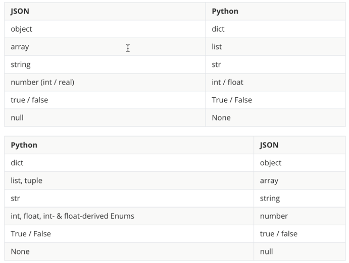

我们使用Python中的json模块就可以将字典或列表以json格式保存到文件中

 

```python
import json
def main():
    mydict={
        'name':'拼客学院',
        'age':10,
        'qq':123456789,
        'chengyuan':['xiaoming','xiaohong'],
        'kecheng':[
            {'fenlei':'shentouceshi','tedian':'heike'},
            {'fenlei':'xitongyunwei','tedian':'yunwei'}
        ]
    }
with open('data.json','w',encoding='utf-8') as f:
	json.dump(mydict,f)
	print('数据保存完成！')
if __name__=='__main__':
	main()
```

  

JSON模块中四个比较重要的函数:

dump-将python对象按照json格式序列化到文件中

dumps-将python对象处理成json格式的字符串

load-将文件中的json数据反序列化成对象

loads-将字符串的内容反序列化成Python对象

目前绝大多数网络数据服务（网络API）都是基于http协议提供json格式的数据

 

下面这个例子通过requests模块访问网络API获取国内新闻
 天行数据

```python
import requests
import json 
def main():
	resp=requests.get('http://api.tianapi.com/guonei/index?key= xx &num=10')
	data_model=json.loads(resp.text)
	for news in data_model['newslist']:
		print(news['title'])
if __name__=='__main__':
    main()
```

 

JSON序列化优势

如果我们要在不同的编程语言之间传递对象，就必须把对象序列化为标准格式，比如XML

但更好的方法是序列化为JSON，因为JSON表示出来就是一个字符串，可以被所有语言读取，也可以方便的存储到磁盘或者通过网络传输

JSON不仅是标准格式，并且XML更快，而且可以直接在web页面读取，非常方便

很多HTTP接口都采用json来传输数据


Python的异常处理

什么是异常？

程序在运行过程中会出现各种各样的问题，例如语法编写错误或者文件读写错误等。

默认情况下，出现错误的时候程序后马上停止执行，并根据错误情况反馈异常，这样就可以方便程序员进行排错和调试。

本质上讲，异常是一种类，并且有很多子类，基类为BaseException

常见的异常类型

IOError/FileNotFoundError

输入输出异常/文件未找到异常

Python2中是IO，Python3中是FileNotFound

异常代码：file1=open('filetest.txt','r')

ZeroDivisionError：分母为零的异常

异常代码：  a=1

​					 b=0

​					 print(a/b)

TypeError：类型错误，操作对本类型无效

异常代码：a=1

​                   b='hello'

​                   print(a+b)

ValueError：值异常，或者叫参数异常

异常代码：num=int('a')

​                   print(num)

SyntexError：语法错误

异常代码：a=1+

NameError：名字异常，对象未定义

异常代码：a=1

​                   print(a+b)

ArributeError：属性异常，对象没有此属性或者方法

异常代码：a='hello'

​                   b=a.coun()

​                   print(b)


异常处理

异常错误会导致程序终止运行，我们可以对异常进行捕获，进行进一步操作

异常处理分为异常捕获，异常清理，异常触发


功能：可以提高程序的健壮性，实现程序的友好度，实现程序的功能调试


异常捕获

try…except…

功能：执行try语句，若没有异常，则正常执行，忽略except代码块；若出现异常，跳过try语句，执行except代码块


捕获一个异常

```python
try:
    a=1
    b='hello'
    print(a+b)
except TypeError:
print('invalid type,please try again')
```

捕获多个异常，同一个处理结果

```python
try:
    s=int(input('how old are you：'))
    print(s)
    a='hello'
    print(a+s)   #代码逻辑有问题，仅用于触发异常

except (TypeError,ValueError):
    print('enter an integer value,please try again!')
```

捕获多个异常，不同的处理结果

```python
try:
    s=int(input('how old are you：'))
    print(s)
    a='hello'
    print(a+s)

except TypeError:
    print('enter an integer value')
except ValueError:
    print('please try again!')
```

捕获所有异常

```python
try:
    s=int(input('how old are you：'))
    # print(s)
    a=10
    # print(a+s)
    print(a/s)

except:  #捕获所有异常，except这里不需要写特定类型异常即可
    print('enter an integer value')
```

正常情况下，只执行一次try语句，当出现异常的时候，重复执行代码块：

```python
def get_age():
    while True:
        try:
            n=int(input('How old are you:'))
            print(n)
            break
        except:
            print('please try again!')

if __name__=='__main__':
    get_age()
```

下面这个代码无论是否出现异常，都会重复执行：


捕获异常，与else语句结合

```python
try:
    a=int(input('请输入一个整数：'))
    b=2
    c=a+b
    print(c)
except TypeError:
    print('please try again')
else: #若没有异常，则执行else语句
    print(b)
```

异常清理

try…finally：用于实现异常清理，不管最终try语句有没有异常，都必须执行finally语句

```python
try:
    file1=open('filetest.txt','w+')
    file1.read()
finally:
    file1.close()
    print('IOerror,the file is closed')
```


打开方式如果选择r，因为文件不存在，所以file1赋值不成功则会提示NameError，改为w+，会在本地创建文件，然后打开并读取文件的时候不会发现异常

try…except和try…finally是有区别的

try…finally是先执行try，完了之后再执行finally。file1因为文件不存在所以赋值失败，finally在调用file1这个变量的时候就会报NameError。

try…except是分开执行的，不存在except里面调用try的变量。如果文件不存在就报FileNotFoundError错误。

```python
try:
    with open('test111.txt','r') as f:
        read_data = f.read()
finally:
    print('IOerror,the file is closed')
```


try..except…finally

try…except…else…finally

```python
try:
    file1=open('filetest.txt','w+')
    file1.read()

except FileNotFoundError:
    print('please try again')

else:
    print('good')

finally:
    file1.close()
    print('close the file')
```

with…as…  ：with类似finally，用于实现程序不管是否异常都能执行as的代码

with 表达式 as 变量：

```python
with open('filetest.txt','r') as f:
	f.close()
```

异常触发

raise用于抛出异常，异常可以自己定义

raise 异常的类型 traceback

```python
def my_number(n):
    if n>0:
        raise NameError('invalid number!n<=0')
    print(n)

my_number(1)

def my_number(n):
    if n>0:
        raise ValueError('invalid number!n<=0')
    print(n)

try:
    my_number(1)
except ValueError:
    print('please enter again')
```


assert

有条件的触发异常，如果不满足则抛出AssertionError异常，相比raise，多了条件判断。但不用像raise一样抛出各种异常类型

语法：assert 条件判断,’traceback’

```python
assert 1==2,'one does not equal two'

try:
    assert 1==2,'one does not equal two'
except AssertionError:
print('please try again')
```

自定义异常类型

Python中自定义自己的异常类型非常简单，只需要从exception类继承即可

```python
class SomeCustomException(Exception):
	pass
class AnotherException(SomeCustomException):
	pass
```

如果内置的异常已经包括了所需要的异常，直接考虑使用内置异常即可。如果内置异常不能满足当前需求，则再考虑自定义异常类型。


Python的进程和线程

目前的计算机已经是多CPU多核时代，我们使用的操作系统也都是支持多任务操作的，这样我们就可以同时运行多个程序，也可以将一个程序分解为若干个相对独立的子任务，让多个子任务并发执行，可以缩短程序的执行时间。


进程

进程就是操作系统中执行的程序，操作系统是以进程为单位分配存储空间。

一个进程还可以拥有多个并发的执行线索，简单的说就是拥有多个可以获得CPU调度的执行单元，这就是所谓的线程。线程在同一个进程下，它们可以共享相同的上下文，相对于进程来说，线程间的信息共享和通信就更加容易


Python即支持多进程也支持多线程，因此使用Python实现并发编程主要有三种方式：多进程、多线程、多进程+多线程


Python中的多进程

Linux操作系统中提供fork()来创建进程，调用fork函数的是父进程，创建出来的是子进程，子进程是父进程的拷贝，但是子进程是有自己的PID，在Python中os模块提供了fork函数。由于Windows系统没有fork调用，因此要实现跨平台的多进程编程，可以使用‘multiprocessing’模块的’process’来创建子进程。


下面这个例子是通过单线程来进行文件下载：

```python
from random import randint
from time import time,sleep

def download_task(filename):
    print('开始下载%s'%filename)
    time_to_download=randint(5,10)
    sleep(time_to_download)
    print('%s下载完成！耗费了%d秒'%(filename,time_to_download))

def main():
    start=time()
    download_task('Python学习手册.pdf')
    download_task('HTML学习教程.mp4')
    end=time()
    print('总共耗费了%.2f秒'%(end-start))

if __name__=='__main__':
    main()

```

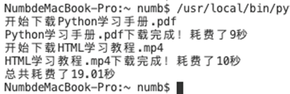

下面这个例子是采用多进程同时下载文件，可以节省下载时间：

```python
from random import randint
from time import time,sleep
from multiprocessing import Process #Process是一个类
from os import getpid

def download_task(filename):
    print('启动下载进程，进程号[%d].'%getpid())
    print('开始下载%s'%filename)
    time_to_download=randint(5,10)
    sleep(time_to_download)
    print('%s下载完成！耗费了%d秒'%(filename,time_to_download))

def main():
    start=time()
    p1=Process(target=download_task,args=('Python学习手册.pdf',)) #实例化，target表示进程启动后要执行的代码，元组里面是传递的参数
    p1.start() #start是Process类中的一个方法
    p2=Process(target=download_task,args=('HTML学习教程.mp4',))
    p2.start()
    p1.join() #等待进程执行结束，是Process类中定义好的
    p2.join()
    end=time()
    print('总共耗费了%.2f秒'%(end-start))

if __name__=='__main__':
    main()

```

要实现两个进程间的通信。我们启动两个进程，一个输出ping，另一个输出pong，两个进程输出的ping和pong加起来总共10个

```python
from multiprocessing import Process
from time import time,sleep

counter=0
def sub_task(string):
    global counter
    while counter<10:
        print(string,end='')
        counter+=1
        sleep(0.1)
    
def main():
    Process(target=sub_task,args=('ping',)).start()
    Process(target=sub_task,args=('pong',)).start()

if __name__=='__main__':
    main()

```

执行后的结果是ping和pong各自都输出了10个。原因是两个子进程复制了父进程及其所有的数据结果，每个子进程都有自己的独立的内存空间，也就是说每个子进程下都有一个counter变量。解决方案就是使用multiprocessing模块中的queue类，可以被多个进程共享队列。


多线程

基于threading模块来实现多线程编程。

```python
from random import randint
from time import time,sleep
from threading import Thread

def download_task(filename):
    print('开始下载%s'%filename)
    time_to_download=randint(5,10)
    sleep(time_to_download)
    print('%s下载完成！耗费了%d秒'%(filename,time_to_download))

def main():
    start=time()
    t1=Thread(target=download_task,args=('Python学习手册.pdf',))
    t1.start()
    t2=Thread(target=download_task,args=('HTML学习视频.MP4',))
    t2.start()
    t1.join()
    t2.join()
    end=time()
    print('总共耗费了%.2f秒'%(end-start))

if __name__=='__main__':
    main()

```

在这个例子中，我们是使用threading模块中的Thread类来创建多线程的。

通过自定义类来实现多线程下载

```python
from random import randint
from threading import Thread
from time import time,sleep

class DownloadTask(Thread):
    def __init__(self,filename):
        super().__init__() #通过super可以调用父类的构造函数。就可以调用父类中的属性
        self.__filename=filename
    
    def run(self):
        print('开始下载%s'%self.__filename)
        time_to_download=randint(5,10)
        sleep(time_to_download)
        print('%s下载完成！耗时%d秒'%(self.__filename,time_to_download))

def main():
    start=time()
    t1=DownloadTask('Python学习手册.pdf')
    t1.start()
    t2=DownloadTask('HTML学习视频.pdf')
    t2.start()
    t1.join()
    t2.join()
    end=time()
    print('总共耗费了%.2f秒'%(end-start))

if __name__=='__main__':
	main()

```

因为多线程可以共享进程的内存空间，因此要实现多线程间的通信相对简单。

一般情况下，创建一个全局变量，所有的线程共享这个全局变量即可。但是当多个线程共享同一个变量（称之为资源），很可能产生不可控的结果，从而导致程序失效甚至崩溃。

如果一个资源被多个线程竞争使用，我们通常称为‘临界资源’,对临界资源的访问是需要保护的，否则资源会处于混乱状态。

```python
from time import sleep
from threading import Thread

class Account():
    def __init__(self):
        self.__balance=0 #创建一个构造函数中的私有变量，初始值为0
    
    def yu_e(self,money):
        #计算存款后的余额
        new_balance=self.__balance+money
        #受理存款业务需要0.1秒时间
        sleep(0.0001)  #时间的长短和Python的处理速度相关
        #修改账户余额
        self.__balance=new_balance

    @property
    def balance(self):
        return self.__balance

class AddMoneyThread(Thread):
    def __init__(self,account,money):
        super().__init__()
        self.__account=account
        self.__money=money

    def run(self):
        self.__account.yu_e(self.__money)
    
def main():
    account=Account()
    threads=[]
    #创建100个存款的线程向同一个账户存钱
    for i in range(100):
        t=AddMoneyThread(account,1)
        threads.append(t)
        t.start()
        
    
    for t in threads:
        t.join()
    print('账户的余额为：%d元'%account.balance)

if __name__=='__main__':
    main()

```

当sleep(0.0001)的时候，运行的结果远小于期望的结果100，这是因为我们没有对银行账户这个临界资源加以保护。因为多个线程账户余额都是从初始值0开始递加的，所以就会得到错误的结果。

要解决这个问题，就要使用锁。只有获得锁的线程才能访问临界资源。没有锁的线程只能被阻塞起来，直到获得锁的线程释放锁才有机会获得锁。

```python
from time import sleep
from threading import Thread,Lock

class Account():
    def __init__(self):
        self.__balance=0 #创建一个构造函数中的私有变量，初始值为0
        #设置锁
        self.__lock=Lock()
    
    def yu_e(self,money):
        #先获取锁才能执行后面的代码
        self.__lock.acquire()
        try:
            #计算存款后的余额
            new_balance=self.__balance+money
            #受理存款业务需要0.1秒时间
            sleep(0.0001)  #时间的长度和Python的处理速度相关
            #修改账户余额
            self.__balance=new_balance
        finally:
            #不管有没有异常，都释放锁
            self.__lock.release()

    @property
    def balance(self):
        return self.__balance

class AddMoneyThread(Thread):
    def __init__(self,account,money):
        super().__init__()
        self.__account=account
        self.__money=money

    def run(self):
        self.__account.yu_e(self.__money)
    
def main():
    account=Account()
    threads=[]
    #创建100个存款的线程向同一个账户存钱
    for i in range(100):
        t=AddMoneyThread(account,1)
        threads.append(t)
        t.start()
        
    
    for t in threads:
        t.join()
    print('账户的余额为：%d元'%account.balance)

if __name__=='__main__':
    main()
```

多进程还是多线程？

单核CPU处理单任务就是等一个任务执行完成之后才执行另一个任务，花费时间比较长。

单核CPU在执行多任务处理的时候，是需要有代价的（比如切换任务的时候需要准备环境），如果任务太多，CPU就会花费大量的时间在任务切换上，从而只有很少的时间来执行任务，这样就会使得系统性能急剧下降，导致所有任务都处理不好。

 

第二个考虑是否多任务的因素是任务的类型（计算密集型、I/O密集型）

计算密集型特点是需要进行大量的计算，消耗CPU的资源。不建议使用多任务，CPU会忙着切换任务，导致执行效率变低。

I/O密集型主要涉及到网络、存储介质输入输出的任务。CPU消耗小，任务的大部分时间都是在等待I/O操作完成。建议使用多任务，可以减少I/O的等待时间。网络应用和web应用都可以看做I/O密集型

 

单线程+异步I/O

现在的操作系统都支持使用异步I/O来执行单进程单线程的多任务处理，这种模型我们成为事件驱动模型。Nginx就是支持异步I/O的web服务器。

 

例子：将耗时间的任务放到线程中以获得更好的用户体验

单线程实现

```python
import time
import tkinter #使用Python进行窗口视图设计的模块
import tkinter.messagebox

def download():
    #模拟下载任务需要花费10秒
    time.sleep(10)
    tkinter.messagebox.showinfo(title='提示',message='下载完成！')

def show_about():
    tkinter.messagebox.showinfo(title='关于',message='pinginglab')

def main(): #先设计视窗，然后再定义下载和关于两个按钮
    top=tkinter.Tk() #调用tkinter的Tk接口
    top.title('单线程')
    top.geometry('200x150') #视窗外部尺寸
    top.wm_attributes('-topmost',True)

    a=tkinter.Frame(top)
    button1=tkinter.Button(a,text='下载',command=download)
    button1.pack(side='left')
    button2=tkinter.Button(a,text='关于',command=show_about)
    button2.pack(side='right')

    a.pack(side='bottom')

    tkinter.mainloop()

if __name__=='__main__':
    main()

```

多线程实现

```python
import time
import tkinter #使用Python进行窗口视图设计的模块
import tkinter.messagebox
from threading import Thread

def main():
    class DownloadTask(Thread):
        def run(self):
            time.sleep(10)
            tkinter.messagebox.showinfo('提示','下载完成')
            #启用下载按钮
            button1.config(state=tkinter.NORMAL)
        
    def download():
        #禁用下载按钮
        button1.config(state=tkinter.DISABLED)
        #设通过daemon置守护线程(主程序退出就不再执行),在线程中，处理耗时的下载任务
        DownloadTask(daemon=True).start()
    def show_about():
        tkinter.messagebox.showinfo('关于','pinginglab')

    top=tkinter.Tk() #调用tkinter的Tk接口
    top.title('单线程')
    top.geometry('200x150') #视窗外部尺寸
    top.wm_attributes('-topmost',True)
    a=tkinter.Frame(top)
    a.pack(side='bottom')

    button1=tkinter.Button(a,text='下载',command=download)
    button1.pack(side='left')
    button2=tkinter.Button(a,text='关于',command=show_about)
    button2.pack(side='right')

    tkinter.mainloop()

if __name__=='__main__':
    main()

```

使用多进程处理复杂的任务

```python
from time import time

def main():
    total=0
    number_list=[x for x in range(1,100000001)]
    start=time()
    for number in number_list:
        total+=number
    print(total)
    end=time()
    print('总共花费了%.2f秒'%(end-start))

if __name__=='__main__':
    main()
```

接下来把生成列表的任务放到8个进程中处理，不考虑列表切片的时间

```python
from time import time
from random import randint
from multiprocessing import Process,Queue

def task(curr_lsit,result_queue):
    total=0
    for number in curr_lsit:
        total+=number
    result_queue.put(total)

def main():
    processes=[]
    number_list=[x for x in range(1,100000001)]
    result_queue=Queue()
    index=0

    #启动8个进程将数据切片后进行计算
    for i in range(8):
        p=Process(target=task,args=(number_list[index:index+12500000],result_queue))
        index+=12500000
        processes.append(p)
        p.start()
    
    #统计所有进程执行完成花费的时间
    start=time()
    for p in processes:
        p.join()
    
    total=0
    while not result_queue.empty():
        total+=result_queue.get()
    print(total)
    end=time()
    print('总共花费了%.2f秒'%(end-start))

if __name__=='__main__':
main()
```

使用多进程可以充分利用CPU多核的特性，减少程序的执行时间，计算量越大效果越明显。

如果计算量超大，可以考虑分布式进程（将多个进程部署在多个计算机上面）


Python网络编程入门和网络应用开发

requests库

是一个基于HTTP协议来使用网络的第三方库。

通过pip3 list来查看有没有安装该库，如果没有通过命令

pip3 intall requests 来进行安装

 

 

例子：通过调用API来进行图片下载

```python
import requests

from time import time
from threading import Thread

class DownloadTask(Thread):
    def __init__(self,url):
        super().__init__()
        self.url=url
    
    def run(self):
        filename=self.url[self.url.rfind('/')+1:]  #用来获取图片的文件名
        resp=requests.get(self.url)
        with open('/Users/Hao/'+filename,'wb') as f:
            f.write(resp.content)

def main():
    resp=requests.get('http://api.tianapi.com/guonei/index?key=xxx&num=10')
    data_model=resp.json()
    for i in data_model['newslist']:
        url=i['picUrl']  #拿到图片的URL
        DownloadTask(url).start() #交给多线程类进行下载

if __name__=='__main__':
    main()

```

网络应用模式

C/S B/S 

去中心化的网络应用模式

 

基于传输层协议的套接字编程

套接字就是一套通过c语言编写的应用程序开发库，用于实现进程间通信和网络编程，在网络应用开发中被广泛使用。

TCP套接字

就是使用tcp协议提供的传输服务来实现网络通信的接口

在Python中通创建socket对象并指定type为SOCK_STREAM来使用tcp套接字。

由于一台主机可能拥有多个ip地址，而且很可能配置了多个服务，所以在设置服务端程序的时候，需要在创建套接字对象后将其绑定到指定的IP地址和端口上。

 

例子：提供时间日期服务

```python
from socket import socket,SOCK_STREAM,AF_INET
from datetime import datetime

def main():
    #创建套接字对象并指定使用哪种传输服务
    #AF_INET IPv4地址
    server=socket(type=SOCK_STREAM,family=AF_INET)
    #同一时间在同一个端口只能绑定一个服务，否则报错
    server.bind(('192.168.0.194',6789))
    server.listen(512)
    print('服务器开始监听')

    #通过循环接收客户端的连接并为其提供服务
    while True:
        #accept方法是一个阻塞方法，如果没有客户端连接到服务器，代码不会向下执行
        client,addr=server.accept()
        print(str(addr)+'连接到了服务器.')
        #发送数据
        client.send(str(datetime.now()).encode('utf-8'))
        #断开连接
        client.close()

if __name__=='__main__':
    main()

```

客户端

```python
from socket import socket

def main():
    client=socket()
    client.connect(('192.168.0.194',6789))
    print(client.recv(1024).decode('utf-8'))
    client.close()

if __name__=='__main__':
main()

```

采用多线程编程优化服务端程序

```python
from socket import socket,SOCK_STREAM,AF_INET
from datetime import datetime
from threading import Thread
from base64 import b64encode
from json import dumps

def main():
    class FlieTran(Thread):

        def __init__(self,cclient):
            super().__init__()
            self.cclient=cclient

        def run(self):
            dict={}
            dict['filename']='timg.jpeg'
            #返回的图片通过json格式，json是纯文本，图片是二进制，所以需要做编码处理
            dict['filedata']=data
            #通过dumps将字典处理成字符串
            json_str=dumps(dict)
            #发送json字符串
            self.cclient.send(json_str.encode('utf-8'))
            self.cclient.close()

    server=socket()
    server.bind(('192.168.0.109',49876))
    server.listen(512)
    print('服务器启动监听')

    with open('timg.jpeg','rb') as f:
        #上面将图片通过json传输的时候做了utf8的编码，所以这里base64编码的对象就是经过utf8编码的json字符串
        data=b64encode(f.read()).decode('utf-8')
    while True:
        client,addr=server.accept()
        FlieTran(client).start()
    
if __name__=='__main__':
    main()

```

客户端代码

```python
from socket import socket
from json import loads
from base64 import b64decode

def main():
    client=socket()
    client.connect(('192.168.0.109',49876))
    #定义一个保存二进制数据的对象
    in_data=bytes()

    data=client.recv(1024)
    while data:
        in_data+=data
        data=client.recv(1024)

    my_dict=loads(in_data.decode('utf-8'))
    filename=my_dict['filename']
    filedata=my_dict['filedata'].encode('utf-8')

    with open('/Users/Hao/'+filename,'wb') as f:
        #将base64的数据解码成二进制些人文件
        f.write(b64decode(filedata))
    print('图片已经保存')

if __name__=='__main__':
    main()

```

UDP套接字

通过UDP套接字实现电子邮件发送

发送电子邮件的时候要用smtp，smtp基于tcp，端口号25

接收邮件 POP3 

 

smtp规定了邮件发送者和发送邮件的服务器进行通信的细节

Python通过 smtplib来实现smtp操作

```python
from smtplib import SMTP
from email.header import Header
from email.mime.text import MIMEText

def main():
    sender='xxx@qq.com'
    receivers=['xxx@gmail.com','xxx@qq.com']
    message=MIMEText('用Python发送邮件示例代码','plain','utf-8')
    message['From']=Header('小明','utf-8')
    message['To']=Header('小红','utf-8')
    message['Subject']=Header('示例代码邮件','utf-8')
    smtper=SMTP('smtp.qq.com')
    smtper.login(sender,'qq邮箱授权码')

    smtper.sendmail(sender,receivers,message.as_string())
    print('邮件发送完成')

if __name__=='__main__':
    main()

```

发送带有附件的邮件

```python
from smtplib import SMTP
from email.header import Header
from email.mime.text import MIMEText
from email.mime.image import MIMEImage
from email.mime.multipart import MIMEMultipart

def main():
    #创建一个带附件的邮件消息对象
    message=MIMEMultipart()

    text_content=MIMEText('带附件的测试邮件','plain','utf-8')
    message['Subject']=Header('测试邮件邮件','utf-8')
    #将文本内容添加到消息对象中
    message.attach(text_content)

    #将文件作为附件添加到消息对象中
    with open('/Users/numb/test.txt','rb') as f:
        txt=MIMEText(f.read(),'plain','utf-8')
        txt['Content-Type']='text/plain'
        txt['Content-Dispositon']='attachment;filename=test.txt'
        message.attach(txt)
    
    sender='xxx@qq.com'
    receivers=['xxx@qq.com','xxx@qq.com']
    smtper=SMTP('smtp.qq.com')
    smtper.login(sender,'邮箱授权码')
    smtper.sendmail(sender,receivers,message.as_string())
    smtper.quit()
    print('邮件发送完成')

if __name__=='__main__':
    main()

```

发送短信

先注册短信平台，互亿无线

```python
import urllib.parse
import http.client
import json

def main():
    host='106.ihuyi.com'
    sms_send_uri = "/webservice/sms.php?method=Submit"

    params = urllib.parse.urlencode({'account':'xxx','password':'xxx',
    'content':'丽哥你好，我是黄卓然。您的验证码是：123456。请不要把验证码泄露给其他人。','mobile':'手机号码','format':'json'})
    print(params)

    headers={'Content-Type':"application/x-www-form-urlencoded", "Accept": "text/plain"}
    conn = http.client.HTTPConnection(host, port=80, timeout=30)
    conn.request("POST", sms_send_uri, params, headers)
    response = conn.getresponse()
    response_str = response.read()
    conn.close()
    return response_str
if __name__=='__main__':
    main()
```

