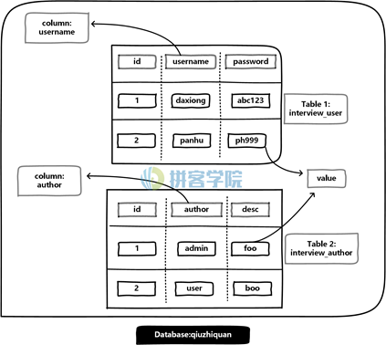
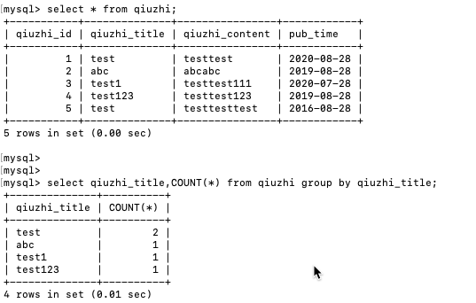

+++
title = "SQL"
date = 2020-08-28

[taxonomies]
categories = ["安全"]
+++

SQL基础

数据库：就是保存数据的仓库，他是长期存储在计算机内，可共享的数据结合

数据库分类：层次型数据库、网络式数据库、关系型数据库

最常见的数据库模型：关系型数据库、非关系型数据库
<!-- more -->

关系型数据库：

表中的行列次序不重要

行row：表中的行，我们称为一条记录

列column：表中的列，称为属性、字段、field域

主键primary key：用于唯一确认一个记录的字段

域domain：属性的取值范围

常见的关系型数据库

MySQL 中型数据库  免费

Oracle 企业用大型数据库  付费

SQLite

access

SQLserver

数据库架构

数据库操作：

查看数据库：

show databases;

创建数据库：

create database XXX;

使用数据库：

use XXX;

查看数据表：

show tables;

show columns from + 表名;

查看数据表的详细信息

show table status from +数据库名;

查看数据库版本

select version()；

查看当前使用的数据库

select database();

查看当前用户

select user();

查看数据库路径

select @@datadir;

查看数据库的安装路径

select @@basedir;

查看操作系统版本

select @@version_compile_os;

 

数据表操作

创建数据表

create table qiuzhi()

 

create table qiuzhi(

qiuzhi_id int not null auto_increment,

qiuzhi_title varchar(100) not null,

qiuzhi_content varchar(100) not null,

pub_time date,

primary key(qiuzhi_id)

)ENGINE=InnoDB DEFAULT CHARSET=utf8;

 

查看此数据表

desc qiuzhi;

查看创建此表的配置文件

show create table qiuzhi;

 

往数据表中增加列

alter table + 表名 add 列名 列类型 列参数 ;

新增加的列默认放在数据表的最后面

alter table + 表名 add 列名 列类型 列参数 first;

 

alter table qiuzhi add qiuzhi_jieguo varchar(100) not null;

 

删除列

alter table 表名 drop 列名;

 

删除数据表

drop table 表名;

 

读取数据表

select * from 表名；

 

数据操作

插入数据

insert into 表名(field1,field2,…) values (values1,values2,…)

insert into qiuzhi

(qiuzhi_id,qiuzhi_title,qiuzhi_content,pub_time)

values

(1,’test’,’testtest’,’2020-08-28’);

 

查询所有数据

select * from 表名;

查询某个数据

select qiuzhi_title from 表名；

条件查询

where操作符

select qiuzhi_content from qiuzhi where qiuzhi_title='test';

条件模糊查询

like操作符

select * from qiuzhi where qiuzhi_title like 'tes%';

更新数据

update qiuzhi set qiuzhi_title='test1' where qiuzhi_id=1;

删除数据

delete from qiuzhi where qiuzhi_id=1;

 

分组查询

group by操作符

 

 

联合查询

union操作符可以联合多个select查询

select qiuzhi_title from qiuzhi union select pub_time from qiuzhi;

 

查询后排序

order by

select * from qiuzhi order by pub_time;

 

 

 

insert into user_information

(username,password,add_time)

values

('admin','admin123','2016-09-24');