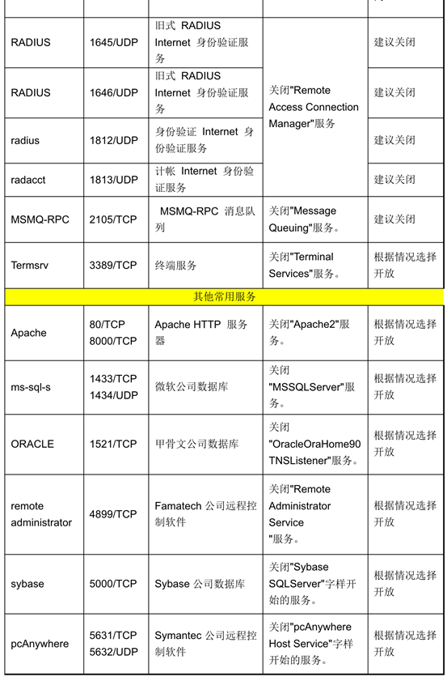
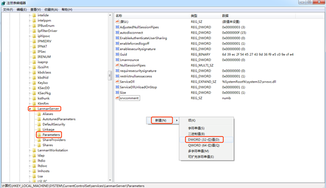

+++
title = "Windows系统服务"
date = 2020-08-01

[taxonomies]
categories = ["安全"]
+++

Windows 系统服务

IIS服务

Internet information service就是一个www服务(world wide web)。ISS是一种web服务组件，其中包括web服务器，ftp服务器，分别用于网页浏览，文件传输。
<!-- more -->

控制面板-程序-打开或关闭windows功能

开启了IIS之后，在浏览器里面输入http://localhost，如果可以看到IIS界面，那就说明服务已经开启

设置web页面

IIS开启成功之后，下一步就要把我们开发好的网站安装到web服务器的目录中，一般情况下，当web服务器安装成功后，会创建一个系统目录C:\inetpub\wwwroot，我们需要将开发好的网站放到这个路径下，即可实现本地访问

防火墙放行流量：

控制面板-系统和安全-windows防火墙-允许应用通过windows防火墙-万维网服务

FTP服务

右键我的电脑-管理-服务和应用程序-选择Internet信息服务iis管理，添加ftp站点

设置FTP账号

控制面板-管理工具-计算机管理-系统工具-本地用户和组-用户

防火墙放行FTP流量：

1. 放行FTP服务器
2. 出站入站端口放行20、21端口

远程桌面

计算机-属性-远程设置-远程

SSH服务

设置-应用-应用和功能-管理可选功能-添加功能-open SSH服务端和客户端

然后使用管理员权限打开cmd，通过命令net start sshd开启ssh服务

客户端ssh命令：ssh username@127.0.0.1

windows系统的安全配置：

账号管理：

密码复杂性要求：控制面板-管理工具-本地安全策略-账号策略-密码策略

强制密码历史：使用户不能重复使用最近多少次内已使用的口令

不存储LAN管理器哈希值：控制面板-管理工具-本地安全策略-安全选项-网络安全

失败认证次数：本地安全策略-账户策略-账户锁定策略

认证授权：

系统强制关机授权：控制面板-管理工具-本地安全策略-用户权限分配

关闭系统授权：

取得文件或其他对象所有权授权：

允许本地访问：

从网络访问此计算机：

日志配置：

控制面板-管理工具-本地安全策略-本地策略-审核策略-审核登录事件

查看系统日志：控制面板-管理工具-组件服务-事件查看器（本地）-Windows日志

Windows服务

批量关闭端口操作略

关闭系统无效启动项：运行里面输入msconfig

文件共享

关闭Windows硬盘默认共享：

开始-运行-输入regedit进入注册表编辑器

HKLM\System\CurrentControlSet\ Services\LanmanServer\Parameters\下，增加REG_DWORD类型的AutoShareServer 键，值为 0

设置共享文件夹访问权限

路径：控制面板-管理工具-计算机管理-系统工具-共享文件夹-共享

其他安全设置：

会话超时设置：

对于远程登录的账户，如果在15分钟内没有操作就端开连接

控制面板-管理工具-本地安全策略-本地策略-安全选项-Microsoft网络服务器：暂停会话前所需的时间数量 

源路由欺骗保护：

HKLM\System\CurrentControlSet\ Services\Tcpip\Parameters\

新建REG_DWORD：DisableIPSourceRouting，值设置为2。

碎片攻击保护：

在HKLM\System\CurrentControlSet\ Services\Tcpip\Parameters\创建REG_DWORD格式的EnablePMTUDiscovery，值设置为1。

Synflood攻击保护：

在HKLM\System\CurrentControlSet\ Services\Tcpip\Parameters\创建格式为REG_DWORD的注册表项SynAttackProtect，值设置为2 。

设置TCP半开会话最大数目：

在HKLM\System\CurrentControlSet\Services\Tcpip\Parameters\创建格式为REG_DWORD的注册表项TcpMaxHalfOpen，值设置为100 或 500。