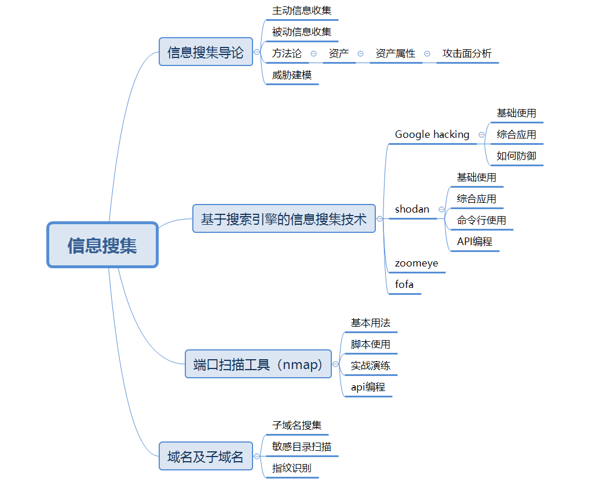

+++
title = "信息搜集"
date = 2020-09-05

[taxonomies]
categories = ["安全"]
+++

# 信息搜集

【问】信息、情报有什么区别？

【问】搜集、收集有什么区别?
<!-- more -->

信息搜集分类：

主动信息收集：与目标主动交互

被动信息收集：不与目标主动交互、第三方

信息搜集分为三个阶段：

- 目标资产枚举

  - 域名
  - 子域名
  - IP地址

  目标最有价值的资产是什么？

  目标有哪些设备有潜在威胁？

  目标有哪些防御措施？

​	   我方有哪些有价值的攻击手段？

​	   我方武器会造成什么影响？

- 资产属性关联
  - DNS
  - 旁站：同一服务器上的不同网站
  - C段：同网段不同服务器
  - 端口
- 资产攻击面分析：
  - 关联漏洞

端口扫描：

隐藏接口扫描

运维自带后门

已知常见后门

信息搜集的作用：

了解目标、了解自身

明确攻击范围

方便后续的威胁建模

如果你比目标更了解其资产，你就能看到更多可以进去的门。

如果你比目标更了解安全技术，你就拥有更多能打开门的钥匙。

资产攻击面分析指的是，通过搜集到的资产信息，联合已知攻击技术进行威胁建模的过程。

https://www.secrss.com/articles/18838

主要关注一下：PASTA威胁建模、OCTAVE威胁建模

钻石模型

基于搜索引擎的信息搜集技术：

- google hacking

  google hacking综合应用

- 防御 google hacking

- shadon hacking 

- zoomeye hacking

- fofa hacking

搜索引擎
		端口扫描
		域名与子域名搜集

github、网盘等

dns域传输漏洞

域名及子域名搜集：

- 常见域名信息搜集命令
- 子域名搜集
- 敏感目录扫描
- 指纹识别

端口扫描：

- 简介
- 用法
- 防火墙/IDS躲避和欺骗
- 输出
- 实战演练
- 脚本扫描
- api编程
- 参考资料

payload(有效攻击负载) 是包含在你用于一次漏洞利用(exploit) 中的ShellCode中的主要功能代码

shellcode(可提权代码) 对于一个漏洞来说， ShellCode就是一个用于某个漏洞的二进制代码框  架， 有了这个框架你可以在这个ShellCode中包含你需要的Payload来做一些事情 

exp(Exploit) 漏洞利用， 一般是个demo程序 

poc.(Proof of Concept漏洞证明， 一般就是个样本用来证明和复现  

vul：(Vulnerability) ：漏洞  

Pwn：是一个黑客语法的俚语词，是指攻破设备或者系统  

一些搜索引擎：https://securitytrails.com/blog/hacker-search-engines

一文读懂域名解析流程：https://www.lsablog.com/network/network-else/understand-dns-by-an-article/

总结：

