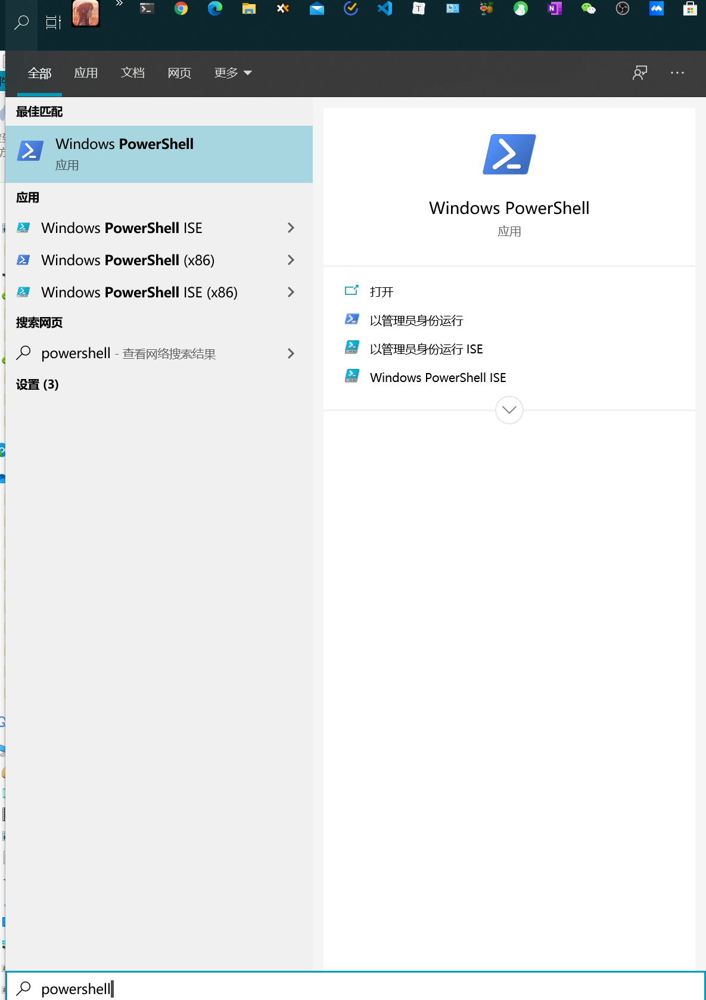
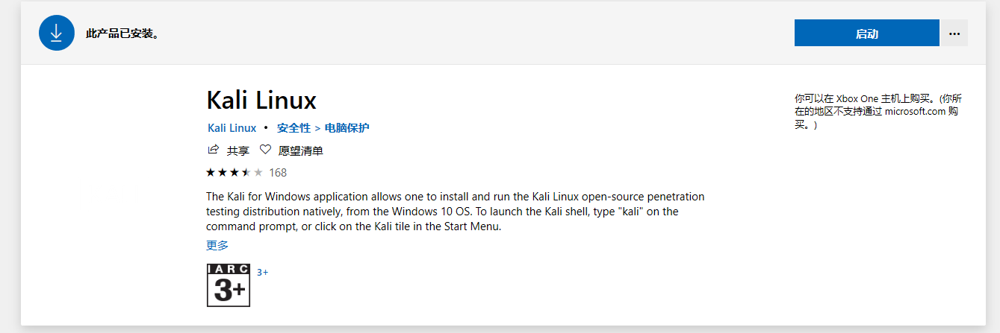

+++
title = "各种工具"
date = 2020-08-31

[taxonomies]
categories = ["安全"]
+++

win自带的虚拟环境wsl2
<!-- more -->

- rss订阅器：

  quiteRSS

  irreader

  https://www.zhihu.com/question/19580096

  

- 社区：

  freebuf

  看雪

  

- 导航站：

  Google：安全导航站

- 靶场：

  https://github.com/Medicean/VulApps
  https://github.com/710leo/ZVulDrill
  dvwa 靶场
  https://github.com/RandomStorm/DVWA
  webgoat 靶场
  https://github.com/WebGoat/WebGoat

- 安全工具

**nmap** 端口扫描工具

masscan_to_nmap

leprechaun 通过netstat显示拓补结构

**wireshark** 网络分析

**tcpdump** 网络嗅探

mitmproxy 代理

**burpsuite** 代理

综合扫描器：

appscan 扫描器

**nessus** 扫描器 —– 扫描系统漏洞

nexpose 扫描器

nikto 扫描器

w3af 扫描器

openvas 扫描器

awvs 扫描器

【问】nmap,burpsuit,nessus这些扫描器之间有什么区别？

【答】

​			CMS Exploit Scan cms扫描
​					wpscan wordpress扫描
​					F-MiddlewareScan 中间件漏洞扫描
​					WeblogicScan weblogic漏洞扫描

【问】常见的web应用框架有哪些？

【答】Django、Flask、Struts2

【问】列出常见的5种cms

【答】

域名
		子域名

https://github.com/lijiejie/subDomainsBrute
		https://github.com/aboul3la/Sublist3r

隧道技术：

frp 内网穿透
		ngrok 内网转发
		nps 内网穿透
		openvpn 虚拟隧道
		ptunnel-ng icmp 隧道
		netcat 网络工具
		hping 自定义发包器
		sqlmap 注入工具
		BeEF 浏览器开发框架
		dirbuster 目录扫描工具
		fdsploit 文件包含模糊测试工具
		filegps 文件上传路径测试
		ssrfmap ssrf 工具
		dotdotpwn 目录遍历
		xssniper xss 工具
		John the Ripper 密码破解工具
		https://github.com/AlessandroZ/LaZagne 本地密码提取工具
		hydra 爆破攻击工具
		DBScanner 自动扫描内网中一些存在未授权访问的数据库，爆破
		F-Scrack 针对FTP、MYSQL、MSSQL、MONGODB、REDIS、TELNET、ELASTICSEARCH、POSTGRESQL 爆破
		fenghuangscanner 扫描内网中弱口令，LDAP、SMB、redis、MSSQL等

长亭

xray 漏洞利用框架

weevely webshell生成和管理工具 webshell-venom 生成免杀webshell Vegile 持久化控制的工具，不死后门，杀死再生

RedGhost 支持各种语言的反向shell、sudo inject、contab、提权
		https://github.com/EnableSecurity/wafw00f waf检测
		https://github.com/sowish/LNScan 内网信息搜集
		https://github.com/gentilkiwi/mimikatz mimikatz明文注入
		https://github.com/danielmiessler/SecLists payload 合集
		https://github.com/tennc/webshell webshell合集
		https://github.com/brianwrf/hackUtils 各种脚本合集
		snort 入侵检测工具 LogonTracer Windows日志分析工具 ModSecurity WAF防火墙
		honeyd 蜜罐
		ufw 防火墙
		keepass 、1password密码管理工具
		curl 网络传输命令行工具
		LinuxCheck 本地信息搜集
		近源渗透测试（社会工程学）
		routersploit：专门针对路由设备进行攻击的框架 PRET：打印机利用框架 isf：工控系统利用框架 HomePWN：物联网渗透测								试框架 dronesploit：无人机渗透测试框架 ehtools：Wifi渗透测试框架 jackit：无线键鼠利用 ps1encode：生成恶								意的vba、			cmd、vbs、php、sct、lnk、cfm等多种脚本类型 TheFatRat：快速生成和MSF联动的payload，								可以加壳和exe植入后门，支		持快速替换图标。 

DKMC：将Powershell shellcode存储在图像中，使得图像和powershell均能使用

POC、EXP

ExploitDB官方git版本：

https://github.com/offensive-security/exploit-database

php漏洞代码分析：

https://github.com/80vul/phpcodz

CVE-2016-2107:

https://github.com/FiloSottile/CVE-2016-2107

CVE-2015-7547 POC:

https://github.com/fjserna/CVE-2015-7547 

JAVA反序列化POC生成工具： 

https://github.com/frohoff/ysoserial 

JAVA反序列化 EXP: 

https://github.com/foxglovesec/JavaUnserializeExploits 

Jenkins CommonCollections EXP: 

https://github.com/CaledoniaProject/jenkins-cli-exploit 

CVE-2015-2426 EXP (windows内核提权)：

https://github.com/vlad902/hacking-team-windows-kernel-lp 

use docker to show web attack(php本地文件包含结合phpinfo getshell以及ssrf结合curl的利用演示 )：

https://github.com/hxer/vulnapp 

php7缓存覆写漏洞Demo及相关工具： 

https://github.com/GoSecure/php7-opcache-override 

XcodeGhost木马样本：

https://github.com/XcodeGhostSource/XcodeGhost 

https://zhuanlan.zhihu.eom/p/101976280

https://www.t00ls.net/pytools.html