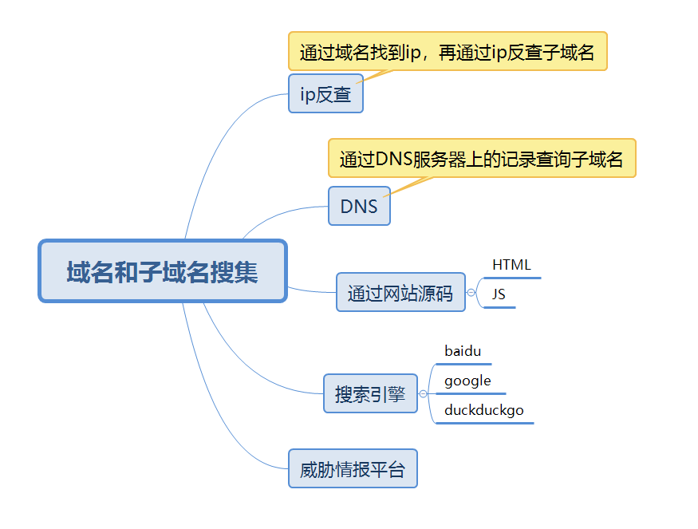
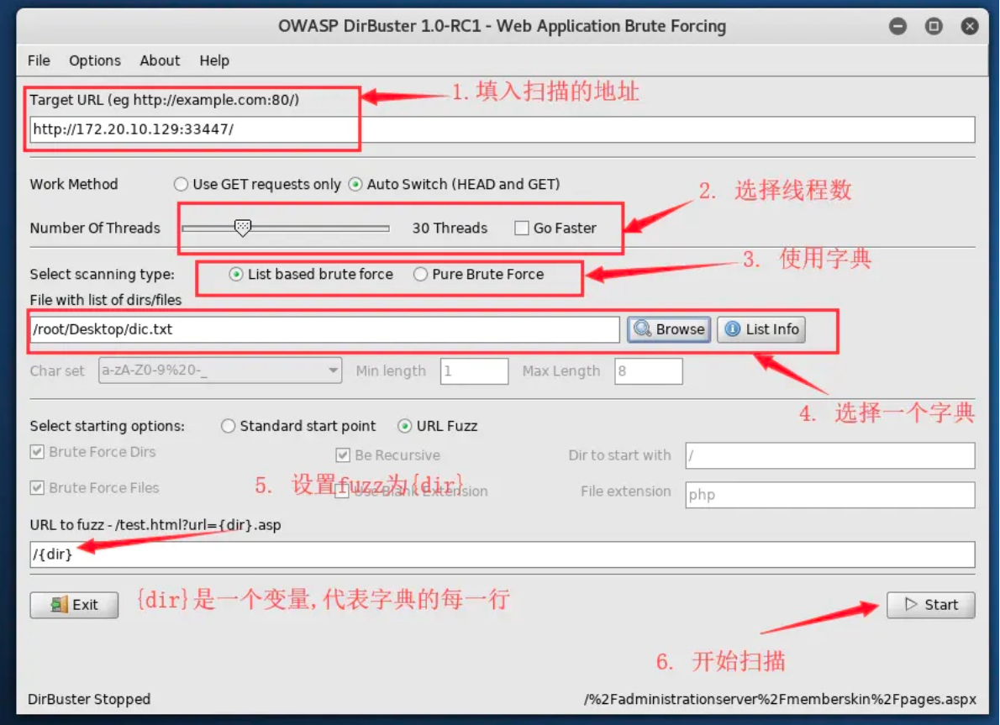

+++
title = "域名和子域名搜集"
date = 2020-09-05

[taxonomies]
categories = ["安全"]
+++

## 域名和子域名搜集

一些命令：

`whois`

`nslookup`用于查询 dns 记录来确定 ip，查询域名解析是否正常，在网络故障时可以用来诊断网络问题。如果返回域名解析对应多个 ip 地址，那么多半是使用了 cdn。
<!-- more -->

在线 ping 网站： http://ping.chinaz.com/ https://www.ipip.net/ 

查询 dns 记录网站： https://dnsdb.io/zh-cn/ https://x.threatbook.cn/ http://toolbar.netcraft.com/site_report?url= http://viewdns.info/

`dig`查询dns记录，包括NS记录、A记录、MX记录等。

`dig @114.114.114.114`指定某个服务器

A记录：域名解析到IP

CNAME记录：域名解析到域名

`dnsenum` 一个工具

`sublist3r`一个工具

`云悉`一个网站

`SubBrute`一个工具

`OneForAll`一个工具

`curl`访问某个网页的源码

`dirbuster`一个工具

`dirmap`一个工具

`御剑`一个工具

