+++
title = "通信网络基础"
date = 2020-08-01

[taxonomies]
categories = ["安全"]
+++

前提：电脑必须要有IP地址，并且可以连接到互联网

1. 浏览器搜索栏输入域名
2. 回车之后，做域名解析，得到IP地址
3. 网卡产生数据包
4. 电脑和服务器产生一个会话（管道），之后数据流量都通过这个管道传递
5. 服务器收到数据包之后，做出回应（数据包）
6. 电脑收到服务器回复的数据包之后，读取数据包内容，通过浏览器显示给用户
<!-- more -->

通信子网的功能是把信息从一台主机传输到另一台主机；资源子网是各种网络资源（硬件、软件、数据信息）的集合。

-----------------------------------

1. 现在使用的网络属于第三代互联网，互联网的前身是阿帕网（ARPANET）
2. TCP/IP协议提出的目的是为了解决阿帕网只能支持“同构”设备这一限制
3. 同构环境是网络上的所有计算机都运行相同的操作系统
4. 现在的TCP/IP协议不仅支持tcp和ip两个协议，也包括其他协议，比如http、dns、arp、dhcp等等，所以也可以称为TCP/IP协议族

网络接入层：

在网络接口层，发送的数据的时候是以字节为单位对比特流进行分组，并且按照一定的顺序依次发送
在以太网里面，一组电信号就是一个数据包，数据包被称为数据帧
MAC地址总长度为48比特，全球唯一。分为两部分，前面24位为厂商编号，后24位为厂商指定的号码

链路层的主要作用是对电信号进行分组并形成局具有特定意义的数据帧，然后通过物理介质发送给接收方

局域网通信的时候，需要知道对方的MAC地址，这个可以通过ARP（地址解析协议，通过IP地址来请求对方的MAC地址）协议来实现。

互联网络层：
同一个局域网的设备都属于同一个IP网段，如果不同网段的话，两个设备之间通信的时候就要借助路由器来转发数据

IP地址长度为32比特，分为网络部分和主机部分，比如192.168.0.1 ，掩码（1代表网络位，0代表主机位）为255.255.255.0，代表这个IP地址的网络部分为192.168.0.0

11000000 10101000 00000000 00000001

11111111 11111111 11111111 00000000

路由器在收到主机的数据包之后，会读取数据表里面的目的IP地址，然后查找自己的路由表进行转发。路由器生成路由表要使用路由协议

传输层：

传输层由两个协议，TCP和UDP

TCP全称传输控制协议，特点是面向连接的，可靠的

UDP全称用户数据报协议，特点是面向无连接不可靠的

应用层：

对用户提供应用或者服务（Telnet ssh dhcp dns···）

定义数据的格式，编码与解码，压缩与解压缩，加密与解密，数据包的拼装

创建与管理会话

端口号是用来区分应用层使用的是哪一种应用或服务

TCP 80 代表HTTP

TCP 443 代表HTTPS

UDP 4000/8000 代表QQ

UDP 67/68 代表DHCP服务

私有IP地址

保留/特殊IP地址：
        

环回测试地址：127.0.0.1        

全网广播地址：255.255.255.255

全网地址：0.0.0.0

自动配置IP地址：169.254.x.x

公有IP地址：从0.0.0.0-255.255.255.255这个范围内，去掉私有IP地址和特殊IP地址，剩下的就是公网IP地址

在公网里面，是不可能出现私网IP地址的

技术分类：

A：1.0.0.0-126.255.255.255

B：128.0.0.0-191.255.255.255

C：192.0.0.0-223.255.255.255

D：224.0.0.0-239.255.255.255    组播

E：240.0.0.0-255.255.255.255     科研

子网划分的目的

1. 减小局域网范围
2. 节省局域网的IP地址

子网划分：通过借用主机位来创造新的网络

子网划分步骤：

1. 先看需要划分的IP地址属于哪一个大类（A\B\C），这个大类默认的子网掩码是多少
2. 根据需求或者题目给的要求，先看需要借用几个主机位（比如说借用两个主机位，就可以划分2²个子网）

ARP协议

在局域网通信中，如果通信前没有对方的MAC地址，那么先通过ARP协议去请求对方的MAC，请求到的MAC地址条目，电脑会保存在ARP缓存表里面，查看命令是arp -a 当ARP缓存表里面有了对方的MAC，接下来通信的时候，就可以封装产生数据包了

清空ARP的命令是arp -d

在二层的以太网头部中，有一个type说明上层使用的协议类型

ARP请求包是一个广播包，ARP回复包是个单播包

ARP过程分为请求和回复：

请求包特点（Request）

1. 因为不知道对方的MAC地址，所以请求包在封装的时候，二层以太网目的地址使用的是广播地址，全F
2. 在ARP头部中，有四个重要的字段，其中，目标的MAC地址地段为空（48个零）

回复包特点（Replay）

1. 二层以太网头部中，源目MAC地址都是唯一的
2. ARP头部中的源MAC地址就是要ARP请求包要请求的内容
3. 当收到ARP回复包之后，电脑会读取ARP回复包里面的源MAC地址这个字段，记录在自己的ARP缓存表中

IP协议

1. PC1封装产生ping包   |smac  dmac|sip  dip|icmp|          （如果PC1没有网关路由器的MAC地址的话，需要先通过ARP进行获取）
2. 产生ping包之后，通过网线传给交换机。交换机收到之后，查看二层头部里面的目的MAC地址，查找转发表，根据对应的条目进行转发（当交换机第一次收到数据包之后，会记录下来，我从这个接口收到的数据包的源mac地址，端口 -mac地址的映射）
3. 路由器收到之后，读取ip头部里面的目的ip地址，然后查找路由表进行转发（一般情况下，路由器在自己的路由表中会自动生成直连路由，路由ip地址和端口的映射），正常情况下，路由器R1没有去往192.168.2.1的路由，所以数据包会被丢弃。如果要路由器正常转发数据包的话，那就需要通过静态路由技术或者路由协议生成路由表。

IP报头的大小：20-60字节

版本：标识ip协议的版本

首部长度：20-60字节

服务类型（tos）：用于服务质量（一般用于Qos技术）

总长度：ip头加上上层数据的数据包大小，最大为65536字节

标识（ID）：实现分片

标志flag：用来确认是否还有分片或者能否分片

分片偏移：按照一定的顺序正确重组数据包

生存时间（TTL）：标识数据包还能生存多长时间，路由器默认值是255，在不同的操作系统下面，TTL值一般也是不同的。当TTL值为零的时候，数据包会被丢弃

协议（protocol）：标识上层使用的是什么协议（tcp-6   udp-17   icmp-1）

头部校验和：保证数据包的完整性

ping 的时候指定数据包大小，用-l这个参数

数据包在传递的过程中，IP头部中的源目IP地址不会变化。TTL值会变（每经过一次转发就减一）

头部校验和会变

在二层以太网头部中，源目MAC地址都会变，头部校验也会变。

TCP功能：

1. 面向连接：通过三次握手建立连接和四次挥手断开连接
2. 可靠传输：通过序列号、确认号以及重传机制来保证可靠传输
3. 流量控制：通过window字段来实现流量控制
4. 多路复用：通过套接字来实现（IP+端口）

TCP报头：

源端口：用来标识这个数据包由哪一个应用程序或者服务发送的

目的端口：用来标识这个数据包由哪一个应用程序或者服务接手

序列号：在TCP连接中传递数据时，都会给数据的每一个字节编号，序列号字段的值指的就是本报文所发送的数据的第一个字节的序号

确认号：是期望收到对方的下一个报文段的数据的第一个字节的序号。这个字段只有当ACK标识置位的时候有效

头长度：20-60

保留位：没有使用

标记位：

1. URG 紧急指针，如果置位代表报文有紧急数据，要尽快传输
2. ACK  确认指针，如果置位代表此报文为确认包
3. PSH  推送指针，如果置位，数据包应该尽快交付给应用程序
4. RST  重置指针，如果置位，必须释放连接，并重新建立连接
5. SYN  同步指针，用来创建会话
6. FIN   结束指针，用来断开会话

滑动窗口：实现TCP的流量控制

校验和：确保数据包的完整性

紧急：只有当URG指针置位的时候有效，支持在本报文段有多少字节紧急数据

可选项：

功能详解：

1. 面向连接：

三次握手：

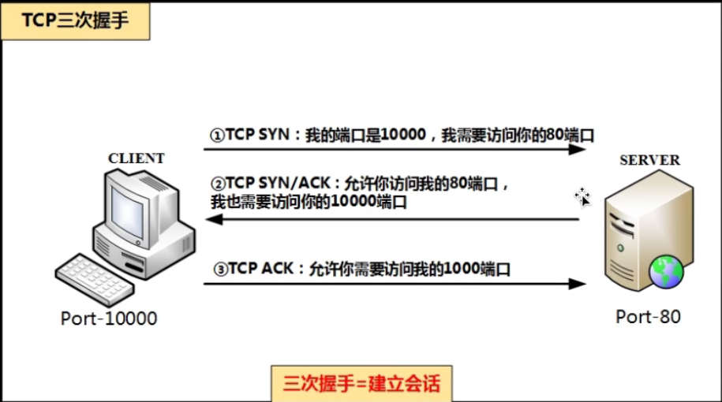

四次挥手：

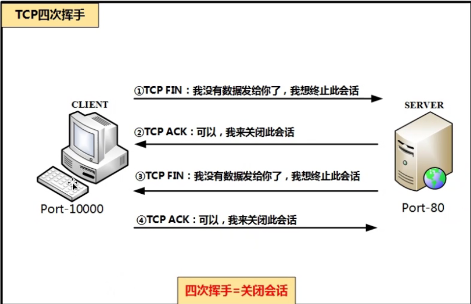

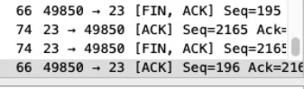

2. 可靠传输

重传机制分为超时重传和快速重传

超时重传：

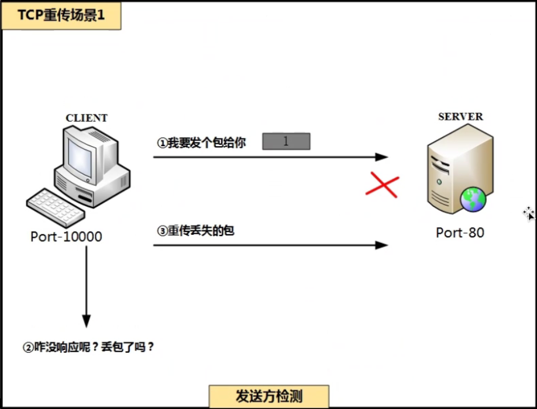

当客户端的请求包发出去的时候会开启一个计时器，当计时器到达时间之后，没有收到对方的ACK就会进行重传操作。直到达到重传次数限制或者收到对方回复的ACK

快速重传：

l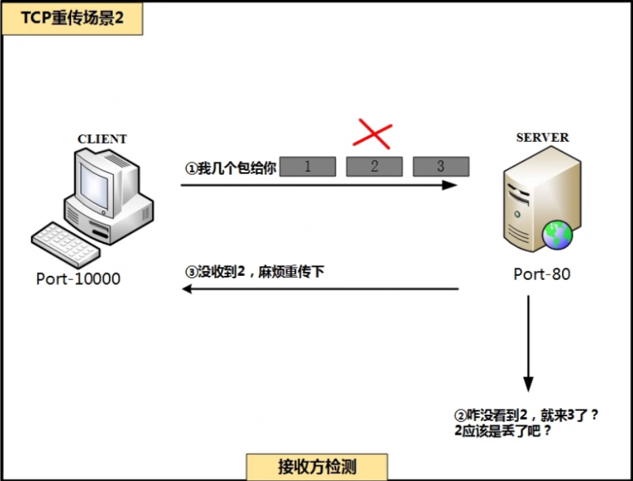

快速重传指的是当接收方收到的数据包不是正常的序列号，那么接收方就会ACK一次期望的序号，来提醒对方重传。当发送方连续收到连续3条同一个序列号的ACK，他就意识到这个包丢了，从而立即重传。

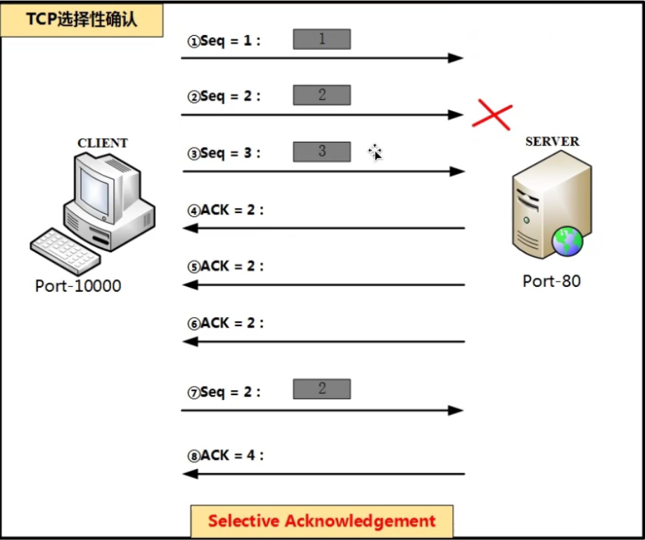

3. 流量控制

通过报头中的window字段进行控制，实时的。

通信过程中，双方会通过window这个字段告诉对方，当前可以接收的数据的大小。

5. 多路复用

套接字：IP+port

web服务器：

公网ip地址12.12.12.12，开放web服务（nginx)，数据库服务，SSH服

UDP协议

特点：

1. UDP是无连接的，在时间上不存在建立连接所需要的时延，因为TCP需要连接，连接需要维护，所以在带宽开销方面UDP比TCP开销小。
2. 包大小只有8个字节，TCP包最小20字节
3. UDP没有拥塞控制，适合某些对延迟有要求的应用
4. UDP不保证可靠交付，如果出现丢包，无错误返回信息
5. UDP是面向报文的，不会对应用层产生的数据进行合并或者分片，而是直接传送
6. UDP一般常用于一次性传输比较少量数据的网络应用

封装：

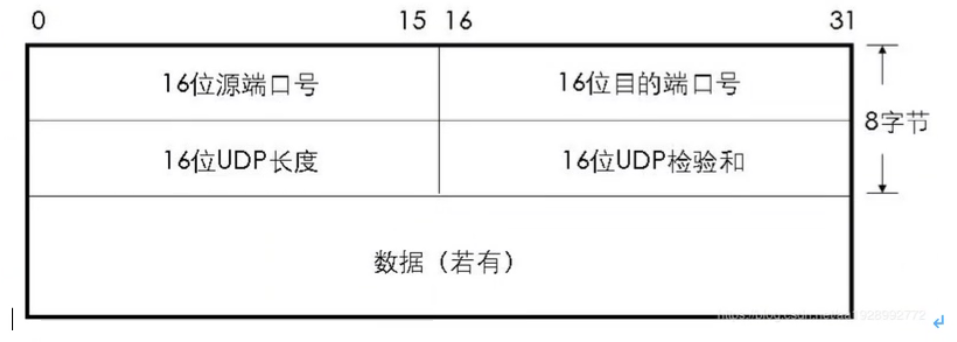

常见 的基于UDP 的服务或者应用：
DNS（53）    DHCP（67、68）     QQ（4000、8000）

常见的基于TCP的服务或应用：

Telnet(23)

HTTP(80)

https(443)

ftp(20 21)

微软的远程桌面（3389）

445端口   net file system，可以实现局域网文件共享或者局域网打印机共享

DNS协议：

域名系统

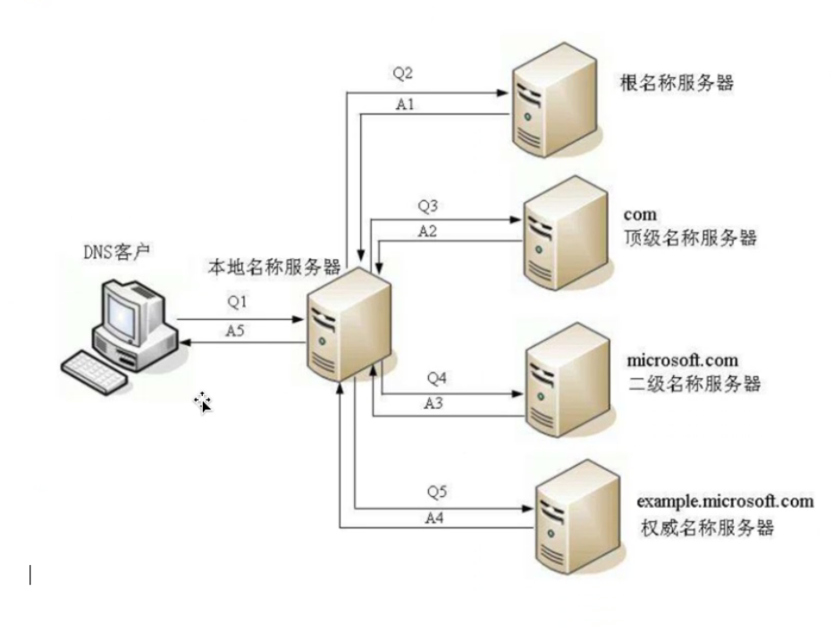

假设客户端要访问example.microsoft.com，具体的DNS过程：

1. 先检查自身的DNS缓存，如果没有再检查hosts文件，如果还没有，就向本地域名服务器发出DNS解析请求
2. 本地域名服务器收到查询请求之后，先检查缓存，如果查到请求的地址或者名字，即向客户端发出应答；如果没有查到，则在数据库中查找，若查到请求的地址或名字，即向客户端进行应答，如果在数据库中也没有查到，就向根域名服务器进行查找，如果根域名服务器没有找到则会让本地域名服务器去com顶级域名服务器查找
3. 本地域名服务器向com顶级域名服务器发送查找请求，如果com顶级域名服务器没有查找到则会让本地域名服务器microsoft.com此二级域名服务器查找
4. 如果二级域名服务器也没有查找到，则会去权威名称服务器查找
5. 权威域名服务器收到请求之后，从name.conf中查找关于主机的记录然后返回给本地域名服务器IP地址
6. 本地域名服务器收到回应之后在缓存中记录下来，然后再回复客户端

dig命令和nslookup命令进行查询

dig math.stackexchange.com

dig命令会显示出6部分内容：

第一部分是查询的参数和统计：

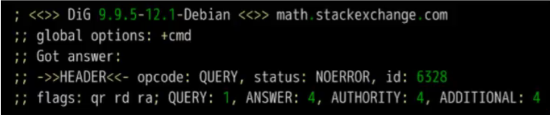

第二部分是查询内容：

第三部分是DNS服务器的应答

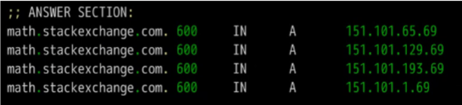

第四部分是NS记录，用来说明哪些服务器上保存了该域名的记录：

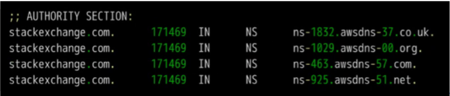

第五部分是上面四个NS服务器的IP地址，是随着上一段一起返回的

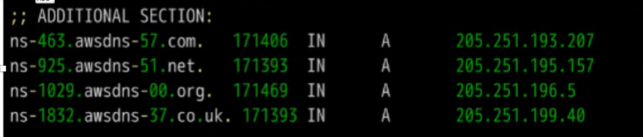

第六部分是DNS服务器的传输信息：

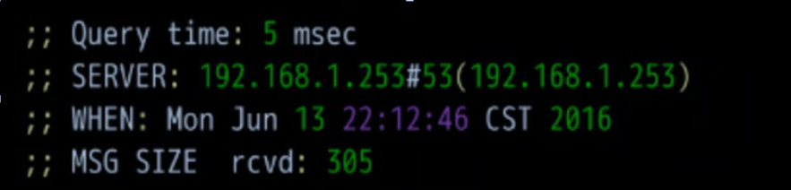

域名的层级：DNS服务器怎么知道每个域名对应的IP地址的呢？原因就是分级查询。通过上图的查询内容这张图，可以看到查询的域名尾部有一个点 “.”  ，这个点代表根域名

www.example.com真正的域名是www.example.com.root，简写为www.example.com  因为根域名.root对于所有的域名都是一样的，所以平时是省略的。

根域名的下一级是顶级域名，比如常见的.com .net .cn ；再下一级叫做次级域名或者二级域名，比如：example.com；二级域名用户是可以注册的。再下一级是主机名（host）www被称为三级域名

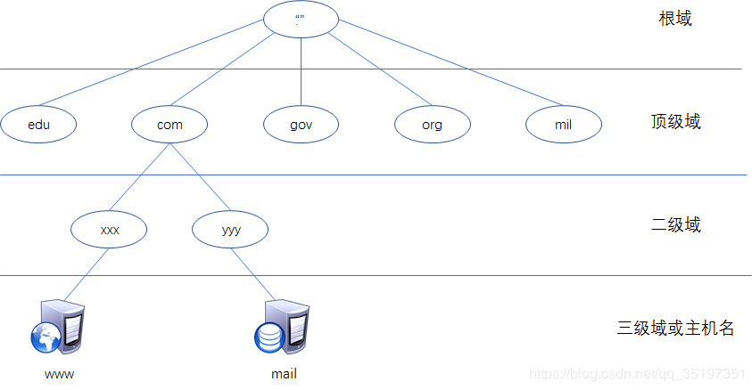

主机名.次级域名.顶级域名.根域名

 host   .    sld      .    tld       .  root  

DHCP

配置IP地址的方式：静态配置、自动获取

静态配置IP地址缺点：不方便管理，容易出错

动态配置IP：DHCP动态主机配置协议

telnet过程：

telnet是一个C/S的服务模型。在使用telnet的时候，我们启动了两个程序：一个是telnet的客户程序，运行在我们的本地主机上；另一个是telnet的服务器程序，它运行在你要远程登录的服务器上。

本地telnet客户程序主要完成以下功能：

1. 建立与服务器通信的tcp连接
2. 接收本地输入的字符
3. 将输入的字符串变成标准的格式并传送给服务端
4. 从服务端接收信息
5. 将接收的信息显示在本地屏幕上

远程服务端（精灵）功能：

1. 通知客户端，服务端已经做好通信准备
2. 等候客户端输入
3. 对客户端的命令做出反应（查看文件、显示目录、执行程序）
4. 将执行命令的结果返回给客户端
5. 重新等候客户端的命令

telnet的安全性

数据都是明文传送的非常不安全，所以如果有远程登录需求，一般采用SSH来实现。

SSH服务（安全外壳程序secure Shell）

使用SSH可以有效的防止远程登录过程中的信息泄露问题

SSH可以有效防止“中间人攻击”，而且也能防止DNS欺骗和IP欺骗

SSH在传输数据的时候，数据是经过压缩的，可以提高传输速度

SSH验证

SSH也属于C/S模型。从客户端来看，SSH提供了两张级别的安全验证

基于口令的安全验证

只有知道了账号和密码，就可以远程登录的服务器。可能会有其他服务器冒充真正的服务器，会受到“中间人攻击”

基于密钥的安全验证

需要依靠密钥，也就是说必须创建一对密钥。（非对称加密）

这一对密钥一把是公钥（所有人都可以知道），和一把私钥（只有本客户端知道）客户端会把公钥上传给服务器，服务器会保存在服务器本地。通信的时候，客户端连接到服务器，客户端软件就会向服务器发出请求，请求使用密钥进行安全验证。服务器本地收到请求后，现在服务器本地寻找公钥，然后和客户端发送过来的公钥进行对比，如果一致的话，服务器使用这把公钥加密“质询”，并把它发送给客户端软件，客户端收到后使用私钥解密再把它发送给服务器

HTTP协议（超文本传输协议）   1960年  泰德尼尔森

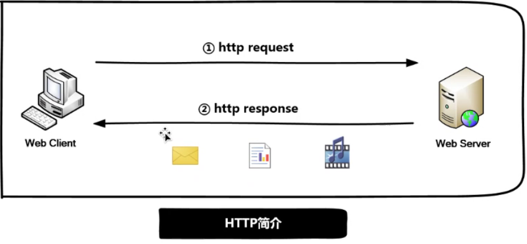

HTTP版本：

常见的有0.9 1.0 1.1 2.0，目前主流的版本是1.1，支持多种文件类型

HTTP 0.9 ：1991年，第一个正式使用的HTTP协议。支持get方法和HTML文本传输

HTTP 1.0 ：1996年，支持富文本，支持get/post/put/head四种请求方式

HTTP 1.1 ：1999年，支持get/post/put/head/delete/trace/connect/options请求方法

HTTP 2.0 ：2015年正式发布

2.0版本特点：

1. 多路复用
2. 二进制格式
3. 服务端推送

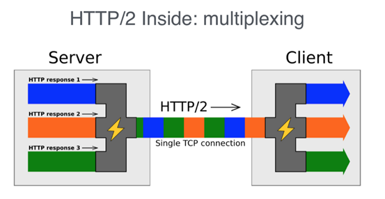

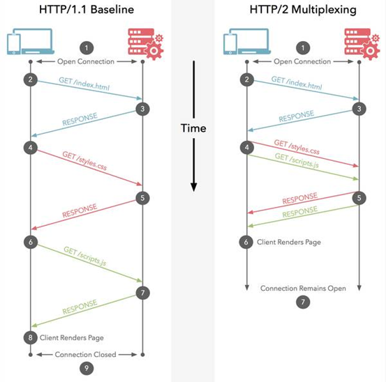

HTTP请求和响应

http请求

请求方法：

Get方法：用于请求指定页面信息，一般的浏览网页就采用get方法，请求访问的内容一般会显示在浏览器的地址栏中

POST方法：用于请求并提交内容到指定页面，提交表单、上传文件变身采用post方法。提交的内容不会显示在浏览器地址栏，相对get来说更加安全，用户登录一般使用的都是post方法。

Head方法：跟get类似，只不过返回的响应中没有具体的内容，一般用于捕获报头。扫描器做内容探测的时候经常会有head方法，速度最快也不易被发现

Put方法：从客户端向服务器传送数据取代指定的内容。此方法容易被黑客利用，所以建议服务器关闭此方法

Delete方法：请求服务器删除指定的页面。此方法容易被黑客利用，所以建议服务器关闭此方法

Connect方法：1.1版本中预留给能够将连接改为管道方式的代理服务器

Options方法：容许客户端来查看服务器的性能

Trace方法：回显服务器收到的请求，一般用于测试或者诊断

响应状态码：

1XX  正在处理，范围100-101

2XX 成功处理，范围200-206

3XX 重定向，范围300-307

4XX客户端错误，范围400-417

5XX服务器错误，范围500-505

常见状态码：

200 请求成功

302 资源被临时转移到其他的URL，需要重定向访问

404 客户端请求错误或请求的资源不存在，服务器没法处理

500 服务器内部错误，无法提供服务

503 服务器暂时无法提供服务，需要等待一段时间

502 错误网关

请求字段：

用于客户端将附加信息告知服务端

**Host**：标识请求的主机和端口

**Uaer-agent**：用于将用客户端的操作系统和浏览器的信息告知服务器。服务端可以根据这个字段，判断并统计终端用户的类型。很多的安全软件可以伪造这个字段来欺骗服务器

**Referer**：标识从哪一个连接跳转到此页面，包含一个URL。

Origin：与Referer类似，也是用来标识从哪个网站跳转过来的。Referer可以存在于各种请求，而Origin只存在于post请求中。

**cookie**：用于记录客户端的身份信息，例如通过cookie可以登录网站。HTTP是无状态的，所以引入cookie支持会话管理。

​				Cookie: MARK-MANGE-GUIDE=true; online-uuid=30BCA95C-xx27-9280-xxA4-5704xxx41588xx;

Range：用于实现分块请求，比如一个比较大的文件，通过range来实现多线程下载

x-forward：表示客户端的IP地址。一般称为XXF头。服务器可以通过这个头部知道客户端的真实或者代理IP。攻击者也可以通过这个头部，伪造源IP地址，欺骗服务器。

Accept：表示客户端能够接收哪些文件类型（MIME）

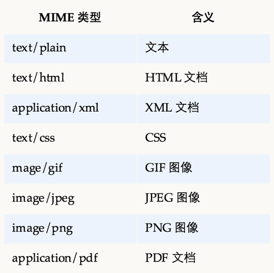

Accept-charset：表示客户端能够接收的字符集 utf-8

Authorization：web认证信息

Expect：期待服务器特定行为

**From**：用户的电子邮箱

if-match：比较实体标记

if-modified-since：比较资源的更新时间

if-range：资源未更新时发送实体字节范围请求

Max-forward：最大传输的跳数

DNT：do not track，chrome浏览器提供的安全功能，用于解决流量追踪问题

Upgrade-insecure-Request：Chrome提出的安全功能，升级非安全请求

**x-CSRF-token**：用于解决CSRF跨站请求伪造攻击，通过token令牌解决

响应字段：

用于服务端根据用户请求做出响应

**Server**：表示服务器的信息，为了安全性，可以关闭或修改

**x-power-by**：表示服务器程序版本，为了安全性，可以关闭或修改

**set-cookie**：服务器可以通过此字段，为客户端设置cookie信息，后续客户端根据此cookie进行访问

accept-ranges：表示是否接收字节范围请求

location：服务器告知客户端去哪里访问这个资源，一般用于重定向，配合状态码302使用

www-authenticate：服务器对客户端的认证信息

retry-after：对再次发起请求的要求

refresh：服务器告知客户端，定时刷新浏览器

ETag：表示资源的匹配信息

Vary：代理服务器缓存的管理信息

通用字段

可以存在于请求头和回复头

connection：用于表示连接是否可持续 keep-alive/close

**Catche-control**：用于控制缓存信息，no-cache：不缓存过期信息，no-store：不进行缓存

Transfer-encoding：表示输出的内容长度不定，需要分块处理。对于动态内容或者在发送数据前不能判定长度的情况下，可以使用分块的方法来传送，对于静态内容或者在发送数据可以预判长度的情况下，可以用content-length来标识

upgrade：升级为其他协议

Via：代理服务器的相关信息

Warning：错误信息通告

Date：表示内容产生的时间

实体字段：

可以存在于请求和相应报文中，针对实体内部进行描述。用于表示请求和相应正文的属性，包括介质类型，长度，压缩方法，最后一次修改时间等

Content-type：表示实体内容的介质类型

Content-encoding：表示实体内容的编码方式

Content-length：表示实体内容的长度

Content-language：表示实体内容的语言

Content-location：代替对应资源的URL

Content-MD5：表示实体内容的报文摘要

Content-range：表示实体内容的过期时间

last-modified：表示实体内容最后的更新时间

